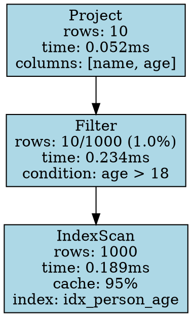

# Explain/Profile 功能实现分析

## 1. 现有实现分析

### 1.1 当前架构

```
┌─────────────────────────────────────────────────────────────────┐
│                      QueryPipelineManager                        │
├─────────────────────────────────────────────────────────────────┤
│  1. parse_into_context()     → ParserResult                     │
│  2. validate_query_with_context() → ValidationInfo              │
│  3. generate_execution_plan() → ExecutionPlan                   │
│  4. optimize_execution_plan() → OptimizedPlan                   │
│  5. execute_plan()           → ExecutionResult                   │
└─────────────────────────────────────────────────────────────────┘
                              │
                              ▼
┌─────────────────────────────────────────────────────────────────┐
│                     execute_query_with_profile                   │
├─────────────────────────────────────────────────────────────────┤
│  • 记录各阶段时间 (parse_ms, validate_ms, plan_ms, ...)         │
│  • 收集 ExecutorStats (行数、执行时间、内存使用)                │
│  • 生成 QueryProfile                                            │
└─────────────────────────────────────────────────────────────────┘
```

### 1.2 现有组件

#### 1.2.1 统计信息收集

**ExecutorStats** ([src/query/executor/base/executor_stats.rs](../../src/query/executor/base/executor_stats.rs)):
```rust
pub struct ExecutorStats {
    pub num_rows: usize,           // 处理的行数
    pub exec_time_us: u64,         // 执行时间(微秒)
    pub total_time_us: u64,        // 总时间(微秒)
    pub memory_peak: usize,        // 峰值内存
    pub memory_current: usize,     // 当前内存
    pub batch_count: usize,        // 批处理次数
    pub cache_hits: usize,         // 缓存命中
    pub cache_misses: usize,       // 缓存未命中
    pub other_stats: HashMap<String, String>,
}
```

**QueryProfile** ([src/core/stats/profile.rs](../../src/core/stats/profile.rs)):
```rust
pub struct QueryProfile {
    pub trace_id: String,
    pub session_id: i64,
    pub query_text: String,
    pub total_duration_ms: u64,
    pub stages: StageMetrics,      // 各阶段时间
    pub executor_stats: Vec<ExecutorStat>,
    pub result_count: usize,
    pub status: QueryStatus,
    pub error_info: Option<ErrorInfo>,
}
```

#### 1.2.2 Plan描述

**PlanNodeDescription** ([src/query/planning/plan/core/explain.rs](../../src/query/planning/plan/core/explain.rs)):
```rust
pub struct PlanNodeDescription {
    pub name: String,
    pub id: i64,
    pub output_var: String,
    pub description: Option<Vec<Pair>>,
    pub profiles: Option<Vec<ProfilingStats>>,  // 性能统计
    pub branch_info: Option<PlanNodeBranchInfo>,
    pub dependencies: Option<Vec<i64>>,
}

pub struct ProfilingStats {
    pub rows: i64,
    pub exec_duration_in_us: i64,
    pub total_duration_in_us: i64,
    pub other_stats: HashMap<String, String>,
}
```

### 1.3 当前问题

#### 问题1: Explain仅验证不执行

**ExplainValidator** 目前只验证内部语句，不实际执行：
```rust
impl StatementValidator for ExplainValidator {
    fn validate(&mut self, ast: Arc<Ast>, qctx: Arc<QueryContext>) -> Result<ValidationResult, ValidationError> {
        // 1. 验证内部语句
        self.validate_impl(explain_stmt)?;
        
        // 2. 递归验证内部语句
        if let Some(ref mut inner) = self.inner_validator {
            let result = inner.validate(...)?;
        }
        
        // ❌ 没有实际执行，无法获取真实执行统计
        Ok(ValidationResult::success_with_info(info))
    }
}
```

#### 问题2: Profile缺少执行器集成

**ProfileValidator** 与 **ExplainValidator** 结构几乎相同，都缺少：
- 实际执行计划的能力
- 收集执行器详细统计的机制
- 将执行统计与PlanNode关联的方法

#### 问题3: 统计信息粒度不足

当前统计主要在`QueryPipelineManager`层面：
```rust
// 只能获取整体阶段时间
profile.stages.parse_ms = parse_start.elapsed().as_millis() as u64;
profile.stages.execute_ms = execute_start.elapsed().as_millis() as u64;

// 无法获取每个Executor的详细统计
// 如：IndexScan具体扫描了多少行，耗时多少
```

#### 问题4: 执行统计与PlanNode分离

`PlanNodeDescription`有`profiles`字段，但：
- 实际执行时没有填充
- `DescribeVisitor`只生成静态描述
- 没有机制在执行后将`ExecutorStats`映射到`PlanNodeDescription`

## 2. 正确实现方案

### 2.1 核心设计原则

基于PostgreSQL等成熟数据库的实现经验：

1. **Instrumentation（插桩）**: 在执行器中植入统计收集点
2. **Per-Node Statistics**: 每个PlanNode都有对应的执行统计
3. **Actual vs Estimated**: 对比预估和实际值
4. **Timing Precision**: 微秒级精度的时间统计
5. **Resource Tracking**: 内存、I/O等资源使用追踪

### 2.2 架构设计

```
┌─────────────────────────────────────────────────────────────────────┐
│                    Explain/Profile Executor                          │
├─────────────────────────────────────────────────────────────────────┤
│                                                                      │
│  ┌─────────────┐    ┌─────────────┐    ┌─────────────────────────┐ │
│  │   EXPLAIN   │    │   PROFILE   │    │    EXPLAIN ANALYZE      │ │
│  │  (Plan Only)│    │(Exec+Stats) │    │  (Plan+Exec+Actuals)    │ │
│  └──────┬──────┘    └──────┬──────┘    └───────────┬─────────────┘ │
│         │                  │                       │               │
│         ▼                  ▼                       ▼               │
│  ┌─────────────────────────────────────────────────────────────┐  │
│  │              Instrumented Execution Pipeline                 │  │
│  ├─────────────────────────────────────────────────────────────┤  │
│  │  PlanNode(Scan) ──► Executor(ScanVertices) ──► StatsCollector│  │
│  │       │                    │                      │          │  │
│  │       │                    │                      ▼          │  │
│  │       │                    │            ┌─────────────────┐  │  │
│  │       │                    │            │  Start Timer    │  │  │
│  │       │                    │            │  Count Rows     │  │  │
│  │       │                    │            │  Track Memory   │  │  │
│  │       │                    │            │  Record I/O     │  │  │
│  │       │                    │            │  Stop Timer     │  │  │
│  │       │                    │            └─────────────────┘  │  │
│  │       │                    │                      │          │  │
│  │       ▼                    ▼                      ▼          │  │
│  │  PlanDescription ◄─── ExecutorStats ◄────── Results         │  │
│  └─────────────────────────────────────────────────────────────┘  │
│                                                                      │
└─────────────────────────────────────────────────────────────────────┘
```

### 2.3 关键实现组件

#### 2.3.1 InstrumentedExecutor 包装器

```rust
/// 带统计收集的执行器包装器
pub struct InstrumentedExecutor<S: StorageClient> {
    inner: ExecutorEnum<S>,
    node_id: i64,
    stats: NodeExecutionStats,
    context: Arc<ExecutionStatsContext>,
}

pub struct NodeExecutionStats {
    pub actual_rows: usize,           // 实际输出行数
    pub actual_time_ms: f64,          // 实际执行时间
    pub startup_time_ms: f64,         // 首次输出行时间
    pub total_time_ms: f64,           // 总时间(含子节点)
    pub memory_used: usize,           // 内存使用
    pub cache_hits: usize,            // 缓存命中
    pub cache_misses: usize,          // 缓存未命中
    pub io_reads: usize,              // I/O读取次数
    pub io_read_bytes: usize,         // I/O读取字节
}

impl<S: StorageClient> Executor<S> for InstrumentedExecutor<S> {
    fn execute(&mut self) -> DBResult<ExecutionResult> {
        let start = Instant::now();
        let mut first_row_time: Option<Instant> = None;
        let mut row_count = 0;
        
        // 执行前记录
        self.context.on_node_start(self.node_id);
        
        // 执行内部执行器
        let result = self.inner.execute()?;
        
        // 收集结果统计
        match &result {
            ExecutionResult::Data(data) => {
                row_count = data.len();
                if first_row_time.is_none() && !data.is_empty() {
                    first_row_time = Some(Instant::now());
                }
            }
            _ => {}
        }
        
        // 记录统计
        let elapsed = start.elapsed();
        self.stats.actual_rows = row_count;
        self.stats.actual_time_ms = elapsed.as_micros() as f64 / 1000.0;
        self.stats.startup_time_ms = first_row_time
            .map(|t| t.duration_since(start).as_micros() as f64 / 1000.0)
            .unwrap_or(0.0);
        
        // 合并内部执行器统计
        let inner_stats = self.inner.stats();
        self.stats.memory_used = inner_stats.memory_peak;
        self.stats.cache_hits = inner_stats.cache_hits;
        self.stats.cache_misses = inner_stats.cache_misses;
        
        // 通知上下文
        self.context.on_node_complete(self.node_id, &self.stats);
        
        Ok(result)
    }
    
    fn open(&mut self) -> DBResult<()> {
        let start = Instant::now();
        self.inner.open()?;
        self.stats.open_time_ms = start.elapsed().as_micros() as f64 / 1000.0;
        Ok(())
    }
    
    fn close(&mut self) -> DBResult<()> {
        let start = Instant::now();
        self.inner.close()?;
        self.stats.close_time_ms = start.elapsed().as_micros() as f64 / 1000.0;
        Ok(())
    }
}
```

#### 2.3.2 ExplainExecutor 实现

```rust
/// EXPLAIN语句执行器
pub struct ExplainExecutor<S: StorageClient> {
    base: BaseExecutor<S>,
    inner_plan: ExecutionPlan,
    format: ExplainFormat,
    mode: ExplainMode,  // PlanOnly, Analyze, Profile
}

pub enum ExplainMode {
    PlanOnly,   // 仅显示计划
    Analyze,    // 执行并显示实际统计
    Profile,    // 执行并显示详细性能分析
}

impl<S: StorageClient> Executor<S> for ExplainExecutor<S> {
    fn execute(&mut self) -> DBResult<ExecutionResult> {
        match self.mode {
            ExplainMode::PlanOnly => {
                // 仅生成计划描述
                let description = self.generate_plan_description()?;
                Ok(ExecutionResult::Explain(description))
            }
            
            ExplainMode::Analyze | ExplainMode::Profile => {
                // 1. 创建统计收集上下文
                let stats_context = Arc::new(ExecutionStatsContext::new());
                
                // 2. 包装所有执行器
                let instrumented_plan = self.wrap_with_instrumentation(
                    self.inner_plan.clone(),
                    stats_context.clone()
                )?;
                
                // 3. 执行计划
                let exec_result = self.execute_instrumented_plan(instrumented_plan)?;
                
                // 4. 收集统计
                let node_stats = stats_context.collect_stats();
                
                // 5. 生成带实际统计的计划描述
                let mut description = self.generate_plan_description()?;
                self.attach_actual_stats(&mut description, &node_stats)?;
                
                // 6. 根据模式返回不同结果
                if self.mode == ExplainMode::Profile {
                    // Profile模式返回详细性能数据
                    let profile_data = self.generate_profile_data(&description, &node_stats);
                    Ok(ExecutionResult::Profile(profile_data))
                } else {
                    Ok(ExecutionResult::Explain(description))
                }
            }
        }
    }
}
```

#### 2.3.3 ExecutionStatsContext 统计上下文

```rust
/// 执行统计上下文，用于收集所有节点的统计信息
pub struct ExecutionStatsContext {
    node_stats: DashMap<i64, NodeExecutionStats>,
    global_stats: Mutex<GlobalExecutionStats>,
    start_time: Instant,
}

pub struct GlobalExecutionStats {
    pub planning_time_ms: f64,
    pub execution_time_ms: f64,
    pub total_rows: usize,
    pub peak_memory: usize,
    pub cache_hit_rate: f64,
}

impl ExecutionStatsContext {
    pub fn new() -> Self {
        Self {
            node_stats: DashMap::new(),
            global_stats: Mutex::new(GlobalExecutionStats::default()),
            start_time: Instant::now(),
        }
    }
    
    pub fn on_node_start(&self, node_id: i64) {
        self.node_stats.entry(node_id).or_insert_with(|| {
            NodeExecutionStats {
                node_id,
                start_time: Some(Instant::now()),
                ..Default::default()
            }
        });
    }
    
    pub fn on_node_complete(&self, node_id: i64, stats: &NodeExecutionStats) {
        if let Some(mut entry) = self.node_stats.get_mut(&node_id) {
            *entry = stats.clone();
        }
    }
    
    pub fn collect_stats(&self) -> HashMap<i64, NodeExecutionStats> {
        self.node_stats.iter()
            .map(|entry| (*entry.key(), entry.value().clone()))
            .collect()
    }
    
    pub fn get_node_stats(&self, node_id: i64) -> Option<NodeExecutionStats> {
        self.node_stats.get(&node_id).map(|s| s.clone())
    }
}
```

#### 2.3.4 PlanNode与统计信息关联

```rust
impl PlanDescription {
    /// 将实际执行统计附加到计划描述
    pub fn attach_execution_stats(
        &mut self,
        node_stats: &HashMap<i64, NodeExecutionStats>,
    ) {
        for (node_id, stats) in node_stats {
            if let Some(node_desc) = self.get_node_desc_mut(*node_id) {
                // 创建ProfilingStats
                let profiling = ProfilingStats {
                    rows: stats.actual_rows as i64,
                    exec_duration_in_us: (stats.actual_time_ms * 1000.0) as i64,
                    total_duration_in_us: (stats.total_time_ms * 1000.0) as i64,
                    other_stats: {
                        let mut map = HashMap::new();
                        map.insert("startup_time_ms".to_string(), 
                                  format!("{:.3}", stats.startup_time_ms));
                        map.insert("memory_used".to_string(), 
                                  format!("{}", stats.memory_used));
                        map.insert("cache_hit_rate".to_string(), 
                                  format!("{:.2}%", stats.cache_hit_rate() * 100.0));
                        map
                    },
                };
                
                node_desc.add_profile(profiling);
            }
        }
    }
}
```

### 2.4 输出格式

#### 2.4.1 Table格式（默认）

```
+----+---------------+--------------+------------------+--------------------------------------------------+
| id | name          | dependencies | profiling_data   | operator info                                    |
+----+---------------+--------------+------------------+--------------------------------------------------+
|  1 | Project       | 2            | rows: 10         | columns: [name, age]                             |
|    |               |              | time: 0.052 ms   |                                                  |
|    |               |              | memory: 1.2 KB   |                                                  |
+----+---------------+--------------+------------------+--------------------------------------------------+
|  2 | Filter        | 3            | rows: 10/1000    | condition: (age > 18)                            |
|    |               |              | time: 0.234 ms   | selectivity: 1.0%                                |
|    |               |              | startup: 0.001ms |                                                  |
+----+---------------+--------------+------------------+--------------------------------------------------+
|  3 | IndexScan     |              | rows: 1000       | index: idx_person_age                            |
|    |               |              | time: 0.189 ms   | scan_type: range                                 |
|    |               |              | cache: 95%       | range: (18, +∞)                                  |
+----+---------------+--------------+------------------+--------------------------------------------------+

Planning Time: 0.187 ms
Execution Time: 0.523 ms
```

#### 2.4.2 Dot格式（Graphviz）



### 2.5 集成到QueryPipelineManager

```rust
impl<S: StorageClient> QueryPipelineManager<S> {
    /// 执行EXPLAIN语句
    pub fn execute_explain(
        &mut self,
        explain_stmt: &ExplainStmt,
        qctx: Arc<QueryContext>,
    ) -> DBResult<ExecutionResult> {
        // 1. 获取内部语句的执行计划（但不执行）
        let inner_ast = &explain_stmt.statement;
        let inner_validated = self.validate_statement(inner_ast, qctx.clone())?;
        let inner_plan = self.generate_execution_plan(qctx.clone(), &inner_validated)?;
        let optimized_plan = self.optimize_execution_plan(inner_plan)?;
        
        // 2. 创建ExplainExecutor
        let explain_executor = ExplainExecutor::new(
            self.storage.clone(),
            optimized_plan,
            explain_stmt.format.clone(),
            ExplainMode::PlanOnly,
        );
        
        // 3. 执行Explain
        explain_executor.execute()
    }
    
    /// 执行PROFILE语句（或EXPLAIN ANALYZE）
    pub fn execute_profile(
        &mut self,
        profile_stmt: &ProfileStmt,
        qctx: Arc<QueryContext>,
    ) -> DBResult<ExecutionResult> {
        // 1. 获取并优化内部语句的执行计划
        let inner_ast = &profile_stmt.statement;
        let inner_validated = self.validate_statement(inner_ast, qctx.clone())?;
        let inner_plan = self.generate_execution_plan(qctx.clone(), &inner_validated)?;
        let optimized_plan = self.optimize_execution_plan(inner_plan)?;
        
        // 2. 创建带统计收集的ExplainExecutor
        let profile_executor = ExplainExecutor::new(
            self.storage.clone(),
            optimized_plan,
            profile_stmt.format.clone(),
            ExplainMode::Profile,
        );
        
        // 3. 执行并收集统计
        profile_executor.execute()
    }
}
```

## 3. 关键改进点

### 3.1 统计精度提升

| 维度 | 当前实现 | 改进后 |
|------|----------|--------|
| 时间精度 | 毫秒(ms) | 微秒(us) |
| 行数统计 | 仅最终结果 | 每个节点实际行数 |
| 内存追踪 | 峰值内存 | 峰值+当前+分配次数 |
| I/O统计 | 无 | 读取次数/字节 |
| 缓存统计 | 命中/未命中 | 命中率+逐出次数 |
| 启动时间 | 无 | 首次输出行时间 |

### 3.2 执行器集成

```rust
// 当前：Executor trait只有基本统计
pub trait Executor<S: StorageClient>: Send {
    fn execute(&mut self) -> DBResult<ExecutionResult>;
    fn stats(&self) -> &ExecutorStats;
}

// 改进：增加详细统计接口
pub trait InstrumentedExecutor<S: StorageClient>: Executor<S> {
    fn detailed_stats(&self) -> &NodeExecutionStats;
    fn reset_stats(&mut self);
    fn enable_instrumentation(&mut self, enabled: bool);
}
```

### 3.3 预估vs实际对比

```rust
pub struct PlanNodeWithComparison {
    pub plan_node: PlanNodeDescription,
    pub estimated_rows: i64,      // 优化器预估
    pub actual_rows: i64,         // 实际执行
    pub estimated_cost: f64,      // 预估成本
    pub actual_time_ms: f64,      // 实际时间
}

// 在输出中高亮显示差异
fn format_comparison(est: i64, actual: i64) -> String {
    let ratio = actual as f64 / est as f64;
    if ratio > 10.0 {
        format!("{} (estimated: {} ⚠️ {}x off)", actual, est, ratio)
    } else {
        format!("{} (estimated: {})", actual, est)
    }
}
```

## 4. 实现步骤

### 阶段1: 基础统计增强
1. 扩展`ExecutorStats`结构，增加I/O、缓存等统计
2. 在`BaseExecutor`中实现自动统计收集
3. 更新所有执行器以填充详细统计

### 阶段2: InstrumentedExecutor包装器
1. 创建`InstrumentedExecutor`结构
2. 实现统计收集逻辑
3. 创建`ExecutionStatsContext`用于全局统计管理

### 阶段3: ExplainExecutor实现
1. 创建`ExplainExecutor`结构
2. 实现`PlanOnly`模式
3. 实现`Analyze`模式（执行+统计）
4. 实现`Profile`模式（详细分析）

### 阶段4: 输出格式化
1. 实现Table格式输出
2. 实现Dot格式输出
3. 实现JSON格式输出（可选）

### 阶段5: 集成到Pipeline
1. 在`QueryPipelineManager`中添加`execute_explain`和`execute_profile`
2. 更新语句路由逻辑
3. 添加测试用例

## 5. 使用示例

```rust
// EXPLAIN - 仅查看计划
let result = pipeline.execute_query("EXPLAIN MATCH (p:Person) WHERE p.age > 18 RETURN p.name");

// EXPLAIN ANALYZE - 执行并查看实际统计
let result = pipeline.execute_query(
    "EXPLAIN ANALYZE MATCH (p:Person) WHERE p.age > 18 RETURN p.name"
);

// PROFILE - 详细性能分析
let result = pipeline.execute_query(
    "PROFILE MATCH (p:Person)-[:KNOWS]->(f:Person) WHERE p.name = 'Alice' RETURN f.name"
);
```

## 6. 总结

当前Explain/Profile实现的主要问题是**缺少实际执行和统计收集机制**。正确的实现需要：

1. **Instrumentation**: 在执行器中植入统计收集点
2. **Per-Node Stats**: 每个PlanNode都有独立的执行统计
3. **Actual vs Estimated**: 对比预估和实际执行数据
4. **Integration**: 将统计信息与PlanDescription关联

通过上述方案，可以实现类似PostgreSQL EXPLAIN ANALYZE的功能，提供精准的查询执行细节，帮助用户理解和优化查询性能。
