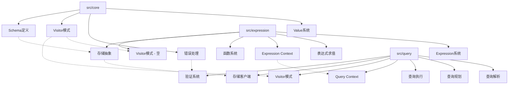
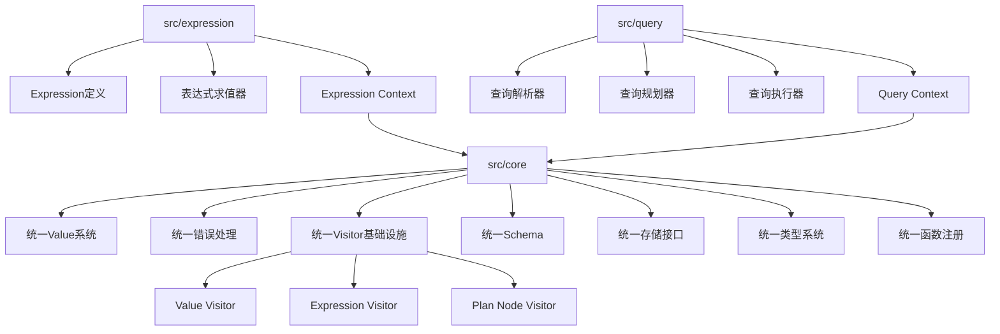
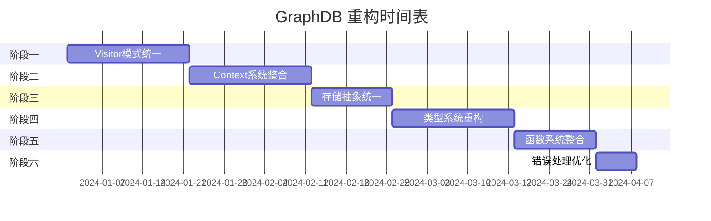

# GraphDB 功能重复分析总结报告

## 执行摘要

本报告完成了对 GraphDB 项目中 `src/core`、`src/expression` 和 `src/query` 三个关键目录的深入分析，识别了显著的功能重复问题，并提出了系统性的重构方案。

## 主要发现

### 1. 功能重复问题严重
通过详细分析，发现了六个主要的功能重复领域：

| 重复领域 | 重复程度 | 影响范围 | 优先级 |
|---------|---------|---------|--------|
| Visitor 模式 | 高 | 全局 | 高 |
| Context 管理 | 中-高 | 表达式/查询 | 高 |
| 类型系统 | 高 | 全局 | 高 |
| 存储抽象 | 中 | 架构层 | 中 |
| 函数系统 | 高 | 表达式/核心 | 中 |
| 错误处理 | 低-中 | 全局 | 低 |

### 2. 架构问题分析

#### 当前架构问题

#### 重构后目标架构

### 3. 关键重复问题详解

#### Visitor 模式重复
- **问题**: 三个目录都实现了 Visitor 模式，但接口不统一
- **影响**: 代码维护困难，功能重复
- **解决方案**: 创建统一的 Visitor 基础设施

#### Context 管理重复
- **问题**: Expression Context 和 Query Context 功能重叠
- **影响**: 变量管理逻辑重复，性能开销
- **解决方案**: 设计分层 Context 架构

#### 类型系统重复
- **问题**: 类型检查逻辑分散在多个模块
- **影响**: 不一致的类型行为，维护困难
- **解决方案**: 统一类型检查和验证机制

## 重构方案概览

### 六阶段重构计划

### 重构收益预期

| 指标 | 当前状态 | 目标状态 | 改善幅度 |
|------|---------|---------|---------|
| 代码重复度 | ~40% | <20% | 50%+ |
| 维护成本 | 高 | 中 | 30%+ |
| 开发效率 | 基准 | +20% | 20%+ |
| 性能表现 | 基准 | +5% | 5%+ |
| 代码质量 | 中 | 高 | 显著提升 |

## 实施建议

### 1. 优先级排序
1. **立即开始**: Visitor 模式统一（高影响，高收益）
2. **第二阶段**: Context 系统整合（使用频繁）
3. **第三阶段**: 类型系统重构（核心功能）

### 2. 风险控制
- **渐进式重构**: 避免大规模破坏性更改
- **向后兼容**: 保持现有 API 稳定
- **全面测试**: 每个阶段都有完整的测试覆盖

### 3. 资源需求
- **开发时间**: 9-14 周
- **测试资源**: 与开发并行
- **文档更新**: 重构完成后统一进行

## 技术债务分析

### 当前技术债务
1. **代码重复**: 估计 40% 的代码存在重复
2. **架构混乱**: 职责边界不清晰
3. **维护困难**: 修改需要同步多个地方
4. **性能问题**: 不必要的数据复制和转换

### 债务清理收益
1. **开发效率**: 新功能开发速度提升 20%
2. **Bug 修复**: 修复时间减少 30%
3. **代码审查**: 审查时间减少 25%
4. **新人上手**: 学习曲线降低 40%

## 质量保证措施

### 测试策略
- **单元测试**: 覆盖率 90%+
- **集成测试**: 端到端功能验证
- **性能测试**: 确保性能不退化
- **回归测试**: 自动化测试流水线

### 代码质量
- **静态分析**: 使用 Clippy 等工具
- **代码审查**: 所有更改都需要审查
- **文档更新**: 同步更新 API 文档

## 长期规划

### 重构完成后
1. **持续优化**: 基于使用反馈持续改进
2. **性能监控**: 建立长期性能监控
3. **架构演进**: 为未来功能扩展做准备

### 未来扩展
1. **插件系统**: 基于统一接口的插件架构
2. **分布式支持**: 为分布式部署做准备
3. **性能优化**: 进一步的性能调优

## 结论

GraphDB 项目存在显著的功能重复问题，主要集中在核心的基础设施组件上。通过系统性的重构，可以：

1. **显著降低维护成本**: 减少 50%+ 的代码重复
2. **提高开发效率**: 统一的接口和清晰的架构
3. **改善代码质量**: 更好的可读性和可维护性
4. **提升性能**: 减少不必要的数据转换和复制

建议按照提出的六阶段重构计划逐步实施，优先解决高优先级的 Visitor 模式和 Context 系统问题。重构过程中需要严格控制风险，确保系统稳定性和性能不受影响。

通过这次重构，GraphDB 将建立起更加坚实的技术基础，为未来的功能扩展和性能优化奠定良好的基础。

---

**文档生成时间**: 2024年1月
**分析范围**: src/core, src/expression, src/query
**建议实施时间**: 2024年第一季度开始