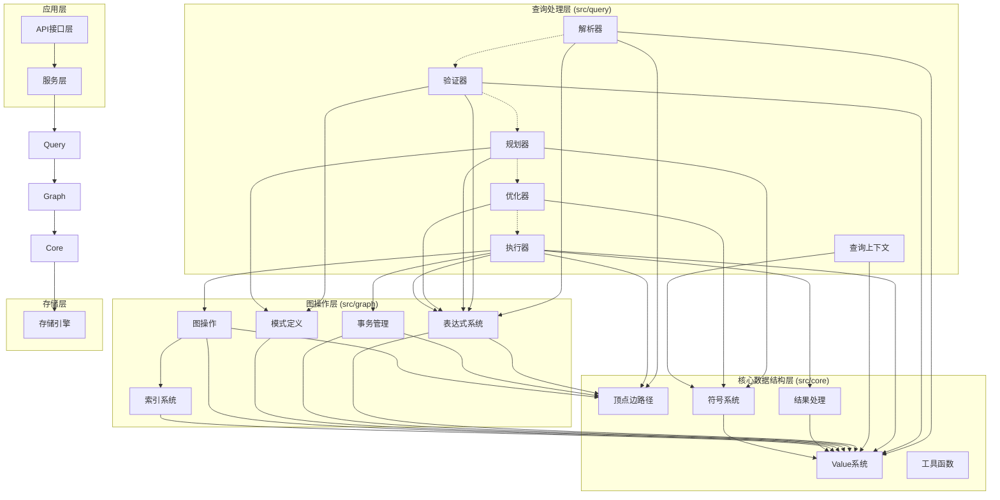
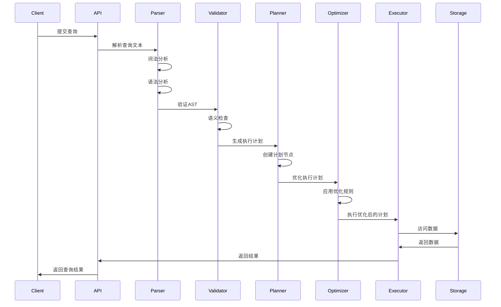
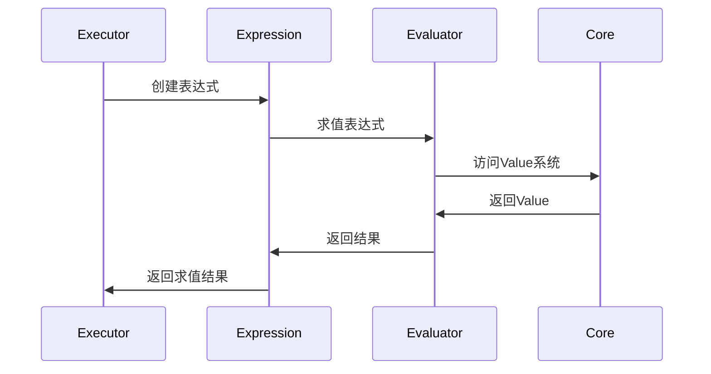

# GraphDB 架构分析：src/core、src/graph 和 src/query 目录关系

## 概述

本文档分析了 GraphDB 项目中三个核心目录 `src/core`、`src/graph` 和 `src/query` 之间的关系和架构设计。这三个目录构成了图数据库的核心功能层，分别负责基础数据结构、图操作和查询处理。

## 目录功能分析

### 1. src/core - 核心数据结构层

`src/core` 目录提供了整个系统的基础数据结构和工具函数，是其他模块的基石。

#### 核心组件：

- **Value 系统** (`value.rs`): 定义了图数据库中所有可能的数据类型
  - 基础类型：Int, Float, String, Bool, Null
  - 图类型：Vertex, Edge, Path
  - 容器类型：List, Set, Map, DataSet
  - 时间类型：Date, Time, DateTime
  - 特殊类型：Geography, Duration

- **图元素定义** (`vertex_edge_path.rs`): 
  - `Vertex`: 顶点结构，包含ID、标签和属性
  - `Edge`: 边结构，包含源顶点、目标顶点、类型和属性
  - `Path`: 路径结构，表示顶点和边的序列
  - `Tag`: 标签结构，用于顶点分类

- **结果处理** (`result/`): 
  - `ResultCore`: 结果核心结构，管理查询执行结果
  - `ResultIterator`: 结果迭代器，支持流式处理
  - `MemoryManager`: 内存管理，优化大数据集处理

- **符号系统** (`symbol/`):
  - `SymbolTable`: 符号表，管理变量和符号
  - `PlanNode`: 计划节点引用，用于查询计划

- **工具函数**:
  - `murmur.rs`: Murmur哈希算法实现
  - `lru_cache.rs`: LRU缓存实现
  - `allocator.rs`: 内存分配器

### 2. src/graph - 图操作层

`src/graph` 目录在 `core` 基础上构建，提供图数据库的核心操作功能。

#### 核心组件：

- **表达式系统** (`expression/`):
  - `Expression`: 表达式枚举，支持各种图查询表达式
  - `ExpressionEvaluator`: 表达式求值器
  - `BinaryOperator`/`UnaryOperator`: 二元和一元操作符
  - `Function`: 函数调用支持
  - `Container`: 容器操作（列表、集合、映射）

- **事务管理** (`transaction.rs`):
  - `Transaction`: 事务结构，管理操作序列
  - `TransactionManager`: 事务管理器
  - `Operation`: 操作枚举（插入、更新、删除）

- **模式定义** (`schema.rs`):
  - `SchemaDef`: 图模式定义
  - `PropertyDef`: 属性定义
  - `IndexDef`: 索引定义

- **图操作**:
  - `batch_operation.rs`: 批量操作
  - `index.rs`: 索引管理
  - `response.rs`: 响应格式化
  - `result_set.rs`: 结果集处理

### 3. src/query - 查询处理层

`src/query` 目录是最高层，负责查询语言的解析、优化和执行。

#### 核心组件：

- **解析器** (`parser/`):
  - `lexer/`: 词法分析器，将查询文本转换为标记
  - `parser/`: 语法分析器，构建AST
  - `ast/`: 抽象语法树定义
  - `expressions/`: 表达式解析和转换

- **规划器** (`planner/`):
  - `planner.rs`: 主规划器接口
  - `plan/`: 执行计划定义
  - `match_planning/`: MATCH查询规划
  - `ngql/`: NebulaGraph查询语言规划

- **执行器** (`executor/`):
  - `base.rs`: 执行器基础接口
  - `data_access.rs`: 数据访问执行器
  - `data_processing/`: 数据处理操作
  - `result_processing/`: 结果处理

- **优化器** (`optimizer/`):
  - `optimizer.rs`: 查询优化器
  - 各种优化规则：谓词下推、投影下推、连接优化等

- **验证器** (`validator/`):
  - 查询语义验证
  - 类型检查
  - 依赖分析

## 依赖关系图



## 架构层次和交互模式

### 1. 分层架构

系统采用清晰的分层架构，从底层到顶层依次为：

1. **核心数据结构层 (src/core)**: 提供基础数据类型和工具
2. **图操作层 (src/graph)**: 在核心层之上构建图操作功能
3. **查询处理层 (src/query)**: 提供完整的查询处理流程
4. **服务层**: 业务逻辑和API接口

### 2. 依赖方向

依赖关系严格遵循自上而下的方向：
- 上层模块依赖下层模块
- 同层模块之间可以有有限依赖
- 禁止下层模块依赖上层模块

### 3. 关键交互模式

#### 查询处理流程



#### 表达式求值流程



## 设计模式和原则

### 1. 设计模式

- **访问者模式**: 用于表达式求值和计划节点遍历
- **策略模式**: 用于不同的查询规划策略
- **建造者模式**: 用于复杂查询构建
- **工厂模式**: 用于执行器和计划节点创建

### 2. 设计原则

- **单一职责原则**: 每个模块有明确的职责
- **开闭原则**: 通过接口和特征支持扩展
- **依赖倒置原则**: 依赖抽象而非具体实现
- **接口隔离原则**: 提供细粒度的接口

## 代码示例

### 1. 核心数据结构使用

```rust
// 创建顶点
use crate::core::{Vertex, Value, Tag};
use std::collections::HashMap;

let mut properties = HashMap::new();
properties.insert("name".to_string(), Value::String("Alice".to_string()));
properties.insert("age".to_string(), Value::Int(30));

let tag = Tag::new("Person".to_string(), properties);
let vertex = Vertex::new(Value::Int(1), vec![tag]);
```

### 2. 表达式系统使用

```rust
// 创建和求值表达式
use crate::graph::expression::{Expression, BinaryOperator, ExpressionEvaluator};
use crate::graph::expression::context::EvalContext;

let expr = Expression::BinaryOp(
    Box::new(Expression::Property("age".to_string())),
    BinaryOperator::GreaterThan,
    Box::new(Expression::Constant(Value::Int(25)))
);

let evaluator = ExpressionEvaluator;
let context = EvalContext::new();
let result = evaluator.evaluate(&expr, &context)?;
```

### 3. 查询处理流程

```rust
// 查询处理示例
use crate::query::parser::QueryParser;
use crate::query::planner::Planner;
use crate::query::executor::Executor;

// 解析查询
let parser = QueryParser::new();
let ast = parser.parse("MATCH (n:Person) WHERE n.age > 25 RETURN n.name")?;

// 验证查询
let validator = QueryValidator::new();
validator.validate(&ast)?;

// 生成执行计划
let planner = MatchPlanner::new();
let plan = planner.transform(&ast)?;

// 优化执行计划
let optimizer = QueryOptimizer::new();
let optimized_plan = optimizer.optimize(plan)?;

// 执行查询
let executor = PlanExecutor::new(storage);
let result = executor.execute(optimized_plan).await?;
```

## 总结

`src/core`、`src/graph` 和 `src/query` 三个目录构成了 GraphDB 的核心架构，形成了清晰的分层结构：

1. **src/core** 提供了坚实的基础数据结构，是整个系统的基石
2. **src/graph** 在核心层之上构建了图操作功能，提供了表达式系统和事务管理
3. **src/query** 作为最高层，提供了完整的查询处理流程，从解析到执行

这种分层设计确保了系统的可维护性、可扩展性和模块化，使得每个层次都可以独立开发和测试，同时通过清晰的接口进行交互。依赖关系严格遵循自上而下的方向，避免了循环依赖，保持了架构的整洁性。