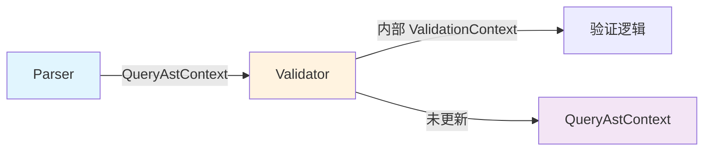

# Validator 模块问题清单与修改方案

## 问题清单

| 序号 | 问题描述 | 严重程度 | 问题类型 | 状态 |
|------|----------|----------|----------|------|
| 3.1 | 使用独立的 ValidationContext 而非 QueryAstContext | 高 | 架构问题 | 待修复 |
| 3.2 | 验证结果未存储回 AST 上下文 | 高 | 数据丢失 | 待修复 |
| 3.3 | validate_unified 方法不接收参数 | 中 | 设计缺陷 | 待修复 |
| 3.4 | 错误类型与 DBError 不统一 | 中 | 一致性问题 | 待修复 |
| 3.5 | 验证器工厂配置不够灵活 | 低 | 扩展性问题 | 待修复 |
| 3.6 | 缺乏验证结果缓存机制 | 低 | 性能问题 | 待修复 |

---

## 详细问题分析

### 问题 3.1: 使用独立的 ValidationContext

**涉及文件**: 
- `src/query/validator/base_validator.rs`
- `src/query/context/validate/context.rs`

**当前实现**:
```rust
// src/query/validator/base_validator.rs
pub struct Validator {
    context: ValidationContext,  // 独立创建
    input_var_name: String,
    no_space_required: bool,
    outputs: Vec<ColumnDef>,
    inputs: Vec<ColumnDef>,
    expr_props: ExpressionProps,
    user_defined_vars: Vec<String>,
}

impl Validator {
    pub fn new(context: ValidationContext) -> Self {
        Self {
            context,
            input_var_name: String::new(),
            no_space_required: false,
            outputs: Vec::new(),
            inputs: Vec::new(),
            expr_props: ExpressionProps::default(),
            user_defined_vars: Vec::new(),
        }
    }
}
```

**问题分析**:


**影响**:
1. **数据冗余**: Parser 生成的信息在 Validator 中被忽略，需要重新收集
2. **数据不一致**: 两个上下文可能包含不一致的信息
3. **状态丢失**: 验证状态无法传递给 Planner

---

### 问题 3.2: 验证结果未存储回 AST 上下文

**涉及文件**: `src/query/query_pipeline_manager.rs`

**当前实现**:
```rust
fn validate_query(
    &mut self,
    _query_context: &mut QueryContext,
    ast: &crate::query::context::ast::QueryAstContext,
) -> DBResult<()> {
    let _stmt = ast.base_context().sentence().ok_or_else(|| {
        DBError::Query(crate::core::error::QueryError::InvalidQuery(
            "AST 上下文中缺少语句".to_string(),
        ))
    })?;
    self.validator.validate_unified().map_err(|e| {
        DBError::Query(crate::core::error::QueryError::InvalidQuery(format!(
            "验证失败: {}",
            e
        )))
    })
}
```

**问题**:
- `validate_unified()` 方法使用内部 `ValidationContext`
- 验证结果（outputs、inputs、错误等）未写回 `QueryAstContext`
- Planner 无法获取验证结果

**缺失的数据流**:
```
QueryAstContext (输入)
    └── statement: Stmt
    └── variables: HashMap
    └── expression_contexts: Vec
    
Validator 处理后
    ├── 应该更新: outputs (输出列定义)
    ├── 应该更新: inputs (输入列定义)
    ├── 应该更新: validation_errors (验证错误)
    └── 实际: 没有任何更新
```

---

### 问题 3.3: validate_unified 方法不接收参数

**涉及文件**: `src/query/validator/base_validator.rs`

**当前实现**:
```rust
impl Validator {
    pub fn validate_unified(&mut self) -> Result<(), DBError> {
        self.validate_lifecycle().map_err(|e| {
            DBError::Query(QueryError::InvalidQuery(format!("验证失败: {}", e.message)))
        })
    }
    
    fn validate_lifecycle(&mut self) -> Result<(), ValidationError> {
        if !self.no_space_required && !self.space_chosen() {
            return Err(ValidationError::new(
                "No space selected. Use `USE <space>` to select a graph space first.".to_string(),
                ValidationErrorType::SemanticError,
            ));
        }

        self.validate_impl()?;

        if self.context.has_validation_errors() {
            let errors = self.context.get_validation_errors();
            if let Some(first_error) = errors.first() {
                return Err(first_error.clone());
            }
        }

        self.check_permission()?;

        self.to_plan()?;

        Ok(())
    }
}
```

**问题**:
- 方法签名不清晰：`validate_unified()` 没有参数，调用者无法传递上下文
- 与 `query_pipeline_manager.rs` 中的调用方式不匹配
- 无法直接操作传入的 AST 上下文

---

### 问题 3.4: 错误类型与 DBError 不统一

**涉及文件**: 
- `src/query/validator/validation_interface.rs`
- `src/query/validator/base_validator.rs`

**当前实现**:
```rust
// src/query/validator/validation_interface.rs
#[derive(Debug, Clone)]
pub struct ValidationError {
    message: String,
    error_type: ValidationErrorType,
    // 缺失: 位置信息、详细上下文
}

#[derive(Debug, Clone, PartialEq)]
pub enum ValidationErrorType {
    SemanticError,
    TypeError,
    SyntaxError,
    PermissionError,
}

// src/query/validator/base_validator.rs
impl Validator {
    pub fn add_semantic_error(&mut self, message: String) {
        self.context.add_validation_error(ValidationError::new(
            message,
            ValidationErrorType::SemanticError,
        ));
    }
    
    pub fn add_type_error(&mut self, message: String) {
        self.context.add_validation_error(ValidationError::new(
            message,
            ValidationErrorType::TypeError,
        ));
    }
}
```

**问题**:
- 没有使用 `thiserror`，错误定义分散
- 错误类型与 `DBError` 之间需要手动转换
- 错误信息格式不统一

---

## 修改方案

### 修改方案 3.1-3.3: 重构验证流程

**预估工作量**: 4-6 人天

**修改目标**:
- 让 Validator 直接操作 `QueryAstContext`
- 将验证结果存储回 `QueryAstContext`
- 改进方法签名

**修改步骤**:

**步骤 1**: 修改 Validator 结构体

```rust
// src/query/validator/base_validator.rs

use crate::query::context::ast::QueryAstContext;
use crate::core::error::{DBError, DBResult};

/// 验证器
///
/// 直接操作 QueryAstContext，验证结果存储到上下文中
pub struct Validator {
    /// 验证状态
    is_valid: bool,
    /// 错误列表
    errors: Vec<ValidationError>,
    /// 是否不需要图空间
    no_space_required: bool,
}

impl Default for Validator {
    fn default() -> Self {
        Self::new()
    }
}

impl Validator {
    pub fn new() -> Self {
        Self {
            is_valid: true,
            errors: Vec::new(),
            no_space_required: false,
        }
    }
    
    /// 使用 AST 上下文进行验证
    ///
    /// # 参数
    /// * `query_context` - 查询上下文（可选，用于访问 schema 等信息）
    /// * `ast` - AST 上下文（将被更新以包含验证结果）
    ///
    /// # 返回
    /// * 成功: Ok(())
    /// * 失败: DBError
    pub fn validate_with_ast_context(
        &mut self,
        query_context: Option<&crate::query::context::execution::QueryContext>,
        ast: &mut QueryAstContext,
    ) -> DBResult<()> {
        // 重置状态
        self.is_valid = true;
        self.errors.clear();
        
        // 验证生命周期
        self.validate_lifecycle(query_context, ast)?;
        
        // 将错误写入 AST 上下文
        for error in &self.errors {
            ast.add_validation_error(error.clone());
        }
        
        // 如果有错误，返回错误
        if !self.errors.is_empty() {
            return Err(DBError::Query(
                crate::core::error::QueryError::InvalidQuery(
                    format!("验证失败: {} 个错误", self.errors.len())
                )
            ));
        }
        
        Ok(())
    }
    
    fn validate_lifecycle(
        &mut self,
        query_context: Option<&crate::query::context::execution::QueryContext>,
        ast: &mut QueryAstContext,
    ) -> Result<(), ValidationError> {
        // 1. 检查图空间
        if !self.no_space_required {
            if !self.space_chosen(ast) {
                self.add_error(ValidationError::semantic_error(
                    "No space selected. Use `USE <space>` to select a graph space first.",
                    ast.query_text(),
                ));
                return Ok(()); // 继续处理其他错误
            }
        }
        
        // 2. 执行具体验证
        self.validate_impl(query_context, ast)?;
        
        // 3. 权限检查
        self.check_permission()?;
        
        // 4. 生成计划（如果有）
        if self.is_valid {
            self.to_plan(ast)?;
        }
        
        Ok(())
    }
    
    fn space_chosen(&self, ast: &QueryAstContext) -> bool {
        ast.base_context().space.space_id.is_some()
    }
}
```

**步骤 2**: 添加验证结果存储方法到 QueryAstContext

```rust
// src/query/context/ast/query_ast_context.rs

impl QueryAstContext {
    /// 添加验证输出列
    pub fn add_output(&mut self, name: String, type_: ValueType) {
        self.base_mut().add_output(name, type_);
    }
    
    /// 获取验证输出列
    pub fn outputs(&self) -> &[ColumnDef] {
        self.base().outputs()
    }
    
    /// 添加验证输入列
    pub fn add_input(&mut self, name: String, type_: ValueType) {
        self.base_mut().add_input(name, type_);
    }
    
    /// 获取验证输入列
    pub fn inputs(&self) -> &[ColumnDef] {
        self.base().inputs()
    }
    
    /// 添加验证错误
    pub fn add_validation_error(&mut self, error: ValidationError) {
        self.base_mut().add_validation_error(error);
    }
    
    /// 获取所有验证错误
    pub fn validation_errors(&self) -> &[ValidationError] {
        self.base().validation_errors()
    }
    
    /// 检查是否有验证错误
    pub fn has_validation_errors(&self) -> bool {
        !self.validation_errors().is_empty()
    }
}
```

**步骤 3**: 修改 AstContext 以支持验证结果

```rust
// src/query/context/ast/base.rs

#[derive(Debug, Clone, Default)]
pub struct AstContext {
    pub query_type: String,
    pub space: SpaceInfo,
    pub sentence: Option<Stmt>,
    
    // 验证结果
    outputs: Vec<ColumnDef>,
    inputs: Vec<ColumnDef>,
    validation_errors: Vec<ValidationError>,
}

impl AstContext {
    // 输出列管理
    pub fn add_output(&mut self, name: String, type_: ValueType) {
        self.outputs.push(ColumnDef { name, type_ });
    }
    
    pub fn outputs(&self) -> &[ColumnDef] {
        &self.outputs
    }
    
    // 输入列管理
    pub fn add_input(&mut self, name: String, type_: ValueType) {
        self.inputs.push(ColumnDef { name, type_ });
    }
    
    pub fn inputs(&self) -> &[ColumnDef] {
        &self.inputs
    }
    
    // 验证错误管理
    pub fn add_validation_error(&mut self, error: ValidationError) {
        self.validation_errors.push(error);
    }
    
    pub fn validation_errors(&self) -> &[ValidationError] {
        &self.validation_errors
    }
}
```

**步骤 4**: 更新 QueryPipelineManager

```rust
// src/query/query_pipeline_manager.rs

impl<S: StorageEngine + 'static> QueryPipelineManager<S> {
    /// 验证查询的语义正确性
    fn validate_query(
        &mut self,
        query_context: &mut QueryContext,
        ast: &mut QueryAstContext,
    ) -> DBResult<()> {
        // 使用 AST 上下文进行验证
        self.validator.validate_with_ast_context(
            Some(query_context),
            ast,
        )
    }
    
    /// 生成执行计划
    fn generate_execution_plan(
        &mut self,
        query_context: &mut QueryContext,
        ast: &QueryAstContext,
    ) -> DBResult<ExecutionPlan> {
        // 检查验证是否成功
        if ast.has_validation_errors() {
            let errors = ast.validation_errors();
            return Err(DBError::Query(
                crate::core::error::QueryError::InvalidQuery(format!(
                    "验证失败: {}",
                    errors.first().map(|e| e.message()).unwrap_or("unknown error")
                )
            ));
        }
        
        let ast_ctx = ast.base_context();
        self.planner.transform(ast_ctx).map_err(|e| {
            DBError::Query(crate::core::error::QueryError::PlanningError(
                format!("规划失败: {}", e)
            ))
        }).map(|sub_plan| {
            ExecutionPlan::new(sub_plan.root().clone())
        })
    }
}
```

---

### 修改方案 3.4: 统一错误类型

**预估工作量**: 2 人天

**修改代码**:

```rust
// src/query/validator/validation_interface.rs

use thiserror::Error;
use crate::core::ValueType;

/// 验证错误
#[derive(Debug, Error)]
pub enum ValidationError {
    #[error("语法错误: {message}")]
    SyntaxError {
        message: String,
        line: Option<usize>,
        column: Option<usize>,
    },
    
    #[error("语义错误: {message}")]
    SemanticError {
        message: String,
        location: Option<String>,
        #[source]
        source: Option<Box<dyn std::error::Error + Send + Sync>>,
    },
    
    #[error("类型错误: {message}\n期望: {expected:?}, 实际: {actual:?}")]
    TypeError {
        message: String,
        expected: ValueType,
        actual: ValueType,
        expression: Option<String>,
    },
    
    #[error("权限错误: {message}")]
    PermissionError {
        message: String,
        user: Option<String>,
        operation: Option<String>,
    },
    
    #[error("验证错误: {message}")]
    ValidationFailed {
        message: String,
        errors: Vec<ValidationError>,
    },
}

impl ValidationError {
    pub fn semantic_error(message: &str, location: &str) -> Self {
        ValidationError::SemanticError {
            message: message.to_string(),
            location: Some(location.to_string()),
            source: None,
        }
    }
    
    pub fn type_error(
        message: &str,
        expected: ValueType,
        actual: ValueType,
    ) -> Self {
        ValidationError::TypeError {
            message: message.to_string(),
            expected,
            actual,
            expression: None,
        }
    }
    
    pub fn with_expression(mut self, expr: &str) -> Self {
        match &mut self {
            ValidationError::TypeError { expression, .. } => {
                *expression = Some(expr.to_string());
            }
            _ => {}
        }
        self
    }
}

/// 验证错误类型
#[derive(Debug, Clone, PartialEq, Eq)]
pub enum ValidationErrorType {
    Syntax,
    Semantic,
    Type,
    Permission,
}

impl From<ValidationError> for DBError {
    fn from(e: ValidationError) -> Self {
        DBError::Query(crate::core::error::QueryError::InvalidQuery(
            e.to_string()
        ))
    }
}
```

---

### 修改方案 3.5: 增强验证器工厂

**预估工作量**: 1 人天

**修改代码**:

```rust
// src/query/validator/validation_factory.rs

use std::collections::HashMap;

/// 验证器配置
#[derive(Debug, Clone, Default)]
pub struct ValidatorConfig {
    /// 是否启用类型检查
    pub enable_type_check: bool,
    /// 是否启用权限检查
    pub enable_permission_check: bool,
    /// 最大嵌套深度
    pub max_nesting_depth: usize,
    /// 最大表达式数量
    pub max_expression_count: usize,
}

/// 验证器工厂
pub struct ValidationFactory {
    validators: HashMap<&'static str, Box<dyn Fn() -> Box<dyn Validator>>>,
    config: ValidatorConfig,
}

impl ValidationFactory {
    pub fn new() -> Self {
        let mut factory = Self {
            validators: HashMap::new(),
            config: ValidatorConfig::default(),
        };
        
        // 注册默认验证器
        factory.register("MATCH", || Box::new(MatchValidator::new()));
        factory.register("GO", || Box::new(GoValidator::new()));
        factory.register("LOOKUP", || Box::new(LookupValidator::new()));
        factory.register("FETCH_VERTICES", || Box::new(FetchVerticesValidator::new()));
        factory.register("FETCH_EDGES", || Box::new(FetchEdgesValidator::new()));
        
        factory
    }
    
    pub fn with_config(config: ValidatorConfig) -> Self {
        let mut factory = Self::new();
        factory.config = config;
        factory
    }
    
    pub fn register<F>(&mut self, name: &str, creator: F)
    where
        F: Fn() -> Box<dyn Validator> + 'static,
    {
        self.validators.insert(name, Box::new(creator));
    }
    
    pub fn create(&self, statement_type: &str) -> Box<dyn Validator> {
        if let Some(creator) = self.validators.get(statement_type) {
            creator()
        } else {
            // 默认验证器
            Box::new(BaseValidator::new())
        }
    }
    
    pub fn set_config(&mut self, config: ValidatorConfig) {
        self.config = config;
    }
}
```

---

### 修改方案 3.6: 添加验证缓存

**预估工作量**: 1 人天

**修改代码**:

```rust
// src/query/validator/validation_factory.rs

use std::sync::Mutex;
use lru_cache::LruCache;

/// 带缓存的验证器工厂
pub struct CachedValidationFactory {
    inner: ValidationFactory,
    cache: Mutex<LruCache<String, ValidatorResult>>,
    cache_size: usize,
}

#[derive(Debug, Clone)]
pub struct ValidatorResult {
    pub is_valid: bool,
    pub outputs: Vec<ColumnDef>,
    pub inputs: Vec<ColumnDef>,
    pub errors: Vec<ValidationError>,
    pub cache_key: String,
}

impl CachedValidationFactory {
    pub fn new(cache_size: usize) -> Self {
        Self {
            inner: ValidationFactory::new(),
            cache: Mutex::new(LruCache::new(cache_size)),
            cache_size,
        }
    }
    
    pub fn validate(
        &self,
        query_text: &str,
        statement_type: &str,
    ) -> DBResult<ValidatorResult> {
        let cache_key = self.generate_cache_key(query_text, statement_type);
        
        // 尝试从缓存获取
        {
            let cache = self.cache.lock().unwrap();
            if let Some(cached) = cache.get(&cache_key) {
                if cached.cache_key == cache_key {
                    return Ok(cached.clone());
                }
            }
        }
        
        // 执行验证
        let mut validator = self.inner.create(statement_type);
        let mut ast = QueryAstContext::new(query_text);
        // ... 设置语句
        
        validator.validate_with_ast_context(None, &mut ast)?;
        
        let result = ValidatorResult {
            is_valid: !ast.has_validation_errors(),
            outputs: ast.outputs().to_vec(),
            inputs: ast.inputs().to_vec(),
            errors: ast.validation_errors().to_vec(),
            cache_key,
        };
        
        // 存入缓存
        {
            let mut cache = self.cache.lock().unwrap();
            cache.insert(cache_key.clone(), result.clone());
        }
        
        Ok(result)
    }
    
    fn generate_cache_key(&self, query_text: &str, statement_type: &str) -> String {
        use std::collections::hash_map::DefaultHasher;
        use std::hash::{Hash, Hasher};
        
        let mut hasher = DefaultHasher::new();
        (query_text, statement_type).hash(&mut hasher);
        format!("{:x}", hasher.finish())
    }
}
```

---

## 修改优先级

| 序号 | 修改方案 | 优先级 | 预估工作量 | 依赖 |
|------|----------|--------|------------|------|
| 3.1-3.3 | 重构验证流程 | 高 | 4-6 人天 | 无 |
| 3.4 | 统一错误类型 | 中 | 2 人天 | 无 |
| 3.5 | 增强验证器工厂 | 低 | 1 人天 | 无 |
| 3.6 | 添加验证缓存 | 低 | 1 人天 | 无 |

---

## 测试建议

### 测试用例 1: 验证结果存储

```rust
#[cfg(test)]
mod tests {
    use super::*;
    
    #[test]
    fn test_validate_result_stored_in_ast() {
        let mut ast = QueryAstContext::new("MATCH (n:InvalidTag) RETURN n");
        ast.set_statement(Stmt::Match(MatchStmt::default()));
        
        let mut validator = Validator::new();
        let result = validator.validate_with_ast_context(None, &mut ast);
        
        // 验证错误被存储到 AST 上下文中
        assert!(ast.has_validation_errors());
    }
    
    #[test]
    fn test_outputs_stored_after_validation() {
        let mut ast = QueryAstContext::new("MATCH (n) RETURN n.name");
        ast.set_statement(Stmt::Match(MatchStmt::default()));
        
        let mut validator = Validator::new();
        validator.validate_with_ast_context(None, &mut ast).unwrap();
        
        // 验证输出列被正确设置
        let outputs = ast.outputs();
        assert!(!outputs.is_empty());
    }
}
```

---

## 风险与注意事项

### 风险 1: 验证器实现差异

- **风险**: 不同验证器（MatchValidator、GoValidator 等）可能有不同的实现假设
- **缓解措施**: 为所有验证器提供统一的接口和基类
- **实现**: 创建 `ValidatedStatement` trait

### 风险 2: 缓存一致性

- **风险**: 缓存的验证结果可能在 schema 变化后失效
- **缓解措施**: 在 schema 变更时清除缓存
- **实现**: 提供 `invalidate_cache()` 方法
