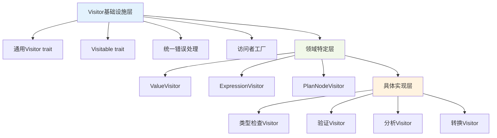
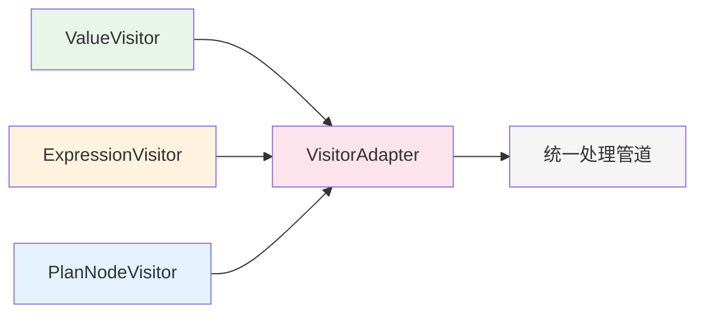
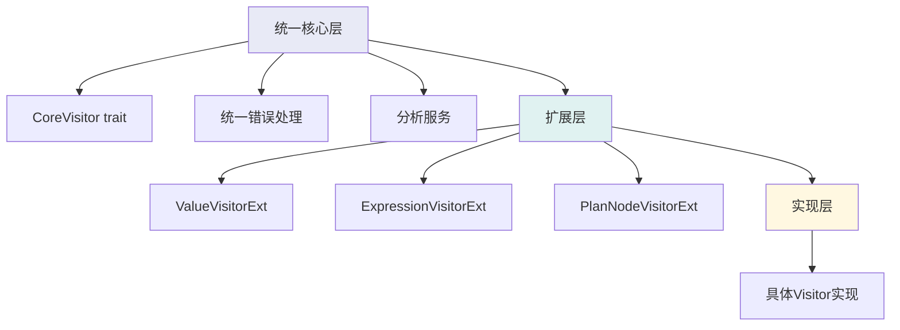
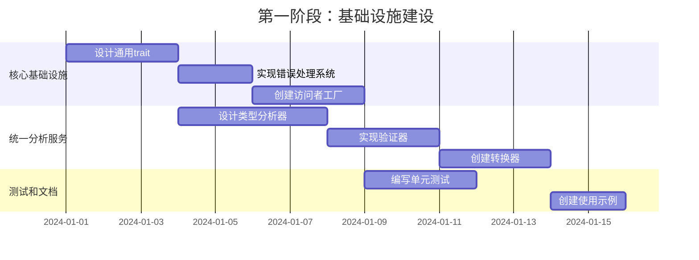

# GraphDB Visitor模块统一设计方案

## 概述

本文档基于对现有visitor模块的深入分析，提出了三种不同的统一设计方案，旨在解决`src/core/visitor`、`src/query/visitor`和`src/query/planner/plan/core/visitor`之间的功能重复和架构不一致问题。

## 现状分析

### 当前Visitor模块架构

```mermaid
graph TD
    A[src/core/visitor] --> B[ValueVisitor trait]
    A --> C[TypeCheckerVisitor]
    A --> D[ComplexityAnalyzerVisitor]
    A --> E[SerializationVisitor]
    A --> F[ValidationVisitor]
    A --> G[TransformationVisitor]
    
    H[src/query/visitor] --> I[DeduceTypeVisitor]
    H --> J[DeducePropsVisitor]
    H --> K[EvaluableExprVisitor]
    H --> L[ExtractFilterExprVisitor]
    H --> M[FindVisitor]
    H --> N[FoldConstantExprVisitor]
    
    O[src/query/planner/plan/core/visitor] --> P[PlanNodeVisitor trait]
    O --> Q[DefaultPlanNodeVisitor]
    O --> R[PlanNodeVisitError]
    
    style A fill:#e1f5fe
    style H fill:#f3e5f5
    style O fill:#e8f5e8
```



### 重复问题识别

1. **接口设计不统一**
   - `ValueVisitor`使用关联类型`Result`
   - `PlanNodeVisitor`返回固定的`Result<(), PlanNodeVisitError>`
   - 表达式visitor没有统一的trait定义

2. **功能重叠**
   - 类型检查：`TypeCheckerVisitor` vs `DeduceTypeVisitor`
   - 验证功能：`ValidationVisitor` vs 各模块的验证逻辑
   - 分析功能：`ComplexityAnalyzerVisitor` vs 表达式分析器

3. **错误处理不一致**
   - 不同的错误类型：`RecursionError`、`TypeDeductionError`、`PlanNodeVisitError`
   - 错误传播机制不统一

4. **生命周期和泛型复杂性**
   - `DeduceTypeVisitor`需要存储引擎和验证上下文
   - 其他visitor相对简单，造成设计不一致

## 设计方案

### 方案一：完全统一架构（推荐）

#### 设计理念
创建一个通用的visitor基础设施，支持所有类型的访问对象，提供统一的接口和错误处理机制。

#### 核心架构

```rust
// src/core/visitor/base.rs - 通用基础设施
pub trait Visitor<T, R = ()> {
    type Error: VisitorError;
    
    fn visit(&mut self, target: &T) -> Result<R, Self::Error>;
    fn pre_visit(&mut self) -> Result<(), Self::Error> { Ok(()) }
    fn post_visit(&mut self) -> Result<(), Self::Error> { Ok(()) }
}

pub trait Visitable<V: Visitor<Self>> {
    fn accept(&self, visitor: &mut V) -> V::Result;
}

// 统一错误处理
pub trait VisitorError: std::error::Error + Send + Sync {
    fn is_recoverable(&self) -> bool { false }
    fn context(&self) -> Option<&str> { None }
}

// 访问者注册和工厂
pub struct VisitorRegistry {
    visitors: HashMap<String, Box<dyn VisitorFactory>>,
}

pub trait VisitorFactory {
    type Output;
    fn create(&self, config: &VisitorConfig) -> Self::Output;
}
```

#### 分层设计



#### 统一类型检查

```rust
// src/core/visitor/analysis.rs
pub struct UnifiedTypeAnalyzer {
    context: AnalysisContext,
    cache: HashMap<String, TypeResult>,
}

impl UnifiedTypeAnalyzer {
    pub fn analyze_value(&mut self, value: &Value) -> Result<TypeInfo, AnalysisError>;
    pub fn analyze_expression(&mut self, expr: &Expression) -> Result<TypeInfo, AnalysisError>;
    pub fn analyze_plan_node(&mut self, node: &dyn PlanNode) -> Result<TypeInfo, AnalysisError>;
}

// 统一的类型信息
#[derive(Debug, Clone)]
pub struct TypeInfo {
    pub type_def: ValueTypeDef,
    pub category: TypeCategory,
    pub complexity: ComplexityLevel,
    pub properties: HashMap<String, Value>,
}
```

#### 迁移策略

1. **阶段1**：创建基础设施，保持现有API
2. **阶段2**：逐步迁移core visitor
3. **阶段3**：迁移query visitor
4. **阶段4**：迁移plan node visitor
5. **阶段5**：清理旧代码

#### 优势
- 完全统一的接口和错误处理
- 高度可扩展，支持未来新的visitor类型
- 性能优化潜力大（统一缓存、批处理等）
- 代码复用率高

#### 劣势
- 初始实现复杂度高
- 迁移工作量较大
- 可能引入过度抽象

---

### 方案二：模块化统一架构

#### 设计理念
保持各模块的独立性，但统一核心接口和错误处理，通过适配器模式实现互操作。

#### 核心架构

```rust
// src/core/visitor/common.rs - 共同接口
pub trait CommonVisitor<T, R = ()> {
    type Error: std::error::Error;
    
    fn visit(&mut self, target: &T) -> Result<R, Self::Error>;
}

// 各模块保持独立trait
pub trait ValueVisitor: CommonVisitor<Value> {
    // Value特定的方法
}

pub trait ExpressionVisitor: CommonVisitor<Expression> {
    // Expression特定的方法
}

pub trait PlanNodeVisitor: CommonVisitor<dyn PlanNode> {
    // PlanNode特定的方法
}

// 适配器模式
pub struct VisitorAdapter<V, T> {
    visitor: V,
    _phantom: PhantomData<T>,
}
```

#### 模块间协作



#### 优势
- 保持模块独立性
- 迁移风险较低
- 学习成本较小

#### 劣势
- 仍然存在一定的重复
- 统一程度有限
- 长期维护成本较高

---

### 方案三：混合架构

#### 设计理念
结合前两种方案的优点，在核心功能上统一，在特定功能上保持独立。

#### 核心架构

```rust
// 统一的核心功能
pub trait CoreVisitor<T, R = ()> {
    type Error: VisitorError;
    
    fn visit(&mut self, target: &T) -> Result<R, Self::Error>;
    fn pre_visit(&mut self) -> Result<(), Self::Error> { Ok(()) }
    fn post_visit(&mut self) -> Result<(), Self::Error> { Ok(()) }
}

// 领域特定扩展
pub trait ValueVisitorExt: CoreVisitor<Value> {
    fn visit_complex(&mut self, value: &Value) -> Result<(), Self::Error>;
}

pub trait ExpressionVisitorExt: CoreVisitor<Expression> {
    fn deduce_type(&mut self, expr: &Expression) -> Result<ValueTypeDef, Self::Error>;
}

// 统一的分析服务
pub struct AnalysisService {
    type_analyzer: UnifiedTypeAnalyzer,
    validator: UnifiedValidator,
    transformer: UnifiedTransformer,
}
```

#### 分层统一



#### 优势
- 平衡了统一性和灵活性
- 渐进式迁移可行
- 性能和可维护性兼顾

#### 劣势
- 架构复杂度中等
- 需要仔细设计边界

## 推荐方案：完全统一架构

### 选择理由

1. **长期收益最大**：虽然初始投入较大，但长期维护成本最低
2. **扩展性最强**：为未来功能扩展奠定良好基础
3. **性能优化潜力大**：统一架构便于实现全局优化
4. **代码质量最高**：彻底消除重复，提高一致性

### 实施计划

#### 第一阶段：基础设施建设（2-3周）



#### 第二阶段：Core Visitor迁移（2周）

1. 重构`ValueVisitor`使用新基础设施
2. 迁移`TypeCheckerVisitor`
3. 迁移`ComplexityAnalyzerVisitor`
4. 迁移其他core visitor

#### 第三阶段：Query Visitor迁移（2-3周）

1. 设计统一的`ExpressionVisitor`
2. 迁移`DeduceTypeVisitor`
3. 迁移其他表达式visitor
4. 统一类型检查逻辑

#### 第四阶段：Plan Node Visitor迁移（2周）

1. 重构`PlanNodeVisitor`使用新基础设施
2. 迁移所有plan node visitor方法
3. 优化访问性能

#### 第五阶段：优化和清理（1周）

1. 性能优化
2. 清理旧代码
3. 完善文档
4. 全面测试

### 风险缓解

1. **向后兼容性**：提供适配器保持现有API可用
2. **渐进迁移**：分阶段实施，每个阶段都可独立验证
3. **回滚计划**：保留原有实现作为备选
4. **性能监控**：持续监控性能指标

### 成功标准

1. **功能完整性**：所有现有功能正常工作
2. **性能指标**：不低于原有性能的95%
3. **代码质量**：重复代码减少50%以上
4. **可维护性**：新功能开发效率提升20%

## 结论

推荐采用**完全统一架构**方案，通过系统性的重构，建立统一的visitor基础设施。虽然初始投入较大，但长期收益显著，能够为GraphDB项目的未来发展奠定坚实的技术基础。

通过分阶段实施和严格的风险控制，可以确保重构过程的稳定性和可控性，最终实现一个高质量、高性能、高可维护性的visitor系统。