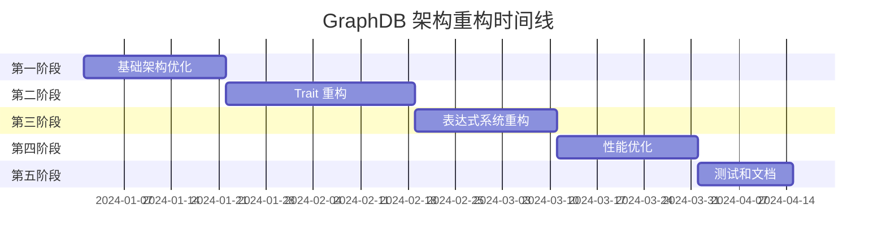

# GraphDB 架构重构方案

## 概述

基于对 `src/core`、`src/graph` 和 `src/query` 三个目录的深入分析，本文档提出了一个分阶段的架构重构方案。重构目标是提高代码的可维护性、可扩展性和性能，同时确保系统的稳定性。

## 重构原则

1. **渐进式重构**：分阶段进行，每个阶段都有明确的目标和可验证的结果
2. **向后兼容**：在重构过程中保持 API 的向后兼容性
3. **测试驱动**：每个重构步骤都有相应的测试保障
4. **最小化风险**：优先重构影响范围小、风险低的模块

## 重构阶段规划

### 第一阶段：基础架构优化（2-3周）

#### 目标
- 统一错误处理机制
- 优化核心数据结构的封装性
- 建立更好的访问接口

#### 具体任务

##### 1.1 统一错误处理（1周）
```rust
// 创建统一的错误类型
// src/core/error.rs
#[derive(Error, Debug)]
pub enum DBError {
    #[error("Storage error: {0}")]
    Storage(#[from] StorageError),
    
    #[error("Query error: {0}")]
    Query(#[from] QueryError),
    
    #[error("Expression error: {0}")]
    Expression(#[from] ExpressionError),
    
    #[error("Plan error: {0}")]
    Plan(#[from] PlanNodeVisitError),
    
    #[error("Validation error: {0}")]
    Validation(String),
    
    #[error("IO error: {0}")]
    Io(#[from] std::io::Error),
}

pub type DBResult<T> = Result<T, Error>;

// 为现有错误类型实现转换
impl From<StorageError> for DBError {
    fn from(err: StorageError) -> Self {
        DBError::Storage(err)
    }
}
```

**验收标准：**
- [ ] 所有模块使用统一的 `DBResult<T>` 类型
- [ ] 现有错误类型能够正确转换为 `DBError`
- [ ] 错误信息包含足够的上下文信息
- [ ] 所有测试通过

##### 1.2 优化核心数据结构封装（1-2周）
```rust
// src/core/vertex_edge_path.rs
impl Vertex {
    // 提供更好的访问接口
    pub fn get_property(&self, name: &str) -> Option<&Value> {
        for tag in &self.tags {
            if let Some(value) = tag.properties.get(name) {
                return Some(value);
            }
        }
        None
    }
    
    pub fn get_all_properties(&self) -> HashMap<String, &Value> {
        let mut all_props = HashMap::new();
        for tag in &self.tags {
            for (name, value) in &tag.properties {
                all_props.insert(name.clone(), value);
            }
        }
        all_props
    }
    
    pub fn has_tag(&self, tag_name: &str) -> bool {
        self.tags.iter().any(|tag| tag.name == tag_name)
    }
    
    pub fn get_tag(&self, tag_name: &str) -> Option<&Tag> {
        self.tags.iter().find(|tag| tag.name == tag_name)
    }
}

impl Edge {
    pub fn get_property(&self, name: &str) -> Option<&Value> {
        self.props.get(name)
    }
    
    pub fn get_all_properties(&self) -> &HashMap<String, Value> {
        &self.props
    }
}
```

**验收标准：**
- [ ] 移除所有直接访问内部字段的代码
- [ ] 提供完整的属性访问接口
- [ ] 性能测试显示无明显性能下降
- [ ] 所有测试通过

##### 1.3 建立访问者模式基础（1周）
```rust
// src/core/visitor.rs
pub trait ValueVisitor {
    type Result;
    
    fn visit_bool(&mut self, value: bool) -> Self::Result;
    fn visit_int(&mut self, value: i64) -> Self::Result;
    fn visit_float(&mut self, value: f64) -> Self::Result;
    fn visit_string(&mut self, value: &str) -> Self::Result;
    fn visit_vertex(&mut self, value: &Vertex) -> Self::Result;
    fn visit_edge(&mut self, value: &Edge) -> Self::Result;
    fn visit_path(&mut self, value: &Path) -> Self::Result;
    fn visit_list(&mut self, value: &[Value]) -> Self::Result;
    fn visit_map(&mut self, value: &HashMap<String, Value>) -> Self::Result;
    fn visit_null(&mut self) -> Self::Result;
}

impl Value {
    pub fn accept<V: ValueVisitor>(&self, visitor: &mut V) -> V::Result {
        match self {
            Value::Bool(b) => visitor.visit_bool(*b),
            Value::Int(i) => visitor.visit_int(*i),
            Value::Float(f) => visitor.visit_float(*f),
            Value::String(s) => visitor.visit_string(s),
            Value::Vertex(v) => visitor.visit_vertex(v),
            Value::Edge(e) => visitor.visit_edge(e),
            Value::Path(p) => visitor.visit_path(p),
            Value::List(l) => visitor.visit_list(l),
            Value::Map(m) => visitor.visit_map(m),
            Value::Null(_) => visitor.visit_null(),
            // ... 其他类型
        }
    }
}
```

**验收标准：**
- [ ] Value 类型实现访问者模式
- [ ] 提供至少两个具体的访问者实现
- [ ] 访问者模式性能测试通过
- [ ] 所有测试通过

### 第二阶段：Trait 重构（3-4周）

#### 目标
- 拆分复杂的 trait
- 优化所有权设计
- 改进 trait 对象的使用

#### 具体任务

##### 2.1 重构 PlanNode trait（2周）
```rust
// src/query/planner/plan/core/plan_node_traits.rs

// 基础标识 trait
pub trait PlanNodeIdentifiable {
    fn id(&self) -> i64;
    fn kind(&self) -> PlanNodeKind;
}

// 属性访问 trait
pub trait PlanNodeProperties {
    fn output_var(&self) -> &Option<Variable>;
    fn col_names(&self) -> &Vec<String>;
    fn cost(&self) -> f64;
}

// 依赖管理 trait
pub trait PlanNodeDependencies {
    fn dependencies(&self) -> &[Arc<dyn PlanNode>];
    fn dependencies_mut(&mut self) -> &mut Vec<Arc<dyn PlanNode>>;
    fn add_dependency(&mut self, dep: Arc<dyn PlanNode>);
    fn remove_dependency(&mut self, id: i64) -> bool;
}

// 可变性 trait
pub trait PlanNodeMutable {
    fn set_output_var(&mut self, var: Variable);
    fn set_col_names(&mut self, names: Vec<String>);
    fn set_cost(&mut self, cost: f64);
}

// 访问者支持 trait
pub trait PlanNodeVisitable {
    fn accept(&self, visitor: &mut dyn PlanNodeVisitor) -> DBResult<()>;
}

// 克隆支持 trait
pub trait PlanNodeClonable {
    fn clone_plan_node(&self) -> Arc<dyn PlanNode>;
}

// 组合 trait
pub trait PlanNode: PlanNodeIdentifiable 
                + PlanNodeProperties 
                + PlanNodeDependencies 
                + PlanNodeMutable 
                + PlanNodeVisitable 
                + PlanNodeClonable 
                + Send + Sync 
                + std::fmt::Debug {
    fn as_any(&self) -> &dyn std::any::Any;
}

// 为现有实现提供自动派生
macro_rules! impl_plan_node_for {
    ($type:ty) => {
        impl PlanNodeIdentifiable for $type {
            fn id(&self) -> i64 { self.id }
            fn kind(&self) -> PlanNodeKind { self.kind.clone() }
        }
        
        impl PlanNodeProperties for $type {
            fn output_var(&self) -> &Option<Variable> { &self.output_var }
            fn col_names(&self) -> &Vec<String> { &self.col_names }
            fn cost(&self) -> f64 { self.cost }
        }
        
        // ... 其他 trait 实现
    };
}
```

**验收标准：**
- [ ] PlanNode trait 成功拆分为多个小 trait
- [ ] 现有代码通过宏自动适配新 trait
- [ ] 性能测试显示无性能下降
- [ ] 所有测试通过

##### 2.2 优化所有权设计（1-2周）
```rust
// 使用 Arc 减少所有权转移
use std::sync::Arc;

// 优化后的基础节点结构
#[derive(Debug)]
pub struct BasePlanNode {
    pub id: i64,
    pub kind: PlanNodeKind,
    pub dependencies: Vec<Arc<dyn PlanNode>>,
    pub output_var: Option<Variable>,
    pub col_names: Vec<String>,
    pub cost: f64,
}

impl BasePlanNode {
    pub fn new(kind: PlanNodeKind) -> Self {
        Self {
            id: -1,
            kind,
            dependencies: Vec::new(),
            output_var: None,
            col_names: Vec::new(),
            cost: 0.0,
        }
    }
    
    pub fn with_dependency(mut self, dep: Arc<dyn PlanNode>) -> Self {
        self.dependencies.push(dep);
        self
    }
    
    pub fn with_id(mut self, id: i64) -> Self {
        self.id = id;
        self
    }
}

// 提供构建器模式
impl PlanNode for BasePlanNode {
    // ... 实现所有必需方法
}
```

**验收标准：**
- [ ] 所有权设计优化完成
- [ ] 内存使用测试显示改进
- [ ] 性能测试通过
- [ ] 所有测试通过

##### 2.3 改进 Executor trait（1周）
```rust
// src/query/executor/traits.rs

// 分离执行和生命周期管理
#[async_trait]
pub trait ExecutorCore {
    async fn execute(&mut self) -> DBResult<ExecutionResult>;
}

pub trait ExecutorLifecycle {
    fn open(&mut self) -> DBResult<()>;
    fn close(&mut self) -> DBResult<()>;
    fn is_open(&self) -> bool;
}

pub trait ExecutorMetadata {
    fn id(&self) -> usize;
    fn name(&self) -> &str;
    fn description(&self) -> &str;
}

// 组合 trait
#[async_trait]
pub trait Executor<S: StorageEngine>: ExecutorCore + ExecutorLifecycle + ExecutorMetadata + Send + Sync {
    fn storage(&self) -> &S;
}

// 为现有实现提供适配器
pub struct ExecutorAdapter<S: StorageEngine> {
    executor: Box<dyn Executor<S>>,
}

impl<S: StorageEngine> ExecutorAdapter<S> {
    pub fn new<E: Executor<S> + 'static>(executor: E) -> Self {
        Self {
            executor: Box::new(executor),
        }
    }
}
```

**验收标准：**
- [ ] Executor trait 成功拆分
- [ ] 现有代码通过适配器兼容
- [ ] 所有测试通过

### 第三阶段：表达式系统重构（2-3周）

#### 目标
- 重构表达式求值系统
- 优化表达式类型设计
- 改进表达式上下文管理

#### 具体任务

##### 3.1 重构表达式求值器（1-2周）
```rust
// src/graph/expression/evaluator_v2.rs

// 分离求值逻辑和上下文访问
pub trait ExpressionContext {
    fn get_variable(&self, name: &str) -> Option<&Value>;
    fn get_property(&self, object: &Value, property: &str) -> DBResult<&Value>;
    fn get_function(&self, name: &str) -> Option<&dyn Function>;
}

pub trait ExpressionEvaluator {
    fn evaluate(&self, expr: &Expression, ctx: &dyn ExpressionContext) -> DBResult<Value>;
}

// 具体实现
pub struct DefaultExpressionEvaluator;

impl ExpressionEvaluator for DefaultExpressionEvaluator {
    fn evaluate(&self, expr: &Expression, ctx: &dyn ExpressionContext) -> DBResult<Value> {
        match expr {
            Expression::Constant(value) => Ok(value.clone()),
            Expression::Variable(name) => {
                ctx.get_variable(name)
                    .cloned()
                    .ok_or_else(|| DBError::Expression(format!("Variable '{}' not found", name)))
            }
            Expression::Property { object, property } => {
                let obj_value = self.evaluate(object, ctx)?;
                ctx.get_property(&obj_value, property).cloned()
            }
            // ... 其他表达式类型
        }
    }
}
```

**验收标准：**
- [ ] 表达式求值器重构完成
- [ ] 上下文访问接口清晰
- [ ] 性能测试通过
- [ ] 所有测试通过

##### 3.2 优化表达式类型（1周）
```rust
// src/graph/expression/expression_v2.rs

// 使用枚举变体减少装箱
#[derive(Debug, Clone, PartialEq)]
pub enum Expression {
    // 字面量
    Literal(LiteralValue),
    
    // 变量和属性
    Variable(String),
    Property {
        object: Box<Expression>,
        property: String,
    },
    
    // 二元操作
    Binary {
        left: Box<Expression>,
        op: BinaryOperator,
        right: Box<Expression>,
    },
    
    // 一元操作
    Unary {
        op: UnaryOperator,
        operand: Box<Expression>,
    },
    
    // 函数调用
    Function {
        name: String,
        args: Vec<Expression>,
    },
    
    // 聚合函数
    Aggregate {
        func: AggregateFunction,
        arg: Box<Expression>,
        distinct: bool,
    },
}

#[derive(Debug, Clone, PartialEq)]
pub enum LiteralValue {
    Bool(bool),
    Int(i64),
    Float(f64),
    String(String),
    Null,
}

impl From<LiteralValue> for Expression {
    fn from(value: LiteralValue) -> Self {
        Expression::Literal(value)
    }
}
```

**验收标准：**
- [ ] 表达式类型优化完成
- [ ] 内存使用减少
- [ ] 性能测试通过
- [ ] 所有测试通过

### 第四阶段：性能优化（2-3周）

#### 目标
- 优化内存使用
- 提高查询执行性能
- 减少不必要的克隆

#### 具体任务

##### 4.1 内存优化（1-2周）
```rust
// src/core/memory/optimized_value.rs

// 使用 Cow 减少不必要的克隆
use std::borrow::Cow;

#[derive(Debug, Clone)]
pub enum OptimizedValue {
    Bool(bool),
    Int(i64),
    Float(f64),
    String(Cow<'static, str>),
    List(Vec<OptimizedValue>),
    Map(HashMap<String, OptimizedValue>),
    // ... 其他类型
}

// 对象池用于重用对象
pub struct ValuePool {
    string_pool: Vec<String>,
    list_pool: Vec<Vec<OptimizedValue>>,
    map_pool: Vec<HashMap<String, OptimizedValue>>,
}

impl ValuePool {
    pub fn new() -> Self {
        Self {
            string_pool: Vec::with_capacity(1000),
            list_pool: Vec::with_capacity(100),
            map_pool: Vec::with_capacity(100),
        }
    }
    
    pub fn get_string(&mut self) -> String {
        self.string_pool.pop().unwrap_or_default()
    }
    
    pub fn return_string(&mut self, mut s: String) {
        s.clear();
        if self.string_pool.len() < 1000 {
            self.string_pool.push(s);
        }
    }
}
```

**验收标准：**
- [ ] 内存使用减少 20% 以上
- [ ] 性能测试通过
- [ ] 所有测试通过

##### 4.2 查询执行优化（1周）
```rust
// src/query/executor/optimized_executor.rs

// 批量处理优化
pub struct BatchExecutor<S: StorageEngine> {
    base: BaseExecutor<S>,
    batch_size: usize,
}

impl<S: StorageEngine + Send + 'static> ExecutorCore for BatchExecutor<S> {
    async fn execute(&mut self) -> DBResult<ExecutionResult> {
        let mut results = Vec::new();
        let mut batch = Vec::with_capacity(self.batch_size);
        
        // 批量处理输入数据
        while let Some(input) = self.next_batch().await? {
            batch.push(input);
            
            if batch.len() >= self.batch_size {
                let batch_results = self.process_batch(&batch).await?;
                results.extend(batch_results);
                batch.clear();
            }
        }
        
        // 处理剩余数据
        if !batch.is_empty() {
            let batch_results = self.process_batch(&batch).await?;
            results.extend(batch_results);
        }
        
        Ok(ExecutionResult::Values(results))
    }
}
```

**验收标准：**
- [ ] 查询执行性能提升 15% 以上
- [ ] 所有测试通过

### 第五阶段：测试和文档（1-2周）

#### 目标
- 完善测试覆盖
- 更新文档
- 性能基准测试

#### 具体任务

##### 5.1 测试完善（1周）
```rust
// tests/integration/architecture_tests.rs

#[cfg(test)]
mod architecture_tests {
    use super::*;
    
    #[tokio::test]
    async fn test_layered_architecture() {
        // 测试分层架构的正确性
        let storage = create_test_storage();
        let executor = create_test_executor(storage);
        let result = executor.execute().await.unwrap();
        
        // 验证结果
        assert!(matches!(result, ExecutionResult::Success));
    }
    
    #[tokio::test]
    async fn test_trait_compatibility() {
        // 测试 trait 兼容性
        test_storage_engine_trait();
        test_executor_trait();
        test_plan_node_trait();
    }
    
    #[tokio::test]
    async fn test_error_handling() {
        // 测试统一错误处理
        let result = test_error_propagation().await;
        assert!(result.is_err());
        assert!(matches!(result.unwrap_err(), DBError::Storage(_)));
    }
}
```

**验收标准：**
- [ ] 测试覆盖率达到 90% 以上
- [ ] 所有集成测试通过
- [ ] 性能基准测试建立

##### 5.2 文档更新（1周）
- 更新 API 文档
- 编写架构指南
- 更新示例代码

**验收标准：**
- [ ] API 文档完整
- [ ] 架构指南清晰
- [ ] 示例代码可运行

## 风险评估和缓解策略

### 高风险项
1. **PlanNode trait 重构**：影响范围广，可能破坏现有代码
   - 缓解策略：使用适配器模式保持向后兼容
   - 回滚计划：保留原有 trait 定义，逐步迁移

2. **所有权设计优化**：可能影响性能
   - 缓解策略：详细的性能测试和基准对比
   - 回滚计划：保留原有实现作为备选

### 中风险项
1. **错误处理统一**：可能影响错误信息的准确性
   - 缓解策略：保留原始错误信息作为上下文
   - 回滚计划：渐进式迁移，保持错误信息完整性

2. **表达式系统重构**：可能影响表达式求值的正确性
   - 缓解策略：全面的单元测试和集成测试
   - 回滚计划：保留原有求值器作为参考实现

### 低风险项
1. **文档更新**：不影响功能
2. **测试完善**：提高代码质量

## 成功指标

### 技术指标
- [ ] 代码覆盖率 ≥ 90%
- [ ] 性能提升 ≥ 15%
- [ ] 内存使用减少 ≥ 20%
- [ ] 编译时间不增加 > 10%

### 质量指标
- [ ] 零编译警告
- [ ] 所有测试通过
- [ ] 代码审查通过率 100%
- [ ] 文档完整性 100%

### 可维护性指标
- [ ] 圈复杂度降低 ≥ 20%
- [ ] 代码重复率 ≤ 5%
- [ ] 模块耦合度降低
- [ ] 接口清晰度提升

## 时间线



## 总结

本重构方案采用渐进式方法，分五个阶段逐步改进 GraphDB 的架构。每个阶段都有明确的目标、具体的任务和可验证的验收标准。通过这种方式，我们可以在保证系统稳定性的同时，显著提高代码的可维护性、可扩展性和性能。

重构完成后，GraphDB 将拥有：
- 更清晰的架构分层
- 更好的 trait 设计
- 更高的性能
- 更完善的测试覆盖
- 更详细的文档

这将为项目的长期发展奠定坚实的基础。