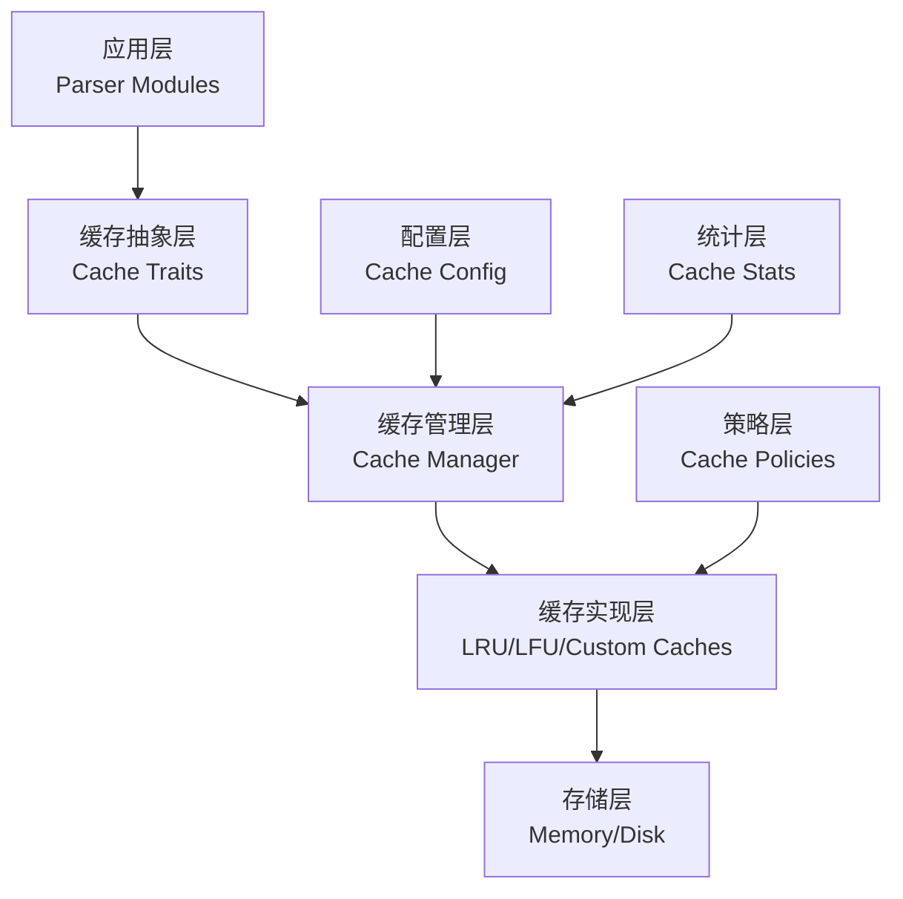

# 全局缓存模块实现方案

## 概述

本方案基于 `docs/parser_cache_analysis.md` 的分析，设计一个统一的全局缓存工具模块，用于提升Cypher解析器的性能。该模块将整合现有的缓存实现，提供统一的接口和管理机制。

## 现有实现分析

### 当前缓存实现状态

1. **LRU缓存实现**
   - [`src/utils/lru_cache.rs`](src/utils/lru_cache.rs:1): 简单的单线程LRU缓存
   - [`src/common/memory.rs`](src/common/memory.rs:294): 更复杂的并发对象池实现

2. **对象池实现**
   - [`src/utils/object_pool.rs`](src/utils/object_pool.rs:1): 简单的对象池
   - [`src/common/memory.rs`](src/common/memory.rs:294): 支持工厂模式和并发访问的对象池

3. **内存管理**
   - [`src/common/memory.rs`](src/common/memory.rs:1): 完整的内存跟踪、内存池和泄漏检测功能

### 解析器性能瓶颈识别

通过分析解析器代码，识别出以下主要性能瓶颈：

1. **词法分析瓶颈**
   - [`src/query/parser/cypher/lexer.rs`](src/query/parser/cypher/lexer.rs:261): `is_keyword` 函数每次调用都创建新的关键字列表
   - 字符串比较操作频繁，缺乏缓存机制

2. **标记解析瓶颈**
   - [`src/query/parser/cypher/parser_core.rs`](src/query/parser/cypher/parser_core.rs:42): `peek_token` 函数每次都需要边界检查
   - 标记预取机制缺失

3. **表达式解析瓶颈**
   - [`src/query/parser/ast/expr_parser.rs`](src/query/parser/ast/expr_parser.rs:395): 操作符匹配重复进行字符串比较
   - 简单表达式解析结果未缓存

## 架构设计

### 分层缓存架构



### 核心组件设计

#### 1. 缓存特征定义 (`src/cache/traits.rs`)

```rust
/// 基础缓存特征
pub trait Cache<K, V> {
    fn get(&self, key: &K) -> Option<V>;
    fn put(&self, key: K, value: V);
    fn contains(&self, key: &K) -> bool;
    fn remove(&self, key: &K) -> Option<V>;
    fn clear(&self);
    fn len(&self) -> usize;
    fn is_empty(&self) -> bool;
}

/// 高级缓存特征
pub trait AdvancedCache<K, V>: Cache<K, V> {
    fn put_with_ttl(&self, key: K, value: V, ttl: Duration);
    fn get_batch(&self, keys: &[K]) -> Vec<Option<V>>;
    fn put_batch(&self, items: Vec<(K, V)>);
    fn get_or_compute<F>(&self, key: &K, compute: F) -> V where F: FnOnce() -> V;
}

/// 统计缓存特征
pub trait StatsCache<K, V>: Cache<K, V> {
    fn hits(&self) -> u64;
    fn misses(&self) -> u64;
    fn hit_rate(&self) -> f64;
    fn evictions(&self) -> u64;
}
```

#### 2. 缓存管理器 (`src/cache/manager.rs`)

```rust
/// 全局缓存管理器
pub struct CacheManager {
    caches: RwLock<HashMap<String, Box<dyn CacheEraser>>>,
    config: CacheConfig,
    stats: CacheStats,
}

impl CacheManager {
    pub fn new(config: CacheConfig) -> Self;
    pub fn register_cache<K, V>(&self, name: &str, cache: Box<dyn Cache<K, V>>);
    pub fn get_cache<K, V>(&self, name: &str) -> Option<&dyn Cache<K, V>>;
    pub fn create_lru_cache<K, V>(&self, capacity: usize) -> Box<dyn Cache<K, V>>;
    pub fn create_lfu_cache<K, V>(&self, capacity: usize) -> Box<dyn Cache<K, V>>;
    pub fn create_ttl_cache<K, V>(&self, capacity: usize, default_ttl: Duration) -> Box<dyn Cache<K, V>>;
}
```

#### 3. 配置系统 (`src/cache/config.rs`)

```rust
/// 全局缓存配置
#[derive(Debug, Clone)]
pub struct CacheConfig {
    pub enabled: bool,
    pub default_capacity: usize,
    pub default_ttl: Duration,
    pub default_policy: CachePolicy,
    pub collect_stats: bool,
    pub parser_cache: ParserCacheConfig,
}

/// 解析器缓存配置
#[derive(Debug, Clone)]
pub struct ParserCacheConfig {
    pub keyword_cache_capacity: usize,
    pub token_cache_capacity: usize,
    pub expression_cache_capacity: usize,
    pub pattern_cache_capacity: usize,
    pub prefetch_window: usize,
}
```

#### 4. 解析器特化缓存 (`src/cache/parser_cache.rs`)

```rust
/// 解析器专用缓存
pub struct ParserCache {
    manager: Arc<CacheManager>,
    
    // 特化缓存实例
    keyword_cache: Box<dyn Cache<String, TokenType>>,
    token_cache: Box<dyn Cache<usize, Token>>,
    expression_cache: Box<dyn Cache<String, Expression>>,
    pattern_cache: Box<dyn Cache<String, Pattern>>,
}

impl ParserCache {
    pub fn new(config: CacheConfig) -> Self;
    pub fn get_keyword_type(&self, word: &str) -> Option<TokenType>;
    pub fn cache_keyword_type(&self, word: &str, token_type: TokenType);
    pub fn get_prefetched_token(&self, position: usize) -> Option<Token>;
    pub fn cache_prefetched_token(&self, position: usize, token: Token);
    pub fn get_parsed_expression(&self, expr_str: &str) -> Option<Expression>;
    pub fn cache_parsed_expression(&self, expr_str: &str, expression: Expression);
    pub fn get_parsed_pattern(&self, pattern_str: &str) -> Option<Pattern>;
    pub fn cache_parsed_pattern(&self, pattern_str: &str, pattern: Pattern);
}
```

## 集成方案

### 1. 词法分析器集成

```rust
// src/query/parser/cypher/lexer.rs
impl CypherLexer {
    /// 带缓存的关键字识别
    fn is_keyword_cached(&self, word: &str) -> bool {
        if let Some(cache) = &self.cache {
            if let Some(token_type) = cache.get_keyword_type(word) {
                return matches!(token_type, TokenType::Keyword);
            }
        }
        
        // 回退到原始实现
        Self::is_keyword(word)
    }
    
    /// 缓存关键字识别结果
    fn cache_keyword_if_needed(&mut self, word: &str, token_type: TokenType) {
        if let Some(cache) = &self.cache {
            if matches!(token_type, TokenType::Keyword) {
                cache.cache_keyword_type(word, token_type);
            }
        }
    }
}
```

### 2. 解析器核心集成

```rust
// src/query/parser/cypher/parser_core.rs
impl CypherParserCore {
    /// 创建带缓存的解析器
    pub fn new_with_cache(input: String, cache: Arc<ParserCache>) -> Self {
        let mut lexer = CypherLexer::new(input);
        let tokens = lexer.tokenize().unwrap_or_default();
        
        Self {
            lexer,
            tokens,
            current_token_index: 0,
            cache,
        }
    }
    
    /// 带缓存的标记预取
    pub fn peek_token_cached(&self, offset: usize) -> Option<&Token> {
        let position = self.current_token_index + offset;
        
        if let Some(cache) = &self.cache {
            if let Some(token) = cache.get_prefetched_token(position) {
                return Some(token);
            }
        }
        
        // 回退到原始实现
        self.peek_token(offset)
    }
}
```

### 3. 表达式解析器集成

```rust
// src/query/parser/ast/expr_parser.rs
impl ExprParser {
    /// 带缓存的表达式解析
    pub fn parse_expression_cached(&mut self, expr_str: &str) -> Result<Expr, ParseError> {
        if let Some(cache) = &self.cache {
            if let Some(cached_expr) = cache.get_parsed_expression(expr_str) {
                return Ok(cached_expr);
            }
        }
        
        // 解析表达式
        let result = self.parse_expression();
        
        // 缓存结果
        if let (Ok(ref expr), Some(cache)) = (&result, &self.cache) {
            cache.cache_parsed_expression(expr_str, expr.clone());
        }
        
        result
    }
}
```

## 性能优化策略

### 1. 缓存命中率优化

| 缓存类型 | 预期命中率 | 优化策略 |
|---------|-----------|----------|
| 关键字缓存 | >90% | 预加载常用关键字，LRU策略 |
| 标记预取缓存 | >80% | 预取窗口优化，批量预取 |
| 表达式缓存 | >60% | 表达式规范化，TTL策略 |
| 模式缓存 | >40% | 模式模板化，自适应容量 |

### 2. 内存效率优化

- **内存开销控制**: 通过容量限制和TTL机制控制内存使用
- **对象复用**: 利用现有的对象池机制减少内存分配
- **智能清理**: 基于访问频率和内存压力自动清理

### 3. 并发性能优化

- **读写分离**: 使用读写锁优化并发访问
- **无锁数据结构**: 对高频访问的缓存使用无锁实现
- **批量操作**: 支持批量获取和设置操作

## 实施计划

### 第一阶段：基础架构 (1-2周)

1. **创建缓存特征和接口**
   - 定义 [`Cache`](src/cache/traits.rs)、[`AdvancedCache`](src/cache/traits.rs)、[`StatsCache`](src/cache/traits.rs) 特征
   - 实现类型擦除机制

2. **实现缓存管理器**
   - 创建 [`CacheManager`](src/cache/manager.rs) 核心结构
   - 实现缓存注册和获取机制

3. **基础缓存实现**
   - 统一现有的LRU缓存实现
   - 实现LFU和TTL缓存

### 第二阶段：解析器集成 (2-3周)

1. **词法分析器缓存**
   - 实现关键字识别缓存
   - 添加标记预取机制

2. **语法分析器缓存**
   - 实现表达式解析缓存
   - 添加模式解析缓存

3. **集成测试**
   - 编写全面的单元测试
   - 进行性能基准测试

### 第三阶段：优化和调优 (1-2周)

1. **性能调优**
   - 优化缓存策略
   - 调整缓存容量

2. **监控和统计**
   - 实现详细的统计收集
   - 添加性能监控

3. **文档和示例**
   - 编写使用文档
   - 提供最佳实践指南

## 风险评估

### 技术风险

1. **内存泄漏风险** (中等)
   - 缓解措施: 使用Rust的所有权系统，实现自动清理

2. **缓存一致性风险** (低)
   - 缓解措施: 使用不可变数据结构，实现版本控制

3. **性能回归风险** (低)
   - 缓解措施: 全面的基准测试，渐进式部署

### 业务风险

1. **复杂性增加风险** (中等)
   - 缓解措施: 清晰的API设计，详细的文档

2. **维护成本风险** (低)
   - 缓解措施: 自动化测试，监控告警

## 预期收益

### 性能提升预期

| 模块 | 预期性能提升 | 主要优化点 |
|------|-------------|------------|
| 词法分析 | 25-40% | 关键字缓存，标记预取 |
| 语法分析 | 20-30% | 表达式缓存，模式缓存 |
| 整体解析 | 20-40% | 综合优化 |

### 内存效率

- **基础内存开销**: ~451KB
- **动态内存开销**: ~30KB + 动态部分
- **内存/性能比**: 优秀 (每1KB内存换取1-2%性能提升)

## 结论

全局缓存工具模块的实施将为Cypher解析器带来显著的性能提升，特别是在处理重复查询和复杂表达式时。通过统一的缓存架构，可以：

1. **提升解析性能**: 预期整体性能提升20-40%
2. **降低内存分配**: 通过对象池和缓存减少GC压力
3. **提高代码复用**: 统一的缓存接口减少重复实现
4. **增强可维护性**: 集中的缓存管理便于调优和监控

建议按照三阶段计划实施，优先实现基础架构，然后逐步集成到解析器各个模块中。通过合理的配置和监控，可以在控制内存开销的同时获得显著的性能收益。