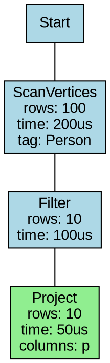

# GraphDB EXPLAIN 语句功能分析报告

## 概述

本文档详细分析 GraphDB 项目中 EXPLAIN 语句的实现功能及覆盖情况，为开发者和用户提供参考。

---

## 一、已实现的功能

### 1. 基础 EXPLAIN 功能

- **语法支持**: `EXPLAIN [FORMAT = {TABLE | DOT}] <statement>`
- **文件位置**: `src/query/parser/parsing/stmt_parser.rs`

### 2. PROFILE 功能

- **语法支持**: `PROFILE [FORMAT = {TABLE | DOT}] <statement>`
- **文件位置**: `src/query/parser/parsing/stmt_parser.rs`

### 3. 输出格式支持

| 格式 | 说明 | 实现文件 |
|------|------|----------|
| TABLE | 表格形式，人类可读 | `src/query/executor/explain/format.rs` |
| DOT | Graphviz DOT 格式，用于可视化 | `src/query/executor/explain/format.rs` |

### 4. 执行模式

- **PlanOnly 模式**: 仅显示查询计划，不实际执行
- **Analyze 模式**: 执行查询并收集实际统计信息（类似 PostgreSQL 的 EXPLAIN ANALYZE）

### 5. 统计信息收集

通过 `InstrumentedExecutor` 包装器收集：

- 实际输出行数 (`actual_rows`)
- 执行时间 (`actual_time_ms`)
- 启动时间 (`startup_time_ms`)
- 内存使用 (`memory_used`)
- 缓存命中率 (`cache_hit_rate`)
- I/O 读取统计 (`io_reads`, `io_read_bytes`)

### 6. 计划节点描述

`DescribeVisitor` 支持 50+ 种计划节点的描述，包括：

- **数据访问节点**: ScanVertices, ScanEdges, IndexScan, GetVertices, GetEdges
- **连接节点**: InnerJoin, LeftJoin, HashInnerJoin, HashLeftJoin, CrossJoin
- **处理节点**: Filter, Project, Aggregate, Sort, Limit, TopN, Dedup
- **图遍历节点**: Traverse, Expand, ExpandAll, GetNeighbors
- **集合操作节点**: Union, Minus, Intersect
- **路径算法节点**: ShortestPath, BFSShortest, AllPaths, MultiShortestPath

---

## 二、核心组件架构

```
┌─────────────────────────────────────────────────────────────────┐
│                      Explain/Profile 模块                        │
├─────────────────────────────────────────────────────────────────┤
│  ┌─────────────────┐  ┌─────────────────┐  ┌─────────────────┐ │
│  │ ExplainExecutor │  │ ProfileExecutor │  │InstrumentedExec │ │
│  │  (explain_)     │  │  (profile_)     │  │  (instrumented_)│ │
│  └────────┬────────┘  └────────┬────────┘  └────────┬────────┘ │
│           │                    │                    │          │
│           └────────────────────┴────────────────────┘          │
│                              │                                  │
│                              ▼                                  │
│           ┌─────────────────────────────────┐                  │
│           │    ExecutionStatsContext        │                  │
│           │  - 全局统计信息管理              │                  │
│           │  - 节点级统计收集                │                  │
│           └─────────────────────────────────┘                  │
└─────────────────────────────────────────────────────────────────┘
```

### 核心文件清单

| 组件 | 文件路径 | 说明 |
|------|----------|------|
| ExplainExecutor | `src/query/executor/explain/explain_executor.rs` | EXPLAIN 执行器 |
| ProfileExecutor | `src/query/executor/explain/profile_executor.rs` | PROFILE 执行器 |
| InstrumentedExecutor | `src/query/executor/explain/instrumented_executor.rs` | 统计收集包装器 |
| ExecutionStatsContext | `src/query/executor/explain/execution_stats_context.rs` | 统计上下文 |
| Format | `src/query/executor/explain/format.rs` | 输出格式化 |
| DescribeVisitor | `src/query/planning/plan/core/explain.rs` | 计划节点描述 |
| ExplainValidator | `src/query/validator/utility/explain_validator.rs` | EXPLAIN 验证器 |

---

## 三、与主流数据库对比分析

| 功能特性 | GraphDB 实现 | PostgreSQL | MySQL | Neo4j | 覆盖情况 |
|----------|-------------|------------|-------|-------|----------|
| **基础 EXPLAIN** | ✅ | ✅ | ✅ | ✅ | 完整 |
| **FORMAT 选项** | TABLE/DOT | TEXT/JSON/XML | 无 | 无 | 良好 |
| **实际执行统计** | ✅ (Analyze模式) | ✅ (ANALYZE) | ✅ (ANALYZE) | ✅ | 完整 |
| **成本估算** | ❌ | ✅ | ✅ | ✅ | **缺失** |
| **行数估算** | ❌ | ✅ | ✅ | ✅ | **缺失** |
| **索引使用提示** | 部分 | ✅ | ✅ | ✅ | 部分 |
| **缓冲区命中统计** | ✅ | ✅ | 部分 | 部分 | 良好 |
| **I/O 统计** | ✅ | ✅ | 部分 | 部分 | 良好 |
| **内存使用** | ✅ | ✅ | 部分 | 部分 | 良好 |
| **并行执行信息** | ❌ | ✅ | 部分 | 部分 | **缺失** |
| **执行时间线** | 部分 | ✅ | 部分 | 部分 | 部分 |

---

## 四、实际使用中的覆盖情况评估

### ✅ 已覆盖的场景

1. **查询计划可视化**
   - 支持 TABLE 格式查看计划结构
   - 支持 DOT 格式生成可视化图表
   - 显示节点间的依赖关系

2. **性能问题定位**
   - 通过 Analyze 模式获取实际执行时间
   - 识别慢节点（通过 `exec_duration_in_us`）
   - 查看各节点的实际输出行数

3. **缓存效率分析**
   - 统计缓存命中/未命中次数
   - 计算缓存命中率

4. **内存使用监控**
   - 跟踪执行器内存峰值
   - 识别内存密集型操作

### ❌ 未覆盖/缺失的功能

1. **成本估算系统**
   - 没有基于统计信息的成本模型
   - 无法预估行数和执行成本
   - 缺少选择性(selectivity)估算

2. **优化器提示**
   - 不支持强制使用特定索引的语法
   - 无法禁用特定优化规则

3. **详细的 I/O 统计**
   - 没有区分顺序读/随机读
   - 缺少页面访问统计

4. **并发执行信息**
   - 不支持显示并行度
   - 缺少 worker 进程统计

5. **计划对比功能**
   - 无法对比不同查询的计划差异
   - 缺少计划变化追踪

---

## 五、使用示例

### 基础 EXPLAIN

```cypher
-- 查看查询计划（TABLE 格式）
EXPLAIN MATCH (p:Person {name: 'Alice'}) RETURN p

-- 查看查询计划（DOT 格式）
EXPLAIN FORMAT = DOT MATCH (p:Person) RETURN p

-- 查看 GO 语句的计划
EXPLAIN GO 2 STEPS FROM "101" OVER follow
```

### PROFILE

```cypher
-- 执行并分析查询性能
PROFILE MATCH (p:Person)-[:FRIEND]->(f) RETURN count(f)

-- DOT 格式输出
PROFILE FORMAT = DOT GO 3 STEPS FROM "player100" OVER follow
```

### 输出示例（TABLE 格式）

```
+------+------------------+------------+------------------+--------------------------------------------------+------------------+
| id   | name             | deps       | profiling_data   | operator_info                                    | output_var       |
+------+------------------+------------+------------------+--------------------------------------------------+------------------+
|    1 | Start            | -          | -                | -                                                | -                |
|    2 | ScanVertices     | 1          | -                | tag:Person                                       | v                |
|    3 | Filter           | 2          | -                | -                                                | v                |
|    4 | Project          | 3          | -                | columns:p                                        | p                |
+------+------------------+------------+------------------+--------------------------------------------------+------------------+
```

### 输出示例（DOT 格式）



### 输出示例（TREE 格式）

```
[4] Project | columns:p | -> p
└── [3] Filter | -> v
    └── [2] ScanVertices | tag:Person | -> v
        └── [1] Start
```

---

## 六、改进建议

### 已完成的改进

1. **丰富 DescribeVisitor 信息** ✅
   - 为所有计划节点添加了依赖关系收集
   - 添加了详细的操作符信息（如扫描的表/标签、过滤条件、投影列等）
   - 支持输出变量显示

2. **优化输出格式** ✅
   - 改进了 TABLE 格式的可读性，添加了 output_var 列
   - 优化了 DOT 格式，使用 rankdir=BT 使流程更清晰
   - 添加了 TREE 格式，便于查看计划层次结构

### 待完成的改进

### 高优先级

3. **实现成本估算模型**
   - 基于表统计信息估算行数
   - 为每个计划节点添加预估成本

### 中优先级

4. **添加 EXPLAIN 选项支持**
   - `EXPLAIN (COSTS, TIMING, BUFFERS)` 语法
   - 允许用户选择显示哪些统计信息

5. **添加更多输出格式**
   - JSON 格式输出（便于程序解析）

### 低优先级

6. **计划缓存分析**
   - 显示计划是否来自缓存
   - 统计计划缓存命中率

---

## 七、总结

当前 GraphDB 的 EXPLAIN 实现已经覆盖了**基础的查询计划展示**、**实际执行统计**和**丰富的节点描述信息**，能够满足：

- 日常查询计划查看
- 基础性能问题诊断
- 执行时间分析
- 计划结构可视化（TABLE/DOT/TREE 格式）
- 详细的操作符信息（扫描表、过滤条件、投影列等）

### 本次修改内容

1. **explain.rs 修改**
   - 重构了 `DescribeVisitor`，为所有计划节点添加了依赖关系收集
   - 为各类节点添加了详细的描述信息（如 ScanVertices 显示扫描的标签、Filter 显示过滤条件等）
   - 添加了输出变量跟踪

2. **format.rs 修改**
   - 改进了 TABLE 格式，添加了 output_var 列，优化了列宽和格式化
   - 优化了 DOT 格式，使用 rankdir=BT 使数据流向更清晰，根节点使用绿色高亮
   - 新增了 TREE 格式，便于直观查看计划的层次结构

3. **文档更新**
   - 更新了输出示例，展示了新的 TABLE、DOT 和 TREE 格式
   - 更新了改进建议列表，标记已完成的项

### 后续工作

对于**深度性能优化**场景，还需要补充**成本估算系统**和**更详细的统计信息**（如缓冲区使用情况）。整体实现质量良好，架构清晰，扩展性强。

---

## 参考文档

- `docs/analysis/explain_profile_implementation_analysis.md` - 详细实现分析
- `docs/analysis/explain_profile_references.md` - 参考资料
- `docs/release/05_other_statements.md` - 语法文档
