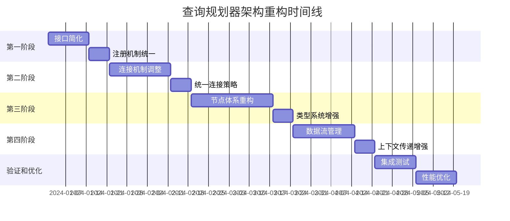

# GraphDB 查询规划器架构重构分阶段执行方案

## 概述

本文档提供了基于前期分析的详细分阶段执行方案，每个阶段都包含相应模块的分析结果、设计方案和具体实施步骤。方案旨在系统性地解决当前架构问题，提升查询规划器的质量、一致性和可维护性。

## 执行方案总览



## 第一阶段：接口简化和注册机制统一（3周）

### 1.1 模块分析结果

#### 1.1.1 当前接口问题分析

**涉及模块**：
- `src/query/planner/match_planning/core/cypher_clause_planner.rs`
- `src/query/planner/match_planning/clauses/*.rs`
- `src/query/planner/planner.rs`

**主要问题**：
1. **接口过于复杂**：`CypherClausePlanner` trait 包含不必要的 `Debug` 约束
2. **缺乏输入依赖表达**：无法明确表达子句间的输入依赖关系
3. **可变性过度**：使用 `&mut self` 增加了不必要的可变性
4. **错误处理不一致**：不同规划器的错误处理方式不统一

**Nebula-Graph 对比**：
```cpp
// Nebula-Graph 简洁的接口设计
class CypherClausePlanner {
public:
  virtual StatusOr<SubPlan> transform(CypherClauseContextBase* clauseCtx) = 0;
};
```

#### 1.1.2 注册机制问题分析

**涉及模块**：
- `src/query/planner/planner.rs`
- `src/query/planner/mod.rs`

**主要问题**：
1. **类型不安全**：使用字符串而非枚举类型进行匹配
2. **注册逻辑分散**：注册逻辑散布在多个地方
3. **匹配机制不灵活**：缺乏灵活的匹配策略

### 1.2 设计方案

#### 1.2.1 新的 CypherClausePlanner 接口设计

```rust
/// 新的子句规划器接口
/// 参考 Nebula-Graph 的简洁设计，增加输入依赖支持
pub trait CypherClausePlanner {
    /// 转换子句上下文为执行计划
    fn transform(
        &self,
        clause_ctx: &CypherClauseContext,
        input_plan: Option<&SubPlan>,
        context: &mut PlanningContext,
    ) -> Result<SubPlan, PlannerError>;
    
    /// 验证输入计划是否满足要求
    fn validate_input(&self, input_plan: Option<&SubPlan>) -> Result<(), PlannerError> {
        // 默认实现：任何输入都可以接受
        Ok(())
    }
    
    /// 获取子句类型
    fn clause_type(&self) -> ClauseType;
    
    /// 是否可以开始数据流
    fn can_start_flow(&self) -> bool {
        matches!(self.clause_type(), ClauseType::Source)
    }
    
    /// 是否需要输入
    fn requires_input(&self) -> bool {
        !self.can_start_flow()
    }
}

/// 子句类型枚举
#[derive(Debug, Clone, PartialEq)]
pub enum ClauseType {
    Source,      // 数据源子句：MATCH, LOOKUP
    Transform,   // 转换子句：WHERE, WITH, UNWIND
    Output,      // 输出子句：RETURN, YIELD
    Modifier,    // 修饰子句：ORDER BY, LIMIT, SKIP
}
```

**设计优势**：
1. **简洁性**：移除不必要的 trait 约束
2. **输入依赖**：明确表达输入依赖关系
3. **不可变性**：使用 `&self` 减少可变性
4. **类型安全**：通过枚举明确子句类型
5. **数据流支持**：支持数据流方向验证

#### 1.2.2 新的注册机制设计

```rust
/// 语句类型枚举（替代字符串）
#[derive(Debug, Clone, PartialEq, Hash, Eq)]
pub enum SentenceKind {
    Match,
    Go,
    Lookup,
    Path,
    Subgraph,
    FetchVertices,
    FetchEdges,
    Maintain,
}

/// 匹配函数类型
pub type MatchFunc = fn(&AstContext) -> bool;

/// 规划器实例化函数类型
pub type PlannerInstantiateFunc = fn() -> Box<dyn Planner>;

/// 匹配和实例化结构
#[derive(Debug, Clone)]
pub struct MatchAndInstantiate {
    pub match_func: MatchFunc,
    pub instantiate_func: PlannerInstantiateFunc,
    pub priority: i32,  // 优先级，用于匹配冲突时选择
}

/// 新的规划器注册表
#[derive(Debug)]
pub struct PlannerRegistry {
    planners: HashMap<SentenceKind, Vec<MatchAndInstantiate>>,
}

impl PlannerRegistry {
    pub fn new() -> Self {
        Self {
            planners: HashMap::new(),
        }
    }
    
    /// 注册规划器
    pub fn register_planner(
        &mut self,
        sentence_kind: SentenceKind,
        match_func: MatchFunc,
        instantiate_func: PlannerInstantiateFunc,
        priority: i32,
    ) {
        let match_and_instantiate = MatchAndInstantiate {
            match_func,
            instantiate_func,
            priority,
        };
        
        self.planners
            .entry(sentence_kind)
            .or_default()
            .push(match_and_instantiate);
        
        // 按优先级排序
        if let Some(planners) = self.planners.get_mut(&sentence_kind) {
            planners.sort_by_key(|p| -p.priority);
        }
    }
    
    /// 批量注册 MATCH 规划器
    pub fn register_match_planners(&mut self) {
        self.register_planner(
            SentenceKind::Match,
            MatchPlanner::match_ast_ctx,
            MatchPlanner::make,
            100,
        );
    }
    
    /// 批量注册 NGQL 规划器
    pub fn register_ngql_planners(&mut self) {
        self.register_planner(
            SentenceKind::Go,
            GoPlanner::match_ast_ctx,
            GoPlanner::make,
            100,
        );
        
        self.register_planner(
            SentenceKind::Lookup,
            LookupPlanner::match_ast_ctx,
            LookupPlanner::make,
            100,
        );
        
        // ... 其他 NGQL 规划器
    }
    
    /// 创建执行计划
    pub fn create_plan(&self, ast_ctx: &AstContext) -> Result<SubPlan, PlannerError> {
        let sentence_kind = self.extract_sentence_kind(ast_ctx)?;
        
        let planners = self.planners.get(&sentence_kind)
            .ok_or_else(|| PlannerError::NoSuitablePlanner(
                format!("No planners registered for sentence kind: {:?}", sentence_kind)
            ))?;
        
        for planner_info in planners {
            if (planner_info.match_func)(ast_ctx) {
                let mut planner = (planner_info.instantiate_func)();
                return planner.transform(ast_ctx);
            }
        }
        
        Err(PlannerError::NoSuitablePlanner(
            "No suitable planner found for the given AST context".to_string()
        ))
    }
    
    /// 从 AST 上下文提取语句类型
    fn extract_sentence_kind(&self, ast_ctx: &AstContext) -> Result<SentenceKind, PlannerError> {
        match ast_ctx.statement_type().to_uppercase().as_str() {
            "MATCH" => Ok(SentenceKind::Match),
            "GO" => Ok(SentenceKind::Go),
            "LOOKUP" => Ok(SentenceKind::Lookup),
            "PATH" => Ok(SentenceKind::Path),
            "SUBGRAPH" => Ok(SentenceKind::Subgraph),
            "FETCH VERTICES" => Ok(SentenceKind::FetchVertices),
            "FETCH EDGES" => Ok(SentenceKind::FetchEdges),
            _ => Err(PlannerError::UnsupportedOperation(
                format!("Unsupported statement type: {}", ast_ctx.statement_type())
            )),
        }
    }
}
```

**设计优势**：
1. **类型安全**：使用枚举替代字符串
2. **优先级支持**：支持规划器优先级
3. **批量注册**：支持批量注册相关规划器
4. **统一接口**：提供统一的注册和创建接口

### 1.3 具体实施步骤

#### 步骤 1.1：重构 CypherClausePlanner 接口（7天）

**任务清单**：
1. [ ] 创建新的 `CypherClausePlanner` trait 定义
2. [ ] 实现 `ClauseType` 枚举和相关方法
3. [ ] 更新所有子句规划器实现新接口
4. [ ] 添加单元测试验证接口变更

**详细实施**：

```rust
// 文件：src/query/planner/match_planning/core/cypher_clause_planner.rs

/// 新的子句规划器接口
pub trait CypherClausePlanner {
    fn transform(
        &self,
        clause_ctx: &CypherClauseContext,
        input_plan: Option<&SubPlan>,
        context: &mut PlanningContext,
    ) -> Result<SubPlan, PlannerError>;
    
    fn validate_input(&self, input_plan: Option<&SubPlan>) -> Result<(), PlannerError> {
        Ok(())
    }
    
    fn clause_type(&self) -> ClauseType;
    fn can_start_flow(&self) -> bool;
    fn requires_input(&self) -> bool;
}

/// 子句类型枚举
#[derive(Debug, Clone, PartialEq)]
pub enum ClauseType {
    Source,
    Transform,
    Output,
    Modifier,
}

impl ClauseType {
    pub fn is_source(&self) -> bool {
        matches!(self, ClauseType::Source)
    }
    
    pub fn is_transform(&self) -> bool {
        matches!(self, ClauseType::Transform)
    }
    
    pub fn is_output(&self) -> bool {
        matches!(self, ClauseType::Output)
    }
    
    pub fn is_modifier(&self) -> bool {
        matches!(self, ClauseType::Modifier)
    }
}
```

**更新子句规划器示例**：

```rust
// 文件：src/query/planner/match_planning/clauses/return_clause_planner.rs

impl CypherClausePlanner for ReturnClausePlanner {
    fn transform(
        &self,
        clause_ctx: &CypherClauseContext,
        input_plan: Option<&SubPlan>,
        context: &mut PlanningContext,
    ) -> Result<SubPlan, PlannerError> {
        // 验证输入
        self.validate_input(input_plan)?;
        
        // 确保有输入计划
        let input_plan = input_plan.ok_or_else(|| {
            PlannerError::MissingInput("RETURN clause requires input".to_string())
        })?;
        
        // 处理 RETURN 子句逻辑
        self.build_return(clause_ctx, input_plan, context)
    }
    
    fn clause_type(&self) -> ClauseType {
        ClauseType::Output
    }
    
    fn can_start_flow(&self) -> bool {
        false  // RETURN 不能开始数据流
    }
    
    fn requires_input(&self) -> bool {
        true   // RETURN 需要输入
    }
    
    fn validate_input(&self, input_plan: Option<&SubPlan>) -> Result<(), PlannerError> {
        if input_plan.is_none() {
            return Err(PlannerError::MissingInput(
                "RETURN clause requires input from previous clauses".to_string()
            ));
        }
        Ok(())
    }
}
```

#### 步骤 1.2：重构注册机制（7天）

**任务清单**：
1. [ ] 创建新的 `SentenceKind` 枚举
2. [ ] 实现 `PlannerRegistry` 新版本
3. [ ] 更新所有规划器的匹配和实例化函数
4. [ ] 更新 `SequentialPlanner` 使用新注册机制
5. [ ] 添加集成测试验证注册机制

**详细实施**：

```rust
// 文件：src/query/planner/planner.rs

/// 语句类型枚举
#[derive(Debug, Clone, PartialEq, Hash, Eq)]
pub enum SentenceKind {
    Match,
    Go,
    Lookup,
    Path,
    Subgraph,
    FetchVertices,
    FetchEdges,
    Maintain,
}

/// 更新 SequentialPlanner
impl SequentialPlanner {
    pub fn register_planners(registry: &mut PlannerRegistry) {
        registry.register_match_planners();
        registry.register_ngql_planners();
    }
    
    pub fn to_plan(ast_ctx: &AstContext) -> Result<SubPlan, PlannerError> {
        let mut registry = PlannerRegistry::new();
        Self::register_planners(&mut registry);
        registry.create_plan(ast_ctx)
    }
}
```

#### 步骤 1.3：测试和验证（7天）

**任务清单**：
1. [ ] 编写接口变更的单元测试
2. [ ] 编写注册机制的集成测试
3. [ ] 验证现有查询的正确性
4. [ ] 性能基准测试

**测试示例**：

```rust
// 文件：tests/planner/interface_tests.rs

#[cfg(test)]
mod tests {
    use super::*;
    
    #[test]
    fn test_clause_type_enum() {
        assert!(ClauseType::Source.is_source());
        assert!(ClauseType::Output.is_output());
        assert!(!ClauseType::Source.is_output());
    }
    
    #[test]
    fn test_return_clause_planner_interface() {
        let planner = ReturnClausePlanner::new();
        assert_eq!(planner.clause_type(), ClauseType::Output);
        assert!(!planner.can_start_flow());
        assert!(planner.requires_input());
    }
    
    #[test]
    fn test_planner_registry() {
        let mut registry = PlannerRegistry::new();
        registry.register_match_planners();
        
        // 测试注册是否成功
        assert!(registry.planners.contains_key(&SentenceKind::Match));
    }
}
```

### 1.4 验收标准

1. **接口一致性**：所有子句规划器实现统一的新接口
2. **类型安全**：使用枚举类型替代字符串匹配
3. **向后兼容**：现有查询功能不受影响
4. **测试覆盖**：新功能有完整的测试覆盖
5. **性能保持**：性能不低于重构前水平

## 第二阶段：连接机制调整（4周）

### 2.1 模块分析结果

#### 2.1.1 当前连接机制问题分析

**涉及模块**：
- `src/query/planner/match_planning/utils/connector.rs`
- `src/query/planner/match_planning/clauses/*.rs`

**主要问题**：
1. **实例方法设计**：需要创建实例才能使用连接方法
2. **缺乏上下文**：连接方法缺乏 QueryContext 参数
3. **接口不一致**：不同连接方法的参数模式不一致
4. **功能分散**：连接逻辑分散在各个规划器中

**Nebula-Graph 对比**：
```cpp
// Nebula-Graph 的静态方法设计
class SegmentsConnector final {
public:
  static SubPlan innerJoin(QueryContext* qctx, ...);
  static SubPlan leftJoin(QueryContext* qctx, ...);
  static SubPlan cartesianProduct(QueryContext* qctx, ...);
};
```

#### 2.1.2 连接策略问题分析

**主要问题**：
1. **缺乏抽象**：没有统一的连接策略抽象
2. **硬编码逻辑**：连接逻辑硬编码在各个规划器中
3. **扩展困难**：添加新的连接类型困难

### 2.2 设计方案

#### 2.2.1 新的连接机制设计

```rust
/// 连接类型枚举
#[derive(Debug, Clone, PartialEq)]
pub enum ConnectionType {
    InnerJoin,
    LeftJoin,
    RightJoin,
    FullJoin,
    Cartesian,
    RollUpApply,
    PatternApply,
    Sequential,
}

/// 连接参数
#[derive(Debug, Clone)]
pub struct ConnectionParams {
    pub connection_type: ConnectionType,
    pub intersected_aliases: HashSet<String>,
    pub copy_col_names: bool,
    pub join_keys: Option<Vec<Expression>>,
    pub filter_condition: Option<Expression>,
}

impl ConnectionParams {
    pub fn inner_join(intersected_aliases: HashSet<String>) -> Self {
        Self {
            connection_type: ConnectionType::InnerJoin,
            intersected_aliases,
            copy_col_names: false,
            join_keys: None,
            filter_condition: None,
        }
    }
    
    pub fn left_join(intersected_aliases: HashSet<String>) -> Self {
        Self {
            connection_type: ConnectionType::LeftJoin,
            intersected_aliases,
            copy_col_names: false,
            join_keys: None,
            filter_condition: None,
        }
    }
    
    pub fn cartesian() -> Self {
        Self {
            connection_type: ConnectionType::Cartesian,
            intersected_aliases: HashSet::new(),
            copy_col_names: false,
            join_keys: None,
            filter_condition: None,
        }
    }
    
    pub fn sequential(copy_col_names: bool) -> Self {
        Self {
            connection_type: ConnectionType::Sequential,
            intersected_aliases: HashSet::new(),
            copy_col_names,
            join_keys: None,
            filter_condition: None,
        }
    }
}

/// 连接策略特征
pub trait ConnectionStrategy {
    fn connect(
        &self,
        qctx: &QueryContext,
        left: &SubPlan,
        right: &SubPlan,
        params: &ConnectionParams,
    ) -> Result<SubPlan, PlannerError>;
    
    fn can_handle(&self, connection_type: &ConnectionType) -> bool;
}

/// 内连接策略
pub struct InnerJoinStrategy;

impl ConnectionStrategy for InnerJoinStrategy {
    fn connect(
        &self,
        qctx: &QueryContext,
        left: &SubPlan,
        right: &SubPlan,
        params: &ConnectionParams,
    ) -> Result<SubPlan, PlannerError> {
        if left.root.is_none() || right.root.is_none() {
            return Ok(if left.root.is_some() { left.clone() } else { right.clone() });
        }
        
        let left_root = left.root.unwrap();
        let right_root = right.root.unwrap();
        
        // 创建内连接节点
        let join_node = Arc::new(BinaryInputNode::new(
            PlanNodeKind::HashInnerJoin,
            left_root,
            right_root,
        ));
        
        // 设置连接键
        if let Some(join_keys) = &params.join_keys {
            // TODO: 设置连接键
        }
        
        Ok(SubPlan::new(
            Some(join_node.clone_plan_node()),
            Some(join_node),
        ))
    }
    
    fn can_handle(&self, connection_type: &ConnectionType) -> bool {
        matches!(connection_type, ConnectionType::InnerJoin)
    }
}

/// 左连接策略
pub struct LeftJoinStrategy;

impl ConnectionStrategy for LeftJoinStrategy {
    fn connect(
        &self,
        qctx: &QueryContext,
        left: &SubPlan,
        right: &SubPlan,
        params: &ConnectionParams,
    ) -> Result<SubPlan, PlannerError> {
        if left.root.is_none() {
            return Ok(right.clone());
        }
        if right.root.is_none() {
            return Ok(left.clone());
        }
        
        let left_root = left.root.unwrap();
        let right_root = right.root.unwrap();
        
        // 创建左连接节点
        let join_node = Arc::new(BinaryInputNode::new(
            PlanNodeKind::HashLeftJoin,
            left_root,
            right_root,
        ));
        
        // 设置连接键
        if let Some(join_keys) = &params.join_keys {
            // TODO: 设置连接键
        }
        
        Ok(SubPlan::new(
            Some(join_node.clone_plan_node()),
            Some(join_node),
        ))
    }
    
    fn can_handle(&self, connection_type: &ConnectionType) -> bool {
        matches!(connection_type, ConnectionType::LeftJoin)
    }
}

/// 笛卡尔积策略
pub struct CartesianStrategy;

impl ConnectionStrategy for CartesianStrategy {
    fn connect(
        &self,
        qctx: &QueryContext,
        left: &SubPlan,
        right: &SubPlan,
        params: &ConnectionParams,
    ) -> Result<SubPlan, PlannerError> {
        if left.root.is_none() || right.root.is_none() {
            return Ok(if left.root.is_some() { left.clone() } else { right.clone() });
        }
        
        let left_root = left.root.unwrap();
        let right_root = right.root.unwrap();
        
        // 创建笛卡尔积节点
        let cartesian_node = Arc::new(BinaryInputNode::new(
            PlanNodeKind::CartesianProduct,
            left_root,
            right_root,
        ));
        
        Ok(SubPlan::new(
            Some(cartesian_node.clone_plan_node()),
            Some(cartesian_node),
        ))
    }
    
    fn can_handle(&self, connection_type: &ConnectionType) -> bool {
        matches!(connection_type, ConnectionType::Cartesian)
    }
}

/// 顺序连接策略
pub struct SequentialStrategy;

impl ConnectionStrategy for SequentialStrategy {
    fn connect(
        &self,
        qctx: &QueryContext,
        left: &SubPlan,
        right: &SubPlan,
        params: &ConnectionParams,
    ) -> Result<SubPlan, PlannerError> {
        if left.root.is_none() {
            return Ok(right.clone());
        }
        
        // 使用引用避免移动值
        match (&left.root, &right.tail) {
            (Some(_), Some(_)) => {
                // TODO: 设置输入变量和列名
                SubPlan::new(left.root, right.tail)
            }
            _ => SubPlan::new(left.root, right.tail),
        }
    }
    
    fn can_handle(&self, connection_type: &ConnectionType) -> bool {
        matches!(connection_type, ConnectionType::Sequential)
    }
}

/// 统一的连接器
pub struct UnifiedConnector {
    strategies: HashMap<ConnectionType, Box<dyn ConnectionStrategy>>,
}

impl UnifiedConnector {
    pub fn new() -> Self {
        let mut strategies: HashMap<ConnectionType, Box<dyn ConnectionStrategy>> = HashMap::new();
        
        strategies.insert(ConnectionType::InnerJoin, Box::new(InnerJoinStrategy));
        strategies.insert(ConnectionType::LeftJoin, Box::new(LeftJoinStrategy));
        strategies.insert(ConnectionType::Cartesian, Box::new(CartesianStrategy));
        strategies.insert(ConnectionType::Sequential, Box::new(SequentialStrategy));
        
        Self { strategies }
    }
    
    pub fn connect(
        &self,
        qctx: &QueryContext,
        left: &SubPlan,
        right: &SubPlan,
        params: &ConnectionParams,
    ) -> Result<SubPlan, PlannerError> {
        let strategy = self.strategies.get(&params.connection_type)
            .ok_or_else(|| PlannerError::UnsupportedOperation(
                format!("Unsupported connection type: {:?}", params.connection_type)
            ))?;
        
        strategy.connect(qctx, left, right, params)
    }
}

// 为了向后兼容，提供静态方法
impl UnifiedConnector {
    pub fn inner_join(
        qctx: &QueryContext,
        left: &SubPlan,
        right: &SubPlan,
        intersected_aliases: HashSet<String>,
    ) -> Result<SubPlan, PlannerError> {
        let connector = Self::new();
        let params = ConnectionParams::inner_join(intersected_aliases);
        connector.connect(qctx, left, right, &params)
    }
    
    pub fn left_join(
        qctx: &QueryContext,
        left: &SubPlan,
        right: &SubPlan,
        intersected_aliases: HashSet<String>,
    ) -> Result<SubPlan, PlannerError> {
        let connector = Self::new();
        let params = ConnectionParams::left_join(intersected_aliases);
        connector.connect(qctx, left, right, &params)
    }
    
    pub fn cartesian_product(
        qctx: &QueryContext,
        left: &SubPlan,
        right: &SubPlan,
    ) -> Result<SubPlan, PlannerError> {
        let connector = Self::new();
        let params = ConnectionParams::cartesian();
        connector.connect(qctx, left, right, &params)
    }
    
    pub fn add_input(
        qctx: &QueryContext,
        left: &SubPlan,
        right: &SubPlan,
        copy_col_names: bool,
    ) -> Result<SubPlan, PlannerError> {
        let connector = Self::new();
        let params = ConnectionParams::sequential(copy_col_names);
        connector.connect(qctx, left, right, &params)
    }
}
```

**设计优势**：
1. **策略模式**：使用策略模式支持不同连接类型
2. **统一接口**：所有连接操作使用统一接口
3. **参数化**：通过参数对象支持复杂的连接配置
4. **向后兼容**：提供静态方法保持向后兼容
5. **可扩展**：易于添加新的连接策略

### 2.3 具体实施步骤

#### 步骤 2.1：实现连接策略框架（14天）

**任务清单**：
1. [ ] 创建 `ConnectionType` 枚举和 `ConnectionParams` 结构
2. [ ] 实现 `ConnectionStrategy` trait
3. [ ] 实现各种连接策略（InnerJoin, LeftJoin, Cartesian, Sequential）
4. [ ] 实现 `UnifiedConnector`
5. [ ] 添加向后兼容的静态方法

#### 步骤 2.2：更新子句规划器使用新连接机制（7天）

**任务清单**：
1. [ ] 更新 `MatchClausePlanner` 使用新连接机制
2. [ ] 更新 `ReturnClausePlanner` 使用新连接机制
3. [ ] 更新 `WithClausePlanner` 使用新连接机制
4. [ ] 更新其他子句规划器使用新连接机制

**更新示例**：

```rust
// 文件：src/query/planner/match_planning/clauses/return_clause_planner.rs

impl ReturnClausePlanner {
    fn build_return(
        &self,
        rctx: &ReturnClauseContext,
        input_plan: &SubPlan,
        context: &mut PlanningContext,
    ) -> Result<SubPlan, PlannerError> {
        // 首先处理 YIELD 子句
        let mut yield_planner = YieldClausePlanner::new();
        let yield_clause_ctx = CypherClauseContext::Yield(rctx.yield_clause.clone());
        let mut plan = yield_planner.transform(&yield_clause_ctx, Some(input_plan), context)?;
        
        // 处理 ORDER BY 子句
        if let Some(order_by) = &rctx.order_by {
            let mut order_by_planner = OrderByClausePlanner::new();
            let order_by_clause_ctx = CypherClauseContext::OrderBy(order_by.clone());
            let order_plan = order_by_planner.transform(&order_by_clause_ctx, Some(&plan), context)?;
            
            // 使用新的连接机制
            plan = UnifiedConnector::add_input(
                context.query_context(),
                &order_plan,
                &plan,
                true,
            )?;
        }
        
        // 处理分页
        if let Some(pagination) = &rctx.pagination {
            if pagination.skip != 0 || pagination.limit != i64::MAX {
                let mut pagination_planner = PaginationPlanner::new();
                let pagination_clause_ctx = CypherClauseContext::Pagination(pagination.clone());
                let pagination_plan = pagination_planner.transform(&pagination_clause_ctx, Some(&plan), context)?;
                
                plan = UnifiedConnector::add_input(
                    context.query_context(),
                    &pagination_plan,
                    &plan,
                    true,
                )?;
            }
        }
        
        // 处理去重
        if rctx.distinct {
            let dedup_node = Arc::new(SingleInputNode::new(
                PlanNodeKind::Dedup,
                plan.root.ok_or_else(|| PlannerError::InvalidOperation(
                    "Cannot create dedup node without root".to_string()
                ))?,
            ));
            
            plan = SubPlan::new(Some(dedup_node.clone_plan_node()), Some(dedup_node));
        }
        
        Ok(plan)
    }
}
```

#### 步骤 2.3：测试和验证（7天）

**任务清单**：
1. [ ] 编写连接策略的单元测试
2. [ ] 编写连接机制的集成测试
3. [ ] 验证复杂查询的连接逻辑
4. [ ] 性能基准测试

### 2.4 验收标准

1. **连接一致性**：所有连接操作使用统一机制
2. **策略可扩展**：易于添加新的连接策略
3. **向后兼容**：现有查询功能不受影响
4. **性能保持**：连接性能不低于重构前水平
5. **测试覆盖**：新功能有完整的测试覆盖

## 第三阶段：节点体系重构（5周）

### 3.1 模块分析结果

#### 3.1.1 当前节点体系问题分析

**涉及模块**：
- `src/query/planner/plan/core/plan_node.rs`
- `src/query/planner/plan/core/plan_node_kind.rs`
- `src/query/planner/match_planning/utils/node_factory.rs`

**主要问题**：
1. **通用节点类型**：使用通用的 `SingleInputNode`、`BinaryInputNode` 等
2. **缺乏具体类型**：缺乏具体的节点类型如 `FilterNode`、`ProjectNode`
3. **工厂模式复杂**：节点工厂设计过于复杂
4. **类型信息丢失**：节点类型信息在运行时丢失

**Nebula-Graph 对比**：
```cpp
// Nebula-Graph 有具体的节点类型
class FilterNode : public SingleInputNode {
public:
  FilterNode(QueryContext* qctx, PlanNode* input, Expression* condition)
      : SingleInputNode(qctx, Kind::kFilter, input) {
    condition_ = DCHECK_NOTNULL(condition);
  }
  
  Expression* condition() const { return condition_; }
  
private:
  Expression* condition_;
};
```

#### 3.1.2 节点创建问题分析

**主要问题**：
1. **创建过程复杂**：需要通过工厂方法创建节点
2. **参数传递困难**：节点特定参数难以传递
3. **类型转换频繁**：需要频繁的类型转换

### 3.2 设计方案

#### 3.2.1 新的节点体系设计

```rust
/// 基础计划节点特征
pub trait PlanNode: std::fmt::Debug + Send + Sync {
    fn id(&self) -> i64;
    fn kind(&self) -> PlanNodeKind;
    fn dependencies(&self) -> &[Arc<dyn PlanNode>];
    fn output_var(&self) -> Option<&Variable>;
    fn col_names(&self) -> &[String];
    fn cost(&self) -> f64;
    
    fn clone_plan_node(&self) -> Arc<dyn PlanNode>;
    fn accept(&self, visitor: &mut dyn PlanNodeVisitor) -> Result<(), PlanNodeVisitError>;
}

/// 单输入节点特征
pub trait SingleInputPlanNode: PlanNode {
    fn input(&self) -> &Arc<dyn PlanNode>;
    fn set_input(&mut self, input: Arc<dyn PlanNode>);
}

/// 双输入节点特征
pub trait BinaryInputPlanNode: PlanNode {
    fn left(&self) -> &Arc<dyn PlanNode>;
    fn right(&self) -> &Arc<dyn PlanNode>;
    fn set_left(&mut self, left: Arc<dyn PlanNode>);
    fn set_right(&mut self, right: Arc<dyn PlanNode>);
}

/// 过滤节点
#[derive(Debug)]
pub struct FilterNode {
    id: i64,
    input: Arc<dyn PlanNode>,
    condition: Expression,
    output_var: Option<Variable>,
    col_names: Vec<String>,
    cost: f64,
}

impl FilterNode {
    pub fn new(
        input: Arc<dyn PlanNode>,
        condition: Expression,
    ) -> Result<Self, PlannerError> {
        let col_names = input.col_names().to_vec();
        
        Ok(Self {
            id: -1,  // 将在后续分配
            input,
            condition,
            output_var: None,
            col_names,
            cost: 0.0,
        })
    }
    
    pub fn condition(&self) -> &Expression {
        &self.condition
    }
}

impl PlanNode for FilterNode {
    fn id(&self) -> i64 { self.id }
    fn kind(&self) -> PlanNodeKind { PlanNodeKind::Filter }
    fn dependencies(&self) -> &[Arc<dyn PlanNode>] { std::slice::from_ref(&self.input) }
    fn output_var(&self) -> Option<&Variable> { self.output_var.as_ref() }
    fn col_names(&self) -> &[String] { &self.col_names }
    fn cost(&self) -> f64 { self.cost }
    
    fn clone_plan_node(&self) -> Arc<dyn PlanNode> {
        Arc::new(Self {
            id: self.id,
            input: self.input.clone_plan_node(),
            condition: self.condition.clone(),
            output_var: self.output_var.clone(),
            col_names: self.col_names.clone(),
            cost: self.cost,
        })
    }
    
    fn accept(&self, visitor: &mut dyn PlanNodeVisitor) -> Result<(), PlanNodeVisitError> {
        visitor.pre_visit()?;
        visitor.visit_filter_node(self)?;
        visitor.post_visit()?;
        Ok(())
    }
}

impl SingleInputPlanNode for FilterNode {
    fn input(&self) -> &Arc<dyn PlanNode> {
        &self.input
    }
    
    fn set_input(&mut self, input: Arc<dyn PlanNode>) {
        self.input = input;
    }
}

/// 投影节点
#[derive(Debug)]
pub struct ProjectNode {
    id: i64,
    input: Arc<dyn PlanNode>,
    columns: Vec<YieldColumn>,
    output_var: Option<Variable>,
    col_names: Vec<String>,
    cost: f64,
}

impl ProjectNode {
    pub fn new(
        input: Arc<dyn PlanNode>,
        columns: Vec<YieldColumn>,
    ) -> Result<Self, PlannerError> {
        let col_names: Vec<String> = columns.iter()
            .map(|col| col.alias.clone())
            .collect();
        
        Ok(Self {
            id: -1,
            input,
            columns,
            output_var: None,
            col_names,
            cost: 0.0,
        })
    }
    
    pub fn columns(&self) -> &[YieldColumn] {
        &self.columns
    }
}

impl PlanNode for ProjectNode {
    fn id(&self) -> i64 { self.id }
    fn kind(&self) -> PlanNodeKind { PlanNodeKind::Project }
    fn dependencies(&self) -> &[Arc<dyn PlanNode>] { std::slice::from_ref(&self.input) }
    fn output_var(&self) -> Option<&Variable> { self.output_var.as_ref() }
    fn col_names(&self) -> &[String] { &self.col_names }
    fn cost(&self) -> f64 { self.cost }
    
    fn clone_plan_node(&self) -> Arc<dyn PlanNode> {
        Arc::new(Self {
            id: self.id,
            input: self.input.clone_plan_node(),
            columns: self.columns.clone(),
            output_var: self.output_var.clone(),
            col_names: self.col_names.clone(),
            cost: self.cost,
        })
    }
    
    fn accept(&self, visitor: &mut dyn PlanNodeVisitor) -> Result<(), PlanNodeVisitError> {
        visitor.pre_visit()?;
        visitor.visit_project_node(self)?;
        visitor.post_visit()?;
        Ok(())
    }
}

impl SingleInputPlanNode for ProjectNode {
    fn input(&self) -> &Arc<dyn PlanNode> {
        &self.input
    }
    
    fn set_input(&mut self, input: Arc<dyn PlanNode>) {
        self.input = input;
    }
}

/// 内连接节点
#[derive(Debug)]
pub struct InnerJoinNode {
    id: i64,
    left: Arc<dyn PlanNode>,
    right: Arc<dyn PlanNode>,
    hash_keys: Vec<Expression>,
    probe_keys: Vec<Expression>,
    output_var: Option<Variable>,
    col_names: Vec<String>,
    cost: f64,
}

impl InnerJoinNode {
    pub fn new(
        left: Arc<dyn PlanNode>,
        right: Arc<dyn PlanNode>,
        hash_keys: Vec<Expression>,
        probe_keys: Vec<Expression>,
    ) -> Result<Self, PlannerError> {
        let mut col_names = left.col_names().to_vec();
        col_names.extend(right.col_names().iter().cloned());
        
        Ok(Self {
            id: -1,
            left,
            right,
            hash_keys,
            probe_keys,
            output_var: None,
            col_names,
            cost: 0.0,
        })
    }
    
    pub fn hash_keys(&self) -> &[Expression] {
        &self.hash_keys
    }
    
    pub fn probe_keys(&self) -> &[Expression] {
        &self.probe_keys
    }
}

impl PlanNode for InnerJoinNode {
    fn id(&self) -> i64 { self.id }
    fn kind(&self) -> PlanNodeKind { PlanNodeKind::HashInnerJoin }
    fn dependencies(&self) -> &[Arc<dyn PlanNode>] {
        unsafe { std::mem::transmute([&self.left, &self.right] as [&Arc<dyn PlanNode>; 2]) }
    }
    fn output_var(&self) -> Option<&Variable> { self.output_var.as_ref() }
    fn col_names(&self) -> &[String] { &self.col_names }
    fn cost(&self) -> f64 { self.cost }
    
    fn clone_plan_node(&self) -> Arc<dyn PlanNode> {
        Arc::new(Self {
            id: self.id,
            left: self.left.clone_plan_node(),
            right: self.right.clone_plan_node(),
            hash_keys: self.hash_keys.clone(),
            probe_keys: self.probe_keys.clone(),
            output_var: self.output_var.clone(),
            col_names: self.col_names.clone(),
            cost: self.cost,
        })
    }
    
    fn accept(&self, visitor: &mut dyn PlanNodeVisitor) -> Result<(), PlanNodeVisitError> {
        visitor.pre_visit()?;
        visitor.visit_inner_join_node(self)?;
        visitor.post_visit()?;
        Ok(())
    }
}

impl BinaryInputPlanNode for InnerJoinNode {
    fn left(&self) -> &Arc<dyn PlanNode> {
        &self.left
    }
    
    fn right(&self) -> &Arc<dyn PlanNode> {
        &self.right
    }
    
    fn set_left(&mut self, left: Arc<dyn PlanNode>) {
        self.left = left;
    }
    
    fn set_right(&mut self, right: Arc<dyn PlanNode>) {
        self.right = right;
    }
}

/// 节点访问者特征
pub trait PlanNodeVisitor {
    fn pre_visit(&mut self) -> Result<(), PlanNodeVisitError>;
    fn post_visit(&mut self) -> Result<(), PlanNodeVisitError>;
    
    fn visit_filter_node(&mut self, node: &FilterNode) -> Result<(), PlanNodeVisitError>;
    fn visit_project_node(&mut self, node: &ProjectNode) -> Result<(), PlanNodeVisitError>;
    fn visit_inner_join_node(&mut self, node: &InnerJoinNode) -> Result<(), PlanNodeVisitError>;
    // ... 其他节点类型的访问方法
}

/// 节点工厂
pub struct PlanNodeFactory;

impl PlanNodeFactory {
    /// 创建过滤节点
    pub fn create_filter(
        input: Arc<dyn PlanNode>,
        condition: Expression,
    ) -> Result<Arc<dyn PlanNode>, PlannerError> {
        Ok(Arc::new(FilterNode::new(input, condition)?))
    }
    
    /// 创建投影节点
    pub fn create_project(
        input: Arc<dyn PlanNode>,
        columns: Vec<YieldColumn>,
    ) -> Result<Arc<dyn PlanNode>, PlannerError> {
        Ok(Arc::new(ProjectNode::new(input, columns)?))
    }
    
    /// 创建内连接节点
    pub fn create_inner_join(
        left: Arc<dyn PlanNode>,
        right: Arc<dyn PlanNode>,
        hash_keys: Vec<Expression>,
        probe_keys: Vec<Expression>,
    ) -> Result<Arc<dyn PlanNode>, PlannerError> {
        Ok(Arc::new(InnerJoinNode::new(left, right, hash_keys, probe_keys)?))
    }
    
    /// 创建起始节点
    pub fn create_start_node() -> Result<Arc<dyn PlanNode>, PlannerError> {
        Ok(Arc::new(StartNode::new()))
    }
    
    /// 创建占位符节点
    pub fn create_placeholder_node() -> Result<Arc<dyn PlanNode>, PlannerError> {
        Ok(Arc::new(PlaceholderNode::new()))
    }
}

/// 起始节点
#[derive(Debug)]
pub struct StartNode {
    id: i64,
    output_var: Option<Variable>,
    col_names: Vec<String>,
    cost: f64,
}

impl StartNode {
    pub fn new() -> Self {
        Self {
            id: -1,
            output_var: None,
            col_names: vec![],
            cost: 0.0,
        }
    }
}

impl PlanNode for StartNode {
    fn id(&self) -> i64 { self.id }
    fn kind(&self) -> PlanNodeKind { PlanNodeKind::Start }
    fn dependencies(&self) -> &[Arc<dyn PlanNode>] { &[] }
    fn output_var(&self) -> Option<&Variable> { self.output_var.as_ref() }
    fn col_names(&self) -> &[String] { &self.col_names }
    fn cost(&self) -> f64 { self.cost }
    
    fn clone_plan_node(&self) -> Arc<dyn PlanNode> {
        Arc::new(Self {
            id: self.id,
            output_var: self.output_var.clone(),
            col_names: self.col_names.clone(),
            cost: self.cost,
        })
    }
    
    fn accept(&self, visitor: &mut dyn PlanNodeVisitor) -> Result<(), PlanNodeVisitError> {
        visitor.pre_visit()?;
        visitor.visit_start_node(self)?;
        visitor.post_visit()?;
        Ok(())
    }
}

/// 占位符节点
#[derive(Debug)]
pub struct PlaceholderNode {
    id: i64,
    output_var: Option<Variable>,
    col_names: Vec<String>,
    cost: f64,
}

impl PlaceholderNode {
    pub fn new() -> Self {
        Self {
            id: -1,
            output_var: None,
            col_names: vec![],
            cost: 0.0,
        }
    }
}

impl PlanNode for PlaceholderNode {
    fn id(&self) -> i64 { self.id }
    fn kind(&self) -> PlanNodeKind { PlanNodeKind::Argument }
    fn dependencies(&self) -> &[Arc<dyn PlanNode>] { &[] }
    fn output_var(&self) -> Option<&Variable> { self.output_var.as_ref() }
    fn col_names(&self) -> &[String] { &self.col_names }
    fn cost(&self) -> f64 { self.cost }
    
    fn clone_plan_node(&self) -> Arc<dyn PlanNode> {
        Arc::new(Self {
            id: self.id,
            output_var: self.output_var.clone(),
            col_names: self.col_names.clone(),
            cost: self.cost,
        })
    }
    
    fn accept(&self, visitor: &mut dyn PlanNodeVisitor) -> Result<(), PlanNodeVisitError> {
        visitor.pre_visit()?;
        visitor.visit_placeholder_node(self)?;
        visitor.post_visit()?;
        Ok(())
    }
}
```

**设计优势**：
1. **具体类型**：提供具体的节点类型而非通用类型
2. **类型安全**：通过 trait 系统确保类型安全
3. **简化创建**：直接构造节点，简化创建过程
4. **访问者模式**：支持访问者模式进行节点操作
5. **工厂方法**：提供便利的工厂方法创建节点

### 3.3 具体实施步骤

#### 步骤 3.1：实现新的节点体系（28天）

**任务清单**：
1. [ ] 创建新的 `PlanNode` trait 和相关 trait
2. [ ] 实现具体的节点类型（FilterNode, ProjectNode, InnerJoinNode 等）
3. [ ] 实现 `PlanNodeFactory`
4. [ ] 更新 `PlanNodeVisitor` trait
5. [ ] 更新 `SubPlan` 结构使用新节点类型

#### 步骤 3.2：更新规划器使用新节点体系（7天）

**任务清单**：
1. [ ] 更新所有子句规划器使用新节点类型
2. [ ] 更新连接策略使用新节点类型
3. [ ] 更新执行引擎使用新节点类型

**更新示例**：

```rust
// 文件：src/query/planner/match_planning/clauses/where_clause_planner.rs

impl WhereClausePlanner {
    fn build_filter(
        &self,
        condition: Expression,
        input_plan: &SubPlan,
        context: &mut PlanningContext,
    ) -> Result<SubPlan, PlannerError> {
        let input_node = input_plan.root.ok_or_else(|| {
            PlannerError::MissingInput("WHERE clause requires input".to_string())
        })?;
        
        // 使用新的节点工厂创建过滤节点
        let filter_node = PlanNodeFactory::create_filter(input_node, condition)?;
        
        Ok(SubPlan::new(Some(filter_node.clone_plan_node()), Some(filter_node)))
    }
}
```

### 3.4 验收标准

1. **类型安全**：所有节点操作都是类型安全的
2. **简化创建**：节点创建过程简化
3. **性能保持**：节点操作性能不低于重构前
4. **向后兼容**：现有查询功能不受影响
5. **测试覆盖**：新功能有完整的测试覆盖

## 第四阶段：数据流管理和上下文传递增强（4周）

### 4.1 模块分析结果

#### 4.1.1 当前数据流管理问题分析

**涉及模块**：
- `src/query/planner/match_planning/core/match_planner.rs`
- `src/query/planner/match_planning/clauses/*.rs`

**主要问题**：
1. **缺乏数据流抽象**：没有明确的数据流方向概念
2. **起始节点创建混乱**：多个子句规划器创建起始节点
3. **上下文信息不足**：缺乏足够的上下文信息指导规划
4. **验证机制缺失**：缺乏数据流正确性验证

#### 4.1.2 上下文传递问题分析

**主要问题**：
1. **上下文信息分散**：上下文信息分散在多个地方
2. **传递机制不统一**：上下文传递机制不统一
3. **状态管理困难**：难以管理规划过程中的状态

### 4.2 设计方案

#### 4.2.1 数据流管理设计

```rust
/// 数据流方向枚举
#[derive(Debug, Clone, PartialEq)]
pub enum FlowDirection {
    Source,     // 数据源：MATCH, LOOKUP
    Transform,  // 转换：WHERE, WITH, UNWIND
    Output,     // 输出：RETURN, YIELD
    Combine,    // 组合：UNION, JOIN
}

/// 数据流节点特征
pub trait DataFlowNode {
    /// 输入要求
    fn input_requirements(&self) -> Vec<VariableRequirement>;
    
    /// 输出提供
    fn output_provides(&self) -> Vec<VariableProvider>;
    
    /// 是否可以开始数据流
    fn can_start_flow(&self) -> bool;
    
    /// 是否需要输入
    fn requires_input(&self) -> bool;
    
    /// 数据流方向
    fn flow_direction(&self) -> FlowDirection;
    
    /// 验证数据流
    fn validate_data_flow(&self, input: Option<&SubPlan>) -> Result<(), PlannerError>;
}

/// 变量要求
#[derive(Debug, Clone)]
pub struct VariableRequirement {
    pub name: String,
    pub var_type: VariableType,
    pub required: bool,  // 是否必需
}

/// 变量提供
#[derive(Debug, Clone)]
pub struct VariableProvider {
    pub name: String,
    pub var_type: VariableType,
    pub nullable: bool,  // 是否可为空
}

/// 数据流验证器
pub struct DataFlowValidator;

impl DataFlowValidator {
    /// 验证子句规划器的数据流
    pub fn validate_clause_flow(
        planner: &dyn CypherClausePlanner,
        input_plan: Option<&SubPlan>,
        context: &PlanningContext,
    ) -> Result<(), PlannerError> {
        // 验证输入要求
        if planner.requires_input() && input_plan.is_none() {
            return Err(PlannerError::MissingInput(
                format!("{} clause requires input", planner.clause_type())
            ));
        }
        
        // 验证数据流方向
        if planner.can_start_flow() && input_plan.is_some() {
            // 起始子句不应该有输入
            return Err(PlannerError::InvalidOperation(
                format!("{} clause should not have input", planner.clause_type())
            ));
        }
        
        // 验证变量依赖
        if let Some(input) = input_plan {
            Self::validate_variable_dependencies(planner, input, context)?;
        }
        
        Ok(())
    }
    
    /// 验证变量依赖
    fn validate_variable_dependencies(
        planner: &dyn CypherClausePlanner,
        input_plan: &SubPlan,
        context: &PlanningContext,
    ) -> Result<(), PlannerError> {
        let requirements = planner.input_requirements();
        
        for requirement in &requirements {
            if requirement.required {
                // 检查输入计划是否提供所需变量
                let input_vars: HashSet<String> = input_plan.root
                    .as_ref()
                    .map(|node| node.col_names().iter().cloned().collect())
                    .unwrap_or_default();
                
                if !input_vars.contains(&requirement.name) {
                    return Err(PlannerError::MissingVariable(
                        format!("Required variable '{}' not found in input", requirement.name)
                    ));
                }
            }
        }
        
        Ok(())
    }
    
    /// 验证查询的数据流
    pub fn validate_query_flow(
        clauses: &[&dyn CypherClausePlanner],
        context: &PlanningContext,
    ) -> Result<(), PlannerError> {
        if clauses.is_empty() {
            return Ok(());
        }
        
        // 第一个子句必须是数据源
        if !clauses[0].can_start_flow() {
            return Err(PlannerError::InvalidOperation(
                "First clause must be a data source".to_string()
            ));
        }
        
        // 验证后续子句的数据流
        for i in 1..clauses.len() {
            let prev_clause = &clauses[i - 1];
            let current_clause = &clauses[i];
            
            // 检查数据流方向是否合理
            if !Self::is_valid_flow_transition(
                prev_clause.flow_direction(),
                current_clause.flow_direction(),
            ) {
                return Err(PlannerError::InvalidOperation(
                    format!(
                        "Invalid flow transition from {:?} to {:?}",
                        prev_clause.flow_direction(),
                        current_clause.flow_direction()
                    )
                ));
            }
        }
        
        // 最后一个子句应该是输出
        let last_clause = clauses.last().unwrap();
        if !matches!(last_clause.flow_direction(), FlowDirection::Output) {
            return Err(PlannerError::InvalidOperation(
                "Last clause should be an output clause".to_string()
            ));
        }
        
        Ok(())
    }
    
    /// 检查数据流转换是否有效
    fn is_valid_flow_transition(
        from: FlowDirection,
        to: FlowDirection,
    ) -> bool {
        match (from, to) {
            (FlowDirection::Source, FlowDirection::Transform) => true,
            (FlowDirection::Source, FlowDirection::Output) => true,
            (FlowDirection::Transform, FlowDirection::Transform) => true,
            (FlowDirection::Transform, FlowDirection::Output) => true,
            (FlowDirection::Transform, FlowDirection::Combine) => true,
            (FlowDirection::Combine, FlowDirection::Transform) => true,
            (FlowDirection::Combine, FlowDirection::Output) => true,
            _ => false,
        }
    }
}

/// 为 CypherClausePlanner 实现 DataFlowNode
impl<T> DataFlowNode for T
where
    T: CypherClausePlanner,
{
    fn input_requirements(&self) -> Vec<VariableRequirement> {
        // 默认实现：无特殊要求
        vec![]
    }
    
    fn output_provides(&self) -> Vec<VariableProvider> {
        // 默认实现：提供所有输出变量
        vec![]
    }
    
    fn can_start_flow(&self) -> bool {
        CypherClausePlanner::can_start_flow(self)
    }
    
    fn requires_input(&self) -> bool {
        CypherClausePlanner::requires_input(self)
    }
    
    fn flow_direction(&self) -> FlowDirection {
        match self.clause_type() {
            ClauseType::Source => FlowDirection::Source,
            ClauseType::Transform => FlowDirection::Transform,
            ClauseType::Output => FlowDirection::Output,
            ClauseType::Modifier => FlowDirection::Transform,
        }
    }
    
    fn validate_data_flow(&self, input: Option<&SubPlan>) -> Result<(), PlannerError> {
        DataFlowValidator::validate_clause_flow(self, input, &PlanningContext::default())
    }
}
```

#### 4.2.2 上下文传递增强设计

```rust
/// 规划上下文
#[derive(Debug, Clone)]
pub struct PlanningContext {
    pub query_context: QueryContext,
    pub available_variables: HashMap<String, VariableType>,
    pub generated_variables: HashMap<String, VariableType>,
    pub current_scope: Vec<String>,
    pub flow_stack: Vec<FlowDirection>,
    pub planning_options: PlanningOptions,
    pub variable_dependencies: HashMap<String, Vec<String>>,
}

/// 规划选项
#[derive(Debug, Clone)]
pub struct PlanningOptions {
    pub enable_optimization: bool,
    pub enable_parallel_planning: bool,
    pub max_plan_depth: usize,
    pub cost_threshold: f64,
}

impl Default for PlanningOptions {
    fn default() -> Self {
        Self {
            enable_optimization: true,
            enable_parallel_planning: false,
            max_plan_depth: 100,
            cost_threshold: 1000.0,
        }
    }
}

impl PlanningContext {
    pub fn new(query_context: QueryContext) -> Self {
        Self {
            query_context,
            available_variables: HashMap::new(),
            generated_variables: HashMap::new(),
            current_scope: vec![],
            flow_stack: vec![],
            planning_options: PlanningOptions::default(),
            variable_dependencies: HashMap::new(),
        }
    }
    
    /// 推入新的作用域
    pub fn push_scope(&mut self, scope: String) {
        self.current_scope.push(scope);
    }
    
    /// 弹出当前作用域
    pub fn pop_scope(&mut self) -> Option<String> {
        self.current_scope.pop()
    }
    
    /// 获取当前作用域
    pub fn current_scope(&self) -> Option<&str> {
        self.current_scope.last().map(|s| s.as_str())
    }
    
    /// 推入数据流方向
    pub fn push_flow_direction(&mut self, direction: FlowDirection) {
        self.flow_stack.push(direction);
    }
    
    /// 弹出数据流方向
    pub fn pop_flow_direction(&mut self) -> Option<FlowDirection> {
        self.flow_stack.pop()
    }
    
    /// 获取当前数据流方向
    pub fn current_flow_direction(&self) -> FlowDirection {
        self.flow_stack.last().copied().unwrap_or(FlowDirection::Source)
    }
    
    /// 添加可用变量
    pub fn add_available_variable(&mut self, name: String, var_type: VariableType) {
        self.available_variables.insert(name, var_type);
    }
    
    /// 添加生成变量
    pub fn add_generated_variable(&mut self, name: String, var_type: VariableType) {
        self.generated_variables.insert(name.clone(), var_type);
        self.add_available_variable(name, var_type);
    }
    
    /// 检查变量是否可用
    pub fn is_variable_available(&self, name: &str) -> bool {
        self.available_variables.contains_key(name)
    }
    
    /// 获取变量类型
    pub fn get_variable_type(&self, name: &str) -> Option<&VariableType> {
        self.available_variables.get(name)
    }
    
    /// 添加变量依赖
    pub fn add_variable_dependency(&mut self, variable: String, dependency: String) {
        self.variable_dependencies
            .entry(variable)
            .or_default()
            .push(dependency);
    }
    
    /// 获取变量依赖
    pub fn get_variable_dependencies(&self, variable: &str) -> Option<&[String]> {
        self.variable_dependencies.get(variable).map(|deps| deps.as_slice())
    }
    
    /// 验证变量依赖
    pub fn validate_variable_dependencies(&self) -> Result<(), PlannerError> {
        for (variable, dependencies) in &self.variable_dependencies {
            for dependency in dependencies {
                if !self.is_variable_available(dependency) {
                    return Err(PlannerError::MissingVariable(
                        format!("Variable '{}' depends on missing variable '{}'", variable, dependency)
                    ));
                }
            }
        }
        Ok(())
    }
    
    /// 创建子上下文
    pub fn create_child_context(&self) -> Self {
        Self {
            query_context: self.query_context.clone(),
            available_variables: self.available_variables.clone(),
            generated_variables: HashMap::new(),
            current_scope: self.current_scope.clone(),
            flow_stack: self.flow_stack.clone(),
            planning_options: self.planning_options.clone(),
            variable_dependencies: HashMap::new(),
        }
    }
    
    /// 合并子上下文
    pub fn merge_child_context(&mut self, child: PlanningContext) {
        // 合并生成的变量
        for (name, var_type) in child.generated_variables {
            self.add_generated_variable(name, var_type);
        }
        
        // 合并变量依赖
        for (variable, dependencies) in child.variable_dependencies {
            for dependency in dependencies {
                self.add_variable_dependency(variable, dependency);
            }
        }
    }
}

/// 上下文管理器
pub struct ContextManager {
    context_stack: Vec<PlanningContext>,
}

impl ContextManager {
    pub fn new(root_context: PlanningContext) -> Self {
        Self {
            context_stack: vec![root_context],
        }
    }
    
    /// 推入新的上下文
    pub fn push_context(&mut self, context: PlanningContext) {
        self.context_stack.push(context);
    }
    
    /// 弹出当前上下文
    pub fn pop_context(&mut self) -> Option<PlanningContext> {
        self.context_stack.pop()
    }
    
    /// 获取当前上下文
    pub fn current_context(&self) -> &PlanningContext {
        self.context_stack.last().unwrap()
    }
    
    /// 获取当前上下文的可变引用
    pub fn current_context_mut(&mut self) -> &mut PlanningContext {
        self.context_stack.last_mut().unwrap()
    }
    
    /// 在子上下文中执行操作
    pub fn with_child_context<F, R>(&mut self, f: F) -> R
    where
        F: FnOnce(&mut PlanningContext) -> R,
    {
        let child_context = self.current_context().create_child_context();
        self.push_context(child_context);
        
        let result = f(self.current_context_mut());
        
        let child_context = self.pop_context().unwrap();
        self.current_context_mut().merge_child_context(child_context);
        
        result
    }
}
```

**设计优势**：
1. **数据流抽象**：提供明确的数据流方向管理
2. **验证机制**：内置数据流正确性验证
3. **上下文增强**：提供丰富的上下文信息
4. **作用域管理**：支持嵌套作用域管理
5. **依赖跟踪**：支持变量依赖关系跟踪

### 4.3 具体实施步骤

#### 步骤 4.1：实现数据流管理（21天）

**任务清单**：
1. [ ] 创建 `FlowDirection` 枚举和相关结构
2. [ ] 实现 `DataFlowNode` trait
3. [ ] 实现 `DataFlowValidator`
4. [ ] 为所有子句规划器实现 `DataFlowNode`
5. [ ] 添加数据流验证到规划过程

#### 步骤 4.2：实现上下文传递增强（7天）

**任务清单**：
1. [ ] 创建新的 `PlanningContext` 结构
2. [ ] 实现 `ContextManager`
3. [ ] 更新所有规划器使用新上下文
4. [ ] 添加上下文验证机制

### 4.4 验收标准

1. **数据流正确性**：所有查询的数据流都是正确的
2. **起始节点问题解决**：不再有错误的起始节点创建
3. **上下文完整性**：上下文信息完整且一致
4. **验证机制有效**：能够有效捕获数据流错误
5. **性能保持**：规划性能不低于重构前水平

## 第五阶段：集成测试和性能优化（4周）

### 5.1 集成测试（2周）

#### 5.1.1 测试范围

1. **功能测试**：验证所有查询功能正常
2. **回归测试**：确保现有查询不受影响
3. **边界测试**：测试各种边界情况
4. **性能测试**：验证性能不低于重构前

#### 5.1.2 测试实施

**任务清单**：
1. [ ] 编写全面的集成测试套件
2. [ ] 执行回归测试
3. [ ] 执行性能基准测试
4. [ ] 修复发现的问题

### 5.2 性能优化（2周）

#### 5.2.1 优化范围

1. **规划性能**：优化查询规划性能
2. **内存使用**：优化内存使用
3. **并发性能**：优化并发规划性能

#### 5.2.2 优化实施

**任务清单**：
1. [ ] 分析性能瓶颈
2. [ ] 实施性能优化
3. [ ] 验证优化效果
4. [ ] 更新性能基准

### 5.3 验收标准

1. **功能完整性**：所有功能正常工作
2. **性能达标**：性能不低于重构前水平
3. **稳定性**：系统稳定运行
4. **文档完整**：所有文档更新完成

## 总结

本分阶段执行方案提供了详细的架构重构路线图，每个阶段都包含：

1. **模块分析结果**：深入分析当前模块的问题和改进空间
2. **设计方案**：基于 Nebula-Graph 参考的详细设计方案
3. **具体实施步骤**：可执行的实施步骤和时间安排
4. **验收标准**：明确的验收标准确保质量

通过系统性的分阶段实施，可以确保：
- **风险可控**：每个阶段都有明确的风险控制措施
- **质量保证**：每个阶段都有完整的测试和验证
- **进度可控**：明确的时间安排和里程碑
- **向后兼容**：确保现有功能不受影响

这个方案将帮助 GraphDB 项目建立一个更加健壮、可维护和可扩展的查询规划器架构。