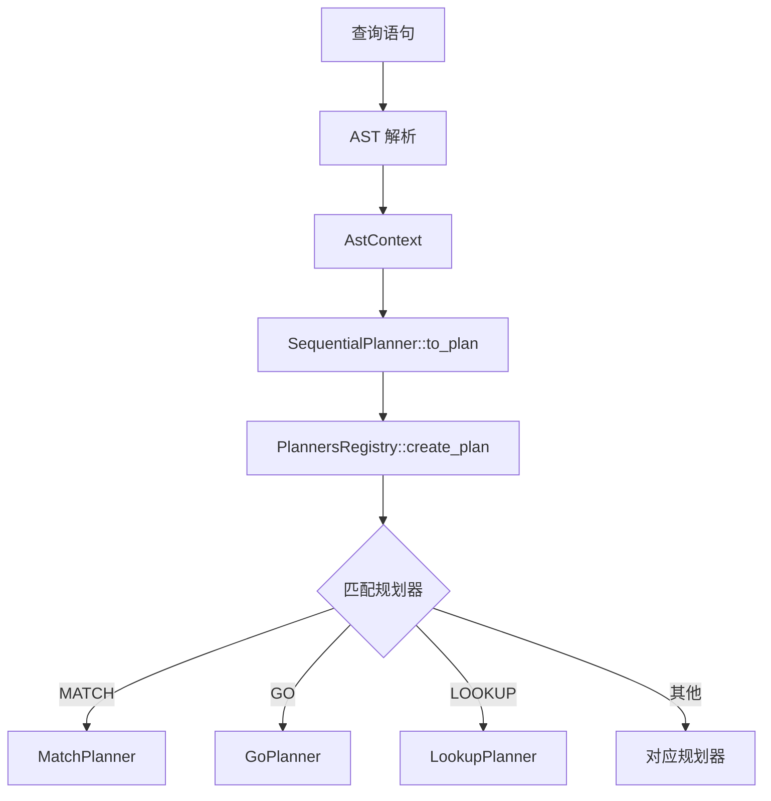
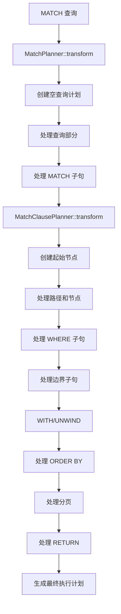
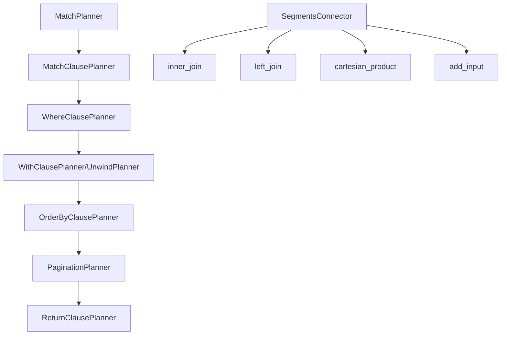
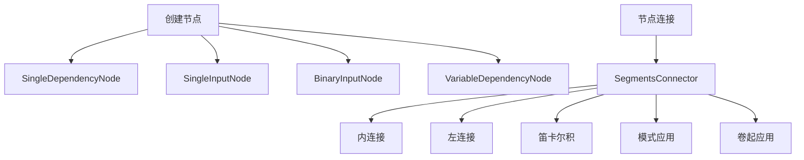

# GraphDB 查询规划器工作流程分析

## 概述

本文档详细分析了 `src/query/planner` 模块的完整工作流程，评估当前实现的完整性，并识别缺失的功能和改进点。

## 1. 模块架构概览

### 1.1 核心模块结构

```
src/query/planner/
├── mod.rs                    # 模块入口和重新导出
├── planner.rs                # 主规划器接口和注册表
├── match_planning/           # Cypher MATCH 查询规划
│   ├── core/                 # 核心规划器
│   │   ├── cypher_clause_planner.rs  # 子句规划器基类
│   │   ├── match_planner.rs          # MATCH 查询主规划器
│   │   └── match_clause_planner.rs   # MATCH 子句规划器
│   ├── clauses/              # 子句规划器实现
│   │   ├── return_clause_planner.rs  # RETURN 子句规划器
│   │   ├── unwind_planner.rs         # UNWIND 子句规划器
│   │   ├── with_clause_planner.rs    # WITH 子句规划器
│   │   ├── where_clause_planner.rs   # WHERE 子句规划器
│   │   ├── order_by_planner.rs       # ORDER BY 子句规划器
│   │   ├── pagination_planner.rs     # 分页规划器
│   │   └── yield_planner.rs          # YIELD 子句规划器
│   ├── paths/                # 路径规划
│   ├── seeks/                # 查找策略
│   └── utils/                # 工具类
│       ├── connector.rs      # 计划段连接器
│       ├── finder.rs         # 查找器
│       └── node_factory.rs   # 节点工厂
├── ngql/                     # NGQL 查询规划
├── plan/                     # 执行计划定义
│   ├── core/                 # 核心计划节点
│   ├── operations/           # 操作节点
│   ├── management/           # 管理操作
│   └── algorithms/           # 算法实现
└── go_planner.rs, lookup_planner.rs, path_planner.rs, subgraph_planner.rs  # 旧版规划器
```

### 1.2 设计模式

1. **策略模式**：不同的查询类型使用不同的规划器策略
2. **工厂模式**：通过工厂函数创建规划器实例
3. **组合模式**：将多个子计划组合成完整的执行计划
4. **访问者模式**：用于计划节点的遍历和操作

## 2. 工作流程详细分析

### 2.1 查询规划入口点



### 2.2 MATCH 查询规划流程



### 2.3 子句规划器协作流程



### 2.4 计划节点创建和连接



## 3. 当前实现完整性评估

### 3.1 已实现的功能

#### 3.1.1 核心框架 ✅
- **规划器注册表**：`PlannersRegistry` 完整实现
- **规划器接口**：`Planner` trait 定义完整
- **子句规划器基类**：`CypherClausePlanner` trait 完整
- **计划节点系统**：各种节点类型和 trait 完整

#### 3.1.2 MATCH 查询支持 ✅
- **MATCH 子句规划器**：`MatchClausePlanner` 基本实现
- **WHERE 子句规划器**：`WhereClausePlanner` 实现完整
- **RETURN 子句规划器**：`ReturnClausePlanner` 实现完整（已修复）
- **WITH 子句规划器**：`WithClausePlanner` 实现完整
- **UNWIND 子句规划器**：`UnwindClausePlanner` 实现完整（已修复）
- **ORDER BY 子句规划器**：`OrderByClausePlanner` 实现完整
- **分页规划器**：`PaginationPlanner` 实现完整
- **YIELD 子句规划器**：`YieldClausePlanner` 实现完整

#### 3.1.3 计划连接机制 ✅
- **段连接器**：`SegmentsConnector` 实现完整
- **连接类型**：内连接、左连接、笛卡尔积等
- **计划组合**：支持多个子计划的组合

#### 3.1.4 NGQL 查询支持 ✅
- **GO 规划器**：基本实现
- **LOOKUP 规划器**：基本实现
- **PATH 规划器**：基本实现
- **SUBGRAPH 规划器**：基本实现

### 3.2 部分实现的功能

#### 3.2.1 路径规划 ⚠️
- **MatchPathPlanner**：框架存在，实现不完整
- **ShortestPathPlanner**：框架存在，实现不完整
- **路径算法**：需要更多算法实现

#### 3.2.2 查找策略 ⚠️
- **SeekStrategy**：框架完整，具体策略实现不完整
- **IndexSeek**：基本实现，需要优化
- **VertexSeek**：基本实现，需要完善
- **ScanSeek**：基本实现

#### 3.2.3 计划节点操作 ⚠️
- **聚合操作**：部分实现
- **排序操作**：基本实现
- **连接操作**：基本实现
- **图遍历操作**：部分实现

### 3.3 缺失的功能

#### 3.3.1 高级查询功能 ❌
- **CALL 子句**：过程调用支持
- **FOREACH 子句**：循环操作
- **SUBQUERY 支持**：子查询支持
- **UNION/UNION ALL**：集合操作
- **LOAD CSV**：数据导入

#### 3.3.2 优化功能 ❌
- **查询优化器**：基于成本的优化
- **索引选择**：智能索引选择
- **计划缓存**：执行计划缓存
- **统计信息**：查询统计和性能分析

#### 3.3.3 管理功能 ❌
- **EXPLAIN 支持**：查询计划解释
- **PROFILE 支持**：查询性能分析
- **计划可视化**：执行计划可视化

#### 3.3.4 错误处理和诊断 ⚠️
- **详细错误信息**：需要更丰富的错误上下文
- **调试支持**：调试信息和日志
- **性能监控**：执行性能监控

## 4. 架构优势

### 4.1 模块化设计
- **清晰的职责分离**：每个模块有明确的职责
- **可扩展性**：易于添加新的查询类型和子句
- **可维护性**：模块间依赖关系清晰

### 4.2 类型安全
- **强类型系统**：利用 Rust 的类型系统确保安全
- **Trait 系统**：通过 trait 定义清晰的接口
- **所有权管理**：通过 Arc 等机制管理所有权

### 4.3 测试覆盖
- **单元测试**：核心组件有较好的测试覆盖
- **集成测试**：部分集成测试存在
- **测试工具**：提供了测试辅助函数

## 5. 主要问题和改进点

### 5.1 架构问题

#### 5.1.1 数据流不一致
- **问题**：部分子句规划器创建不必要的起始节点
- **影响**：破坏数据流的正确性
- **解决方案**：确保只有真正的起始子句创建起始节点

#### 5.1.2 计划连接复杂性
- **问题**：计划连接逻辑分散在多个地方
- **影响**：难以维护和调试
- **解决方案**：统一计划连接接口和逻辑

#### 5.1.3 错误处理不统一
- **问题**：错误类型和处理方式不一致
- **影响**：难以提供一致的用户体验
- **解决方案**：标准化错误类型和处理流程

### 5.2 性能问题

#### 5.2.1 内存使用
- **问题**：大量使用 Arc 可能导致内存开销
- **影响**：影响查询性能
- **解决方案**：优化内存使用，考虑使用引用计数优化

#### 5.2.2 计划生成效率
- **问题**：计划生成过程可能存在重复计算
- **影响**：影响查询规划速度
- **解决方案**：引入计划缓存和优化

### 5.3 功能缺失

#### 5.3.1 查询优化
- **缺失**：基于成本的查询优化
- **影响**：查询性能可能不是最优
- **解决方案**：实现查询优化器

#### 5.3.2 并发支持
- **缺失**：并发查询规划支持
- **影响**：无法充分利用多核性能
- **解决方案**：添加并发规划支持

## 6. 改进建议

### 6.1 短期改进（1-2 个月）

1. **完善现有功能**
   - 修复数据流问题
   - 完善错误处理
   - 优化计划连接逻辑

2. **增强测试覆盖**
   - 添加更多集成测试
   - 增加边界条件测试
   - 添加性能测试

3. **改进文档**
   - 完善 API 文档
   - 添加使用示例
   - 创建架构指南

### 6.2 中期改进（3-6 个月）

1. **实现缺失功能**
   - 添加 CALL 子句支持
   - 实现 SUBQUERY 支持
   - 添加 UNION 操作

2. **性能优化**
   - 实现查询优化器
   - 添加计划缓存
   - 优化内存使用

3. **工具支持**
   - 实现 EXPLAIN 支持
   - 添加 PROFILE 功能
   - 创建计划可视化工具

### 6.3 长期改进（6-12 个月）

1. **高级功能**
   - 分布式查询支持
   - 实时查询优化
   - 自适应查询计划

2. **生态系统**
   - 插件系统
   - 扩展 API
   - 第三方工具集成

## 7. 结论

当前的 `src/query/planner` 模块具有一个良好的架构基础，核心功能基本完整，但在高级功能、性能优化和工具支持方面还有较大改进空间。

### 7.1 优势总结
- **模块化架构**：清晰的模块划分和职责分离
- **类型安全**：充分利用 Rust 的类型系统
- **可扩展性**：易于添加新的查询类型和功能
- **测试覆盖**：核心组件有较好的测试覆盖

### 7.2 主要挑战
- **数据流一致性**：需要确保数据流的正确性
- **性能优化**：需要实现查询优化和性能监控
- **功能完整性**：需要补充缺失的高级查询功能
- **工具支持**：需要提供更好的调试和分析工具

### 7.3 发展方向
1. **短期**：完善现有功能，提高稳定性
2. **中期**：添加缺失功能，提升性能
3. **长期**：实现高级功能，构建完整生态系统

通过系统性的改进，该查询规划器有潜力成为一个功能完整、性能优异的图数据库查询规划系统。