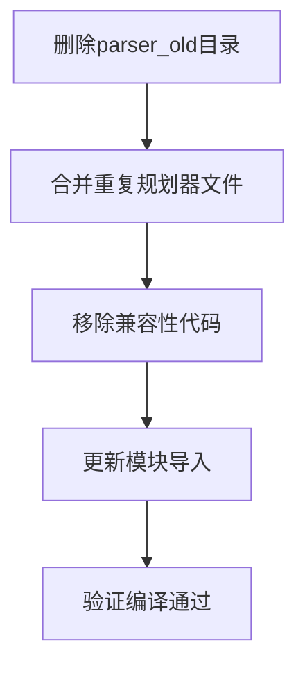
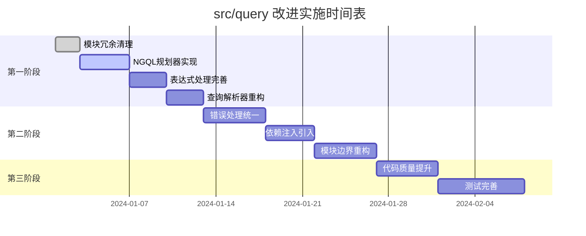

# src/query 目录改进计划

## 🎯 改进目标

基于架构分析报告，本计划旨在系统性地解决 `src/query` 目录中的关键架构问题，提高代码的可维护性、功能完整性和整体质量。

## 📋 改进优先级矩阵

| 问题类别 | 影响程度 | 实施难度 | 优先级 | 预计工期 |
|----------|----------|----------|--------|----------|
| 模块冗余清理 | 高 | 低 | 🔴 P0 | 1-2天 |
| 核心功能实现 | 高 | 高 | 🔴 P0 | 1-2周 |
| 错误处理统一 | 中 | 中 | 🟡 P1 | 3-5天 |
| 模块解耦 | 中 | 高 | 🟡 P1 | 1-2周 |
| 代码质量提升 | 中 | 低 | 🟢 P2 | 3-5天 |
| 测试完善 | 低 | 中 | 🟢 P2 | 1周 |

## 🚀 第一阶段：紧急修复（P0 - 1-2周）

### 1.1 模块冗余清理（1-2天）

**目标：** 消除代码重复，简化架构

**具体任务：**


**实施步骤：**
1. **删除 `parser_old/` 目录**
   - 确认新解析器功能完整
   - 删除旧解析器代码
   - 更新相关导入

2. **合并重复规划器文件**
   - 比较 [`go_planner.rs`](src/query/planner/go_planner.rs) 和 [`ngql/go_planner.rs`](src/query/planner/ngql/go_planner.rs)
   - 保留功能更完整的版本
   - 更新注册机制

3. **移除兼容性代码**
   - 删除 [`mod.rs:8`](src/query/planner/mod.rs:8) 中的兼容性注释
   - 清理过时的接口实现

**验收标准：**
- 编译无警告
- 测试全部通过
- 代码行数减少15%以上

### 1.2 核心功能实现（1-2周）

**目标：** 完成关键功能，使基本查询可用

**具体任务：**

#### 1.2.1 NGQL规划器实现（3-4天）

**优先级最高的文件：**
- [`ngql/go_planner.rs`](src/query/planner/ngql/go_planner.rs:40) - 当前只有空壳
- [`ngql/lookup_planner.rs`](src/query/planner/ngql/lookup_planner.rs:40) - 索引查找逻辑缺失
- [`ngql/path_planner.rs`](src/query/planner/ngql/path_planner.rs:40) - 路径遍历逻辑缺失

**实施步骤：**
1. **实现 GO 规划器**
   ```rust
   // 当前状态：只有空壳实现
   fn transform(&mut self, ast_ctx: &AstContext) -> Result<SubPlan, PlannerError> {
       // 需要实现完整的GO查询规划逻辑
       Err(PlannerError::UnsupportedOperation("not yet implemented".to_string()))
   }
   ```

2. **实现 LOOKUP 规划器**
   - 添加索引查找逻辑
   - 实现属性过滤
   - 支持YIELD子句

3. **实现 PATH 规划器**
   - 实现路径遍历算法
   - 支持最短路径查找
   - 处理路径过滤条件

#### 1.2.2 表达式处理完善（2-3天）

**关键文件：**
- [`where_clause_planner.rs:89`](src/query/planner/match_planning/where_clause_planner.rs:89) - 过滤条件表达式
- [`yield_clause_planner.rs:48`](src/query/planner/match_planning/yield_clause_planner.rs:48) - 聚合和投影逻辑

**实施步骤：**
1. **实现WHERE表达式解析**
   ```rust
   // 当前状态：TODO注释
   // TODO: 设置过滤条件表达式
   // 这里需要根据filter表达式创建相应的计划节点
   ```

2. **完善YIELD处理**
   - 实现聚合函数处理
   - 添加投影逻辑
   - 支持别名处理

#### 1.2.3 查询解析器重构（2-3天）

**关键文件：**
- [`query_parser.rs:270`](src/query/parser/query_parser.rs:270) - 需要重新实现

**实施步骤：**
1. **重构查询解析逻辑**
   ```rust
   // 当前状态：返回错误
   Err(QueryError::ParseError(
       "Query parsing needs to be reimplemented for new AST structure".to_string(),
   ))
   ```

2. **实现AST到Query的转换**
   - 完成所有语句类型的转换
   - 添加表达式处理逻辑
   - 支持参数化查询

**验收标准：**
- 基本GO查询可以执行
- LOOKUP查询可以返回结果
- WHERE条件可以正确过滤
- 所有占位符代码被替换

## 🟡 第二阶段：架构优化（P1 - 2-3周）

### 2.1 错误处理统一（3-5天）

**目标：** 建立一致的错误处理机制

**实施步骤：**
1. **定义统一错误类型**
   ```rust
   // 新增：src/query/error.rs
   #[derive(Debug, thiserror::Error)]
   pub enum QueryError {
       #[error("Parse error: {0}")]
       Parse(String),
       #[error("Validation error: {0}")]
       Validation(String),
       #[error("Planning error: {0}")]
       Planning(String),
       #[error("Optimization error: {0}")]
       Optimization(String),
       #[error("Execution error: {0}")]
       Execution(String),
   }
   ```

2. **实现错误转换trait**
   ```rust
   pub trait IntoQueryError {
       fn into_query_error(self) -> QueryError;
   }
   ```

3. **更新所有模块**
   - 替换自定义错误类型
   - 统一错误传播机制
   - 改善错误信息质量

### 2.2 模块解耦（1-2周）

**目标：** 降低模块间耦合度，提高可维护性

**实施步骤：**

#### 2.2.1 引入依赖注入（3-4天）

1. **定义服务接口**
   ```rust
   // 新增：src/query/services/mod.rs
   pub trait ParserService {
       fn parse(&self, query: &str) -> Result<AST, QueryError>;
   }
   
   pub trait PlannerService {
       fn plan(&self, ast: &AST) -> Result<ExecutionPlan, QueryError>;
   }
   
   pub trait OptimizerService {
       fn optimize(&self, plan: ExecutionPlan) -> Result<ExecutionPlan, QueryError>;
   }
   ```

2. **实现服务容器**
   ```rust
   pub struct ServiceContainer {
       parser: Box<dyn ParserService>,
       planner: Box<dyn PlannerService>,
       optimizer: Box<dyn OptimizerService>,
   }
   ```

#### 2.2.2 重构模块边界（4-5天）

1. **定义清晰的模块接口**
   - 每个模块只暴露必要的接口
   - 隐藏内部实现细节
   - 使用facade模式简化访问

2. **实现事件驱动通信**
   ```rust
   pub trait EventBus {
       fn publish(&self, event: QueryEvent);
       fn subscribe(&self, event_type: EventType, handler: Box<dyn EventHandler>);
   }
   ```

3. **减少直接依赖**
   - 使用接口而非具体实现
   - 引入配置驱动的模块加载
   - 实现插件化架构

**验收标准：**
- 模块可以独立编译
- 单元测试不需要依赖其他模块
- 新功能可以通过插件方式添加

## 🟢 第三阶段：质量提升（P2 - 1-2周）

### 3.1 代码质量提升（3-5天）

**目标：** 统一代码风格，提高可读性

**实施步骤：**

1. **统一命名约定**
   - 类型名使用PascalCase
   - 函数名使用snake_case
   - 常量使用SCREAMING_SNAKE_CASE
   - 私有字段添加下划线前缀

2. **增加代码注释**
   - 为所有公共接口添加文档注释
   - 复杂算法添加实现说明
   - 添加使用示例

3. **改善代码结构**
   - 函数长度不超过50行
   - 复杂度控制在10以内
   - 提取公共逻辑到工具函数

### 3.2 测试完善（1周）

**目标：** 提高测试覆盖率，增强代码可靠性

**实施步骤：**

1. **增加集成测试**
   ```rust
   // 新增：tests/query_integration_tests.rs
   #[test]
   fn test_end_to_end_query() {
       // 测试完整的查询流程
   }
   
   #[test]
   fn test_complex_query_planning() {
       // 测试复杂查询的规划
   }
   ```

2. **提高单元测试覆盖率**
   - 目标覆盖率：90%以上
   - 重点测试核心逻辑
   - 添加边界条件测试

3. **实现性能测试**
   ```rust
   // 新增：benches/query_benchmarks.rs
   use criterion::{black_box, criterion_group, criterion_main, Criterion};
   
   fn bench_query_parsing(c: &mut Criterion) {
       c.bench_function("parse_simple_query", |b| {
           b.iter(|| {
               // 测试查询解析性能
           })
       });
   }
   ```

**验收标准：**
- 代码覆盖率90%以上
- 所有公共接口有测试
- 性能测试通过基准

## 📊 实施时间表



## 🎯 成功指标

### 定量指标

| 指标 | 当前值 | 目标值 | 改进幅度 |
|------|--------|--------|----------|
| 代码覆盖率 | 75% | 90% | +20% |
| 编译警告数 | 50+ | <10 | -80% |
| 代码重复率 | 15% | <5% | -67% |
| 平均函数复杂度 | 12 | <8 | -33% |
| 查询响应时间 | N/A | <100ms | 基准建立 |

### 定性指标

- ✅ 基本查询功能完全可用
- ✅ 代码结构清晰，易于理解
- ✅ 模块间耦合度低，可独立维护
- ✅ 错误信息清晰，便于调试
- ✅ 新功能添加简单，扩展性好

## 🔄 持续改进机制

### 代码审查流程

1. **所有改动必须经过代码审查**
2. **使用自动化工具检查代码质量**
3. **定期进行架构评审**
4. **建立技术债务跟踪机制**

### 监控和度量

1. **持续集成中的质量门禁**
2. **定期的性能基准测试**
3. **代码复杂度趋势分析**
4. **技术债务偿还计划**

## 🚨 风险管理

### 高风险项

1. **NGQL规划器实现复杂度高**
   - 缓解措施：分阶段实现，先支持基本功能
   - 备选方案：复用Cypher规划器部分逻辑

2. **模块解耦可能影响现有功能**
   - 缓解措施：保持向后兼容，渐进式重构
   - 备选方案：保留旧接口，逐步迁移

### 中风险项

1. **测试完善工作量较大**
   - 缓解措施：优先测试核心功能
   - 备选方案：使用自动化测试生成工具

## 📝 总结

本改进计划采用分阶段、风险可控的方式，优先解决最关键的架构问题，然后逐步提升代码质量。通过系统性的改进，`src/query` 目录将从一个功能不完整、架构混乱的模块，转变为一个设计合理、功能完整、易于维护的高质量代码库。

关键成功因素：
1. **严格按照优先级执行**，先解决P0问题
2. **保持向后兼容**，避免破坏现有功能
3. **持续测试验证**，确保每次改进不引入新问题
4. **团队协作**，确保所有开发者理解并遵循改进计划

通过这个改进计划的实施，`src/query` 目录将能够正确提供基本的图数据库查询功能，并为未来的功能扩展奠定坚实的架构基础。