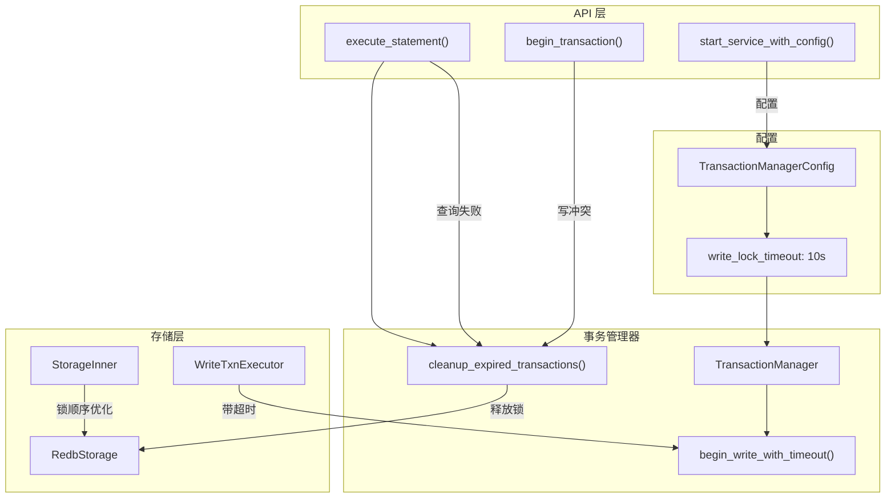

## 1. 高层摘要 (TL;DR)

- **影响**: **高** - 修复了 E2E 测试中的事务超时问题，引入写锁超时机制，优化事务清理逻辑
- **核心变更**:
  - 🛡️ 为 `redb` 的 `begin_write()` 添加超时机制，防止无限阻塞
  - 🧹 在语句执行前自动清理过期事务，避免死锁
  - 🔒 优化 `StorageInner` 的锁顺序，防止死锁
  - 🔄 查询失败时自动清理无效事务状态
  - ✅ 新增完整的写锁超时测试套件

---

## 2. 可视化概览 (代码与逻辑映射)



---

## 3. 详细变更分析

### 📦 组件 1: 文档清理

**变更内容**:

- 删除了 `docs/tests/e2e/e2e_test_fix_analysis.md` - E2E 测试问题分析文档
- 删除了 `docs/tests/e2e/extend.md` - 扩展类型 E2E 测试设计方案
- 删除了 `docs/tests/e2e/optimizer_explain.md` - 优化器验证 E2E 测试设计方案
- 更新了 `docs/tests/e2e/temp.md` - 测试日志更新

**说明**: 这些是临时文档，已在测试完成后清理。

---

### 🔧 组件 2: 事务管理器核心修复

#### 2.1 配置增强 (`src/transaction/types.rs`)

**变更内容**:

```rust
pub struct TransactionManagerConfig {
    // ... 现有字段
    /// 获取 redb 写锁时的超时时间
    pub write_lock_timeout: Duration,
}

impl Default for TransactionManagerConfig {
    fn default() -> Self {
        Self {
            // ...
            write_lock_timeout: Duration::from_secs(10), // 新增默认值
        }
    }
}
```

**配置参数表**:

| 参数                 | 类型       | 默认值 | 说明                         |
| -------------------- | ---------- | ------ | ---------------------------- |
| `write_lock_timeout` | `Duration` | 10秒   | 获取 redb 写锁的最大等待时间 |

---

#### 2.2 超时机制实现 (`src/transaction/manager.rs`)

**新增方法**: `begin_write_with_timeout()`

```rust
fn begin_write_with_timeout(
    db: &Arc<Database>,
    timeout: Duration,
) -> Result<redb::WriteTransaction, TransactionError> {
    let db = Arc::clone(db);
    let (tx, rx) = std::sync::mpsc::channel();

    let _handle = std::thread::spawn(move || {
        let result = db.begin_write();
        let _ = tx.send(result);
    });

    match rx.recv_timeout(timeout) {
        Ok(result) => result.map_err(|e| TransactionError::BeginFailed(e.to_string())),
        Err(_) => {
            log::error!("Timed out acquiring redb write lock after {:?}", timeout);
            Err(TransactionError::BeginFailed(format!(
                "Timed out acquiring write lock after {:?}",
                timeout
            )))
        }
    }
}
```

**变更逻辑**:

- 使用独立线程执行 `db.begin_write()`
- 通过 `recv_timeout()` 等待结果，避免无限阻塞
- 超时后返回明确的错误信息

**过期事务清理优化**:

```rust
// 旧逻辑
for txn_id in expired {
    let _ = self.abort_transaction_internal_by_id(txn_id);
}

// 新逻辑
for txn_id in expired {
    // 先从 active_transactions 移除，释放 redb 写锁
    let context = {
        if let Some((_, ctx)) = self.active_transactions.remove(&txn_id) {
            ctx
        } else {
            continue;
        }
    };

    // 然后中止事务
    let _ = self.abort_transaction_internal(context);
    self.stats.increment_timeout();
}
```

**关键改进**: 先移除事务上下文，再中止事务，确保写锁被及时释放。

---

### 🌐 组件 3: API 服务层增强

#### 3.1 语句执行前清理 (`src/api/server/graph_service.rs`)

**新增逻辑**:

```rust
// 在处理任何语句之前清理过期事务
if let Some(ref txn_manager) = self.transaction_manager {
    txn_manager.cleanup_expired_transactions();
}
```

**位置**: `execute_statement()` 方法开头

---

#### 3.2 查询失败后清理 (`src/api/server/graph_service.rs`)

**新增逻辑**:

```rust
// 如果查询失败且存在活动事务，检查事务状态
if result.is_err() {
    if let Some(txn_id) = session.current_transaction() {
        if let Some(ref txn_manager) = self.transaction_manager {
            if let Ok(ctx) = txn_manager.get_context(txn_id) {
                if !ctx.state().can_execute() {
                    warn!(
                        "Transaction {} is in invalid state {} after failed query, cleaning up",
                        txn_id, ctx.state()
                    );
                    drop(ctx);
                    let _ = txn_manager.rollback_transaction(txn_id);
                    session.unbind_transaction();
                    session.set_auto_commit(true);
                }
            }
        }
    }
}
```

**说明**: 自动清理处于无效状态的事务，防止后续操作阻塞。

---

#### 3.3 事务开始重试机制 (`src/api/server/graph_service.rs`)

**新增逻辑**:

```rust
Err(e) => {
    // 如果是写冲突错误，清理过期事务并重试一次
    if matches!(e, crate::transaction::TransactionError::WriteTransactionConflict) {
        txn_manager.cleanup_expired_transactions();
        let options = session.transaction_options();
        match txn_manager.begin_transaction(options) {
            Ok(txn_id) => {
                session.bind_transaction(txn_id);
                session.set_auto_commit(false);
                info!("Session {} started transaction {} after cleanup retry",
                      session.id(), txn_id);
                return Ok(ExecutionResult::Success);
            }
            Err(retry_err) => {
                return Err(format!("Failed to start transaction: {}", retry_err));
            }
        }
    }
    Err(format!("Failed to start transaction: {}", e))
}
```

**说明**: 遇到写冲突时自动重试一次，提高成功率。

---

### 💾 组件 4: 存储层优化

#### 4.1 写锁超时 (`src/storage/operations/write_txn_executor.rs`)

**新增方法**:

```rust
const WRITE_LOCK_TIMEOUT: Duration = Duration::from_secs(10);

fn begin_write_with_timeout(
    db: &Arc<Database>,
    timeout: Duration,
) -> Result<redb::WriteTransaction, StorageError> {
    // 实现与 TransactionManager 相同
    // ...
}
```

**使用位置**: `execute_with_bound_context()` 方法

---

#### 4.2 锁顺序优化 (`src/storage/shared_state.rs`)

**新增注释**:

```rust
/// Lock ordering convention to prevent deadlocks:
/// Always acquire locks in this order: current_txn_context -> reader -> writer
/// Never acquire an earlier lock while holding a later one.
```

**重构方法**:

```rust
pub fn set_transaction_context(&self, context: Option<Arc<TransactionContext>>) {
    // 始终先获取 current_txn_context 锁，然后获取 reader 锁
    let mut txn_guard = self.current_txn_context.lock();
    *txn_guard = context.clone();

    if let Some(ref ctx) = context {
        let mut reader_guard = self.reader.lock();
        reader_guard.set_transaction_context(Some(ctx.clone()));
    } else {
        let mut reader_guard = self.reader.lock();
        reader_guard.set_transaction_context(None);
    }
}
```

**关键改进**: 确保锁获取顺序一致，避免死锁。

---

#### 4.3 上下文管理简化 (`src/storage/engine/redb_storage.rs`)

**变更内容**:

```rust
// 旧实现
pub fn set_transaction_context(&self, context: Option<Arc<TransactionContext>>) {
    *self.inner.current_txn_context.lock() = context.clone();
    if let Some(ctx) = &context {
        self.inner.reader.lock().set_transaction_context(Some(ctx.clone()));
    } else {
        self.inner.reader.lock().set_transaction_context(None);
    }
}

// 新实现
pub fn set_transaction_context(&self, context: Option<Arc<TransactionContext>>) {
    self.inner.set_transaction_context(context);
}
```

**说明**: 委托给 `StorageInner` 的方法，保持锁顺序一致性。

---

### 🧪 组件 5: 测试套件

#### 5.1 新增测试文件 (`tests/transaction/write_lock_timeout.rs`)

**测试覆盖**:

| 测试名称                                                | 目的                   |
| ------------------------------------------------------- | ---------------------- |
| `test_write_lock_timeout_config_default`                | 验证默认超时配置       |
| `test_write_lock_timeout_config_custom`                 | 验证自定义超时配置     |
| `test_write_lock_acquired_successfully`                 | 验证正常获取写锁       |
| `test_write_conflict_does_not_block_indefinitely`       | 验证写冲突不无限阻塞   |
| `test_write_lock_released_after_commit`                 | 验证提交后释放锁       |
| `test_write_lock_released_after_rollback`               | 验证回滚后释放锁       |
| `test_cleanup_expired_transactions_releases_write_lock` | 验证过期事务清理释放锁 |
| `test_cleanup_multiple_expired_transactions`            | 验证清理多个过期事务   |
| `test_sequential_writes_complete_quickly`               | 验证顺序写操作快速完成 |
| `test_concurrent_read_only_transactions`                | 验证并发只读事务       |
| `test_short_write_lock_timeout_fails_quickly`           | 验证短超时快速失败     |
| `test_transaction_lifecycle_after_errors`               | 验证错误后事务生命周期 |
| `test_cleanup_does_not_affect_active_transactions`      | 验证清理不影响活动事务 |
| `test_rapid_cycles_with_cleanup`                        | 验证快速循环与清理     |

**关键测试示例**:

```rust
#[tokio::test]
async fn test_sequential_writes_complete_quickly() {
    // 验证 10 个顺序写事务在 30 秒内完成
    let result = timeout(Duration::from_secs(30), async {
        for i in 0..10 {
            let txn_id = manager.begin_transaction(...).unwrap();
            manager.commit_transaction(txn_id).await.unwrap();
        }
    }).await;

    assert!(result.is_ok(), "10 sequential writes should complete within 30s");
}
```

---

#### 5.2 配置测试更新 (`tests/transaction/config_options.rs`)

**变更内容**: 在所有测试配置中添加 `write_lock_timeout` 字段

```rust
TransactionManagerConfig {
    default_timeout: Duration::from_secs(60),
    max_concurrent_transactions: 500,
    auto_cleanup: false,
    write_lock_timeout: Duration::from_secs(10), // 新增
}
```

---

### 🗑️ 组件 6: 代码清理

#### 6.1 未使用方法删除 (`src/query/planning/statements/match_statement_planner.rs`)

**删除内容**:

```rust
// 删除未使用的方法
fn contextual_expression_to_string(&self, expr: &ContextualExpression) -> String {
    expr.to_expression_string()
}
```

---

## 4. 影响与风险评估

### ⚠️ 破坏性变更

| 变更类型 | 影响范围                   | 说明                                               |
| -------- | -------------------------- | -------------------------------------------------- |
| 配置结构 | `TransactionManagerConfig` | 新增 `write_lock_timeout` 字段，有默认值，向后兼容 |
| API 行为 | `begin_transaction()`      | 写冲突时可能自动重试一次，提高成功率               |
| 超时行为 | 写事务获取                 | 超时后返回错误而非无限阻塞                         |

### ✅ 测试建议

1. **并发测试**: 验证多个客户端同时执行写操作时的行为
2. **超时测试**: 验证写锁超时在各种场景下的表现
3. **恢复测试**: 验证超时后系统能否正常恢复
4. **清理测试**: 验证过期事务清理不误删活动事务
5. **性能测试**: 验证 10 个顺序写事务在 30 秒内完成

### 🔍 风险点

1. **超时配置**: 默认 10 秒可能对某些场景过短，需根据实际负载调整
2. **重试逻辑**: 只重试一次，可能在高并发场景下不够
3. **清理时机**: 在每个语句执行前清理可能影响性能

---

## 5. 总结

本次变更主要解决了 E2E 测试中的事务超时问题，通过以下机制提升系统稳定性：

- ✅ **超时保护**: 为 `redb` 写锁获取添加超时，避免无限阻塞
- ✅ **自动清理**: 定期清理过期事务，释放资源
- ✅ **智能重试**: 写冲突时自动重试一次，提高成功率
- ✅ **锁顺序优化**: 统一锁获取顺序，避免死锁
- ✅ **完整测试**: 新增 14 个测试用例，覆盖各种场景

这些改进显著提升了系统在高并发场景下的稳定性和可靠性。
