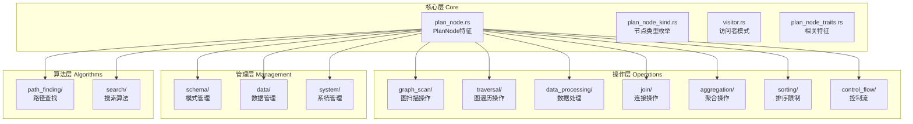

# src\query\planner\plan 目录结构调整方案

## 分析总结

基于对当前目录结构的深入分析，发现了以下主要问题：

### 1. 功能重复
- `logic_nodes.rs` 和 `other_ops.rs` 中都定义了 `Start` 节点
- `logic_nodes.rs` 和 `other_ops.rs` 中都定义了 `Argument` 节点
- `query_nodes.rs` 只是重新导出其他模块的节点，没有实际功能

### 2. 导出结构混乱
- `mod.rs` 中同时使用 `pub use module::*` 和 `pub use module::{具体类型}`
- 存在重复导出，如 `Start` 节点被导出多次
- 导出层次不清晰，难以理解模块间的依赖关系

### 3. 模块划分不合理
- 按操作类型划分的模块（如 `traverse_ops.rs`、`data_ops.rs`）与按功能划分的模块（如 `logic_nodes.rs`）混合
- 某些模块包含过多不相关的节点类型
- 缺乏统一的分类标准

### 4. 依赖关系复杂
- 访问者模式需要导入所有节点类型，导致复杂的导入关系
- 核心类型定义分散在多个文件中

## 新的目录结构设计

```
src/query/planner/plan/
├── core/                    # 核心基础类型
│   ├── mod.rs              # 导出基础特征和枚举
│   ├── plan_node.rs        # PlanNode 特征和基础实现
│   ├── plan_node_kind.rs   # PlanNodeKind 枚举
│   ├── plan_node_traits.rs # PlanNode 相关特征
│   └── visitor.rs          # 访问者模式相关
├── operations/             # 操作节点（按功能分类）
│   ├── graph_scan/         # 图扫描操作
│   │   ├── mod.rs
│   │   ├── get_vertices.rs
│   │   ├── get_edges.rs
│   │   └── get_neighbors.rs
│   ├── traversal/          # 图遍历操作
│   │   ├── mod.rs
│   │   ├── traverse.rs
│   │   ├── expand.rs
│   │   └── append_vertices.rs
│   ├── data_processing/    # 数据处理操作
│   │   ├── mod.rs
│   │   ├── filter.rs
│   │   ├── project.rs
│   │   ├── dedup.rs
│   │   └── union.rs
│   ├── join/               # 连接操作
│   │   ├── mod.rs
│   │   ├── hash_join.rs
│   │   ├── cross_join.rs
│   │   └── hash_left_join.rs
│   ├── aggregation/        # 聚合操作
│   │   ├── mod.rs
│   │   └── aggregate.rs
│   ├── sorting/            # 排序和限制操作
│   │   ├── mod.rs
│   │   ├── sort.rs
│   │   ├── limit.rs
│   │   └── top_n.rs
│   └── control_flow/       # 控制流操作
│       ├── mod.rs
│       ├── start.rs
│       ├── argument.rs
│       ├── select.rs
│       └── loop.rs
├── management/             # 管理操作节点
│   ├── schema/            # 模式管理
│   │   ├── mod.rs
│   │   ├── create_space.rs
│   │   ├── create_tag.rs
│   │   └── create_edge.rs
│   ├── data/              # 数据管理
│   │   ├── mod.rs
│   │   ├── insert_vertices.rs
│   │   ├── insert_edges.rs
│   │   └── update_vertex.rs
│   └── system/            # 系统管理
│       ├── mod.rs
│       ├── submit_job.rs
│       └── show_configs.rs
├── algorithms/             # 算法节点
│   ├── path_finding/      # 路径查找算法
│   │   ├── mod.rs
│   │   ├── shortest_path.rs
│   │   └── multi_shortest_path.rs
│   └── search/            # 搜索算法
│       ├── mod.rs
│       ├── index_scan.rs
│       └── fulltext_index_scan.rs
└── mod.rs                  # 统一导出接口
```

## 架构设计图



## 重构实施计划

### 阶段一：创建新目录结构
1. 创建新的目录层次结构
2. 迁移核心基础类型到 `core/` 目录
3. 建立新的模块导出机制

### 阶段二：迁移操作节点
1. 按功能重新组织操作节点到对应模块
2. 解决重复定义问题
3. 更新节点间的依赖关系

### 阶段三：更新导出机制
1. 重新设计 `mod.rs` 的导出结构
2. 确保向后兼容性
3. 更新所有引用这些模块的代码

### 阶段四：测试和验证
1. 运行现有测试确保功能正常
2. 验证新的导出结构
3. 修复发现的任何问题

## 具体重构步骤

### 第一步：创建新目录结构
```bash
mkdir -p src/query/planner/plan/core
mkdir -p src/query/planner/plan/operations/{graph_scan,traversal,data_processing,join,aggregation,sorting,control_flow}
mkdir -p src/query/planner/plan/management/{schema,data,system}
mkdir -p src/query/planner/plan/algorithms/{path_finding,search}
```

### 第二步：迁移核心文件
- 将 `plan_node.rs` 移动到 `core/plan_node.rs`
- 将 `plan_node_kind.rs` 从 `core/plan_node_kind.rs` 分离
- 将 `plan_node_visitor.rs` 移动到 `core/visitor.rs`
- 将 `common.rs` 移动到 `core/common.rs`

### 第三步：重新组织操作节点
- 将相关节点移动到对应的功能模块
- 删除重复的定义
- 更新模块间的导入关系

### 第四步：重新设计导出结构
- 创建清晰的导出层次
- 避免重复导出
- 保持API兼容性

## 预期收益

1. **消除重复代码** - 解决功能重复问题
2. **清晰的模块边界** - 每个模块职责单一
3. **更好的可维护性** - 结构清晰，易于扩展
4. **统一的导出策略** - 避免导出混乱
5. **简化依赖关系** - 减少循环依赖

## 风险评估

### 技术风险
- 重构过程中可能引入编译错误
- 需要更新大量导入语句
- 需要确保所有测试仍然通过

### 缓解措施
- 分阶段实施重构
- 每个阶段完成后进行测试
- 保持向后兼容的导出接口
- 使用版本控制进行回滚准备

## 实施时间表

| 阶段 | 任务 | 预计时间 | 状态 |
|------|------|----------|------|
| 1 | 创建目录结构 | 1天 | 待开始 |
| 2 | 迁移核心类型 | 2天 | 待开始 |
| 3 | 重新组织操作节点 | 3天 | 待开始 |
| 4 | 更新导出机制 | 2天 | 待开始 |
| 5 | 测试验证 | 2天 | 待开始 |

总计：10个工作日

## 后续维护建议

1. **代码审查** - 确保新的模块结构符合项目标准
2. **文档更新** - 更新相关文档反映新的结构
3. **团队培训** - 确保团队成员理解新的模块组织方式
4. **监控指标** - 跟踪重构后的代码质量指标