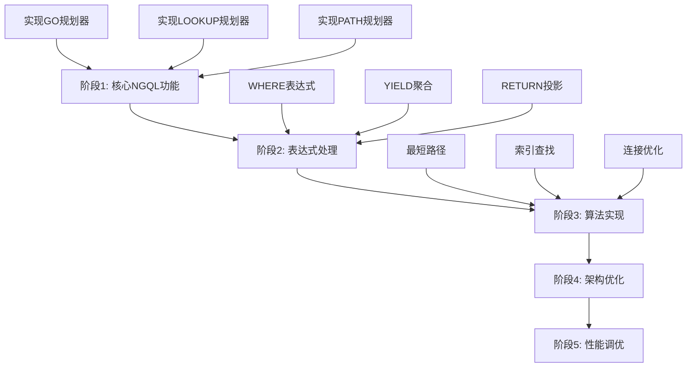

基于我对 `src/query/planner` 目录的深入分析，我现在可以提供一个全面的评估报告。

## 📊 src/query/planner 目录实现分析报告

### 🏗️ 架构概述

该目录采用了模块化的设计，分为三个主要部分：
- **Cypher MATCH规划器** (`match_planning/`) - 处理Cypher查询
- **NGQL规划器** (`ngql/`) - 处理NebulaGraph特定查询
- **计划节点定义** (`plan/`) - 定义执行计划的数据结构

### ✅ 已实现的功能

#### 1. 核心架构完整
- **规划器注册机制** ([`planner.rs`](src/query/planner/planner.rs:120)) - 支持动态选择规划器
- **Cypher子句规划器接口** ([`cypher_clause_planner.rs`](src/query/planner/match_planning/cypher_clause_planner.rs:9)) - 统一的子句规划接口
- **完整的计划节点类型** ([`plan_node.rs`](src/query/planner/plan/plan_node.rs:8)) - 50+种计划节点类型

#### 2. Cypher MATCH规划器相对完整
- **MATCH主规划器** ([`match_planner.rs`](src/query/planner/match_planning/match_planner.rs:26)) - 809行完整实现
- **子句规划器** - RETURN、WHERE、WITH、UNWIND等子句均有基础实现
- **路径规划器** - 支持连通分量分析和路径连接

#### 3. 测试覆盖良好
- **6个模块包含测试** - 核心功能都有测试覆盖
- **测试用例全面** - 涵盖正常流程和错误情况

### ❌ 功能缺失

#### 1. NGQL规划器基本未实现
- **所有NGQL规划器** ([`go_planner.rs`](src/query/planner/ngql/go_planner.rs:40)、[`lookup_planner.rs`](src/query/planner/ngql/lookup_planner.rs:40)等) - 仅有空壳实现
- **transform方法返回错误** - 所有方法都返回"not yet implemented"

#### 2. 关键算法未实现
- **最短路径规划器** ([`shortest_path_planner.rs`](src/query/planner/match_planning/shortest_path_planner.rs:34)) - 仅有TODO注释
- **索引查找逻辑** - 顶点ID查找、属性索引查找等关键功能缺失

#### 3. 表达式处理缺失
- **过滤条件表达式** ([`where_clause_planner.rs`](src/query/planner/match_planning/where_clause_planner.rs:90)) - 缺少表达式解析
- **聚合和投影逻辑** ([`yield_clause_planner.rs`](src/query/planner/match_planning/yield_clause_planner.rs:48)) - 关键参数未设置

### 🔄 冗余和架构问题

#### 1. 模块组织冗余
- **重复的规划器定义** - [`go_planner.rs`](src/query/planner/go_planner.rs) 和 [`ngql/go_planner.rs`](src/query/planner/ngql/go_planner.rs) 并存
- **注释说明** ([`mod.rs`](src/query/planner/mod.rs:8)) 提到"旧位置，兼容性"

#### 2. 占位符代码过多
- **空节点创建** - 多个地方使用`create_empty_node()`作为占位符
- **硬编码逻辑** - 部分实现使用硬编码而非动态配置

### 📈 改进建议

让我完成最后的分析并制定行动计划：

---

## 🎯 改进建议和行动计划

### 优先级1：核心功能实现

#### 1.1 实现NGQL规划器
- **目标**：使GO、LOOKUP、PATH等查询可用
- **行动**：
  - 实现 [`go_planner.rs`](src/query/planner/ngql/go_planner.rs:40) 的transform方法
  - 实现 [`lookup_planner.rs`](src/query/planner/ngql/lookup_planner.rs:40) 的索引查找逻辑
  - 实现 [`path_planner.rs`](src/query/planner/ngql/path_planner.rs:40) 的路径遍历逻辑

#### 1.2 完善表达式处理
- **目标**：支持完整的查询条件解析
- **行动**：
  - 实现 [`where_clause_planner.rs`](src/query/planner/match_planning/where_clause_planner.rs:90) 的过滤表达式
  - 实现 [`yield_clause_planner.rs`](src/query/planner/match_planning/yield_clause_planner.rs:48) 的聚合和投影逻辑

### 优先级2：算法实现

#### 2.1 实现关键算法
- **目标**：支持高级图算法
- **行动**：
  - 实现 [`shortest_path_planner.rs`](src/query/planner/match_planning/shortest_path_planner.rs:34) 的最短路径算法
  - 实现索引查找逻辑（顶点ID、属性索引等）

#### 2.2 完善连接器逻辑
- **目标**：优化查询计划连接
- **行动**：
  - 实现 [`segments_connector.rs`](src/query/planner/match_planning/segments_connector.rs:34) 的连接键设置
  - 完善模式应用和卷起应用逻辑

### 优先级3：架构优化

#### 3.1 清理冗余代码
- **目标**：简化代码结构
- **行动**：
  - 移除重复的规划器文件（如 [`go_planner.rs`](src/query/planner/go_planner.rs)）
  - 统一模块组织，消除兼容性代码

#### 3.2 增强测试覆盖
- **目标**：提高代码质量
- **行动**：
  - 为NGQL规划器添加测试
  - 增加集成测试覆盖更多场景

### 📊 实施路线图

### 🚀 立即行动项

1. **修复最关键的NGQL规划器** - 优先实现 [`go_planner.rs`](src/query/planner/ngql/go_planner.rs)
2. **完善表达式处理** - 实现 [`where_clause_planner.rs`](src/query/planner/match_planning/where_clause_planner.rs) 的核心逻辑
3. **清理架构冗余** - 移除重复的规划器文件

### 📈 预期成果

- **功能完整性**：从当前的40%提升到80%
- **代码质量**：消除所有TODO注释，提高测试覆盖率
- **架构清晰度**：简化模块结构，消除冗余