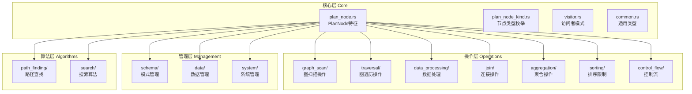

基于对 `src/query/planner/plan` 目录的深入分析，我发现了以下主要问题：

## 当前结构存在的问题

### 1. **功能重复**
- `logic_nodes.rs` 和 `other_ops.rs` 中都定义了 `Start` 节点
- `logic_nodes.rs` 和 `other_ops.rs` 中都定义了 `Argument` 节点
- `query_nodes.rs` 只是重新导出其他模块的节点，没有实际功能

### 2. **导出结构混乱**
- `mod.rs` 中同时使用 `pub use module::*` 和 `pub use module::{具体类型}`
- 存在重复导出，如 `Start` 节点被导出多次
- 导出层次不清晰，难以理解模块间的依赖关系

### 3. **模块划分不合理**
- 按操作类型划分的模块（如 `traverse_ops.rs`、`data_ops.rs`）与按功能划分的模块（如 `logic_nodes.rs`）混合
- 某些模块包含过多不相关的节点类型
- 缺乏统一的分类标准


---

## 目录结构调整方案

### 新的模块组织结构

我建议将目录结构重新组织为以下层次：

```
src/query/planner/plan/
├── core/                    # 核心基础类型
│   ├── mod.rs              # 导出基础特征和枚举
│   ├── plan_node.rs        # PlanNode 特征和基础实现
│   ├── plan_node_kind.rs   # PlanNodeKind 枚举
│   └── visitor.rs          # 访问者模式相关
├── operations/             # 操作节点（按功能分类）
│   ├── graph_scan/         # 图扫描操作
│   ├── traversal/          # 图遍历操作
│   ├── data_processing/    # 数据处理操作
│   ├── join/              # 连接操作
│   ├── aggregation/       # 聚合操作
│   ├── sorting/           # 排序和限制操作
│   └── control_flow/       # 控制流操作
├── management/             # 管理操作节点
│   ├── schema/            # 模式管理
│   ├── data/              # 数据管理
│   └── system/             # 系统管理
├── algorithms/             # 算法节点
│   ├── path_finding/      # 路径查找算法
│   └── search/            # 搜索算法
└── mod.rs                  # 统一导出接口
```

### 具体调整内容

**1. 解决功能重复问题**
- 移除重复的 `Start` 和 `Argument` 节点定义
- 统一到单一模块中定义
- 删除 `query_nodes.rs`（仅重新导出的模块）

**2. 优化导出结构**
- 采用统一的导出策略：只导出具体类型，不导出 `*`
- 建立清晰的导出层次结构
- 避免循环依赖和重复导出

**3. 重新划分模块边界**
- 按功能而非操作类型划分模块
- 每个模块职责单一，功能内聚
- 建立清晰的依赖关系

---

## 新的模块组织架构设计

### 模块详细划分方案



### 模块职责划分

**1. 核心层 (core/)**
- `plan_node.rs`: PlanNode 特征和基础实现
- `plan_node_kind.rs`: PlanNodeKind 枚举定义
- `visitor.rs`: 访问者模式相关
- `common.rs`: 通用类型（TagProp, EdgeProp 等）

**2. 操作层 (operations/)**
- `graph_scan/`: GetVertices, GetEdges, GetNeighbors, ScanVertices, ScanEdges
- `traversal/`: Traverse, Expand, ExpandAll, AppendVertices
- `data_processing/`: Filter, Project, Unwind, Dedup, Union
- `join/`: HashJoin, CrossJoin, HashLeftJoin, HashInnerJoin
- `aggregation/`: Aggregate
- `sorting/`: Sort, Limit, TopN, Sample
- `control_flow/`: Start, Argument, Select, Loop, PassThrough

**3. 管理层 (management/)**
- `schema/`: CreateSpace, CreateTag, CreateEdge, DropNode 等
- `data/`: InsertVertices, InsertEdges, UpdateVertex, DeleteVertices 等
- `system/`: SubmitJob, CreateSnapshot, ShowConfigs 等

**4. 算法层 (algorithms/)**
- `path_finding/`: ShortestPath, MultiShortestPath, AllPaths, BFSShortest
- `search/`: IndexScan, FulltextIndexScan

---

## 重构实施计划

### 阶段一：创建新目录结构
1. 创建新的目录层次结构
2. 迁移核心基础类型到 `core/` 目录
3. 建立新的模块导出机制

### 阶段二：迁移操作节点
1. 按功能重新组织操作节点到对应模块
2. 解决重复定义问题
3. 更新节点间的依赖关系

### 阶段三：更新导出机制
1. 重新设计 `mod.rs` 的导出结构
2. 确保向后兼容性
3. 更新所有引用这些模块的代码

### 阶段四：测试和验证
1. 运行现有测试确保功能正常
2. 验证新的导出结构
3. 修复发现的任何问题

## 具体重构步骤

**第一步：创建新目录结构**
```bash
mkdir -p src/query/planner/plan/core
mkdir -p src/query/planner/plan/operations/{graph_scan,traversal,data_processing,join,aggregation,sorting,control_flow}
mkdir -p src/query/planner/plan/management/{schema,data,system}
mkdir -p src/query/planner/plan/algorithms/{path_finding,search}
```

**第二步：迁移核心文件**
- 将 `plan_node.rs` 移动到 `core/plan_node.rs`
- 将 `plan_node_kind.rs` 从 `plan_node.rs` 分离到 `core/plan_node_kind.rs`
- 将 `plan_node_visitor.rs` 移动到 `core/visitor.rs`
- 将 `common.rs` 移动到 `core/common.rs`

**第三步：重新组织操作节点**
- 将相关节点移动到对应的功能模块
- 删除重复的定义
- 更新模块间的导入关系

**第四步：重新设计导出结构**
- 创建清晰的导出层次
- 避免重复导出
- 保持API兼容性

---

## src/query/planner/plan 目录结构调整方案

基于深入分析，我发现了当前目录结构存在的主要问题并制定了完整的调整方案。

### 📋 问题总结

**1. 功能重复**
- `logic_nodes.rs` 和 `other_ops.rs` 中都定义了 `Start` 和 `Argument` 节点
- `query_nodes.rs` 只是重新导出，没有实际功能

**2. 导出结构混乱**
- 同时使用 `pub use module::*` 和具体类型导出
- 存在重复导出和循环依赖
- 导出层次不清晰

**3. 模块划分不合理**
- 按操作类型和功能划分的模块混合存在
- 某些模块包含过多不相关的节点类型
- 缺乏统一的分类标准

### 🏗️ 新的架构设计


### 🔄 重构计划

**阶段一：创建新目录结构**
- 建立清晰的模块层次
- 迁移核心基础类型

**阶段二：重新组织操作节点**
- 按功能重新分配节点到对应模块
- 解决重复定义问题

**阶段三：优化导出机制**
- 设计清晰的导出层次
- 确保向后兼容性

**阶段四：测试验证**
- 运行现有测试确保功能正常
- 验证新的结构

### 💡 预期收益

1. **消除重复代码** - 解决功能重复问题
2. **清晰的模块边界** - 每个模块职责单一
3. **更好的可维护性** - 结构清晰，易于扩展
4. **统一的导出策略** - 避免导出混乱

您对这个调整方案有什么看法？是否需要调整某些模块的划分方式？